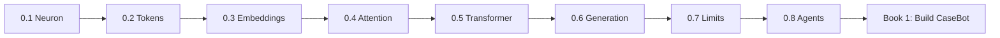

# Book 0: How LLMs Work

Before we build an agent, we need to understand the machine at the center of it.

This is not a survey course. It is one continuous build — from a single neuron to a text-generating model to the specific limits that force you to build CaseBot in Book 1.

## The stack, in order

Each chapter depends on the last. Do not skip.

| Ch | Topic | You will understand |
|----|-------|---------------------|
| [0.1](./01-neural-networks.md) | Neural networks | What a neuron, layer, and gradient descent actually are |
| [0.2](./02-tokens.md) | Tokens | Why LLMs use subwords, not words or characters |
| [0.3](./03-embeddings.md) | Embeddings | How integers become vectors with meaning |
| [0.4](./04-attention.md) | Attention | Q, K, V — derived with real numbers |
| [0.5](./05-transformer-layers.md) | Transformer layers | Multi-head attention, residuals, depth |
| [0.6](./06-generation.md) | Generation | Logits → text, temperature, autoregressive loop |
| [0.7](./07-llm-limits.md) | What the model cannot do | The seven structural limits |
| [0.8](./08-workflows-vs-agents.md) | Workflows vs agents | When an agent is the right tool |

## How to read

- Trace through the Python — every formula has a code version
- Run the tiktoken examples in chapter 0.2 if you want to verify token IDs yourself
- Chapter 0.7 is the bridge: every limit listed there becomes a chapter in Book 1

None of this requires a math degree. It requires patience and a willingness to follow one idea at a time until it clicks.

**Start →** [0.1 What a neural network actually is](./01-neural-networks.md)
