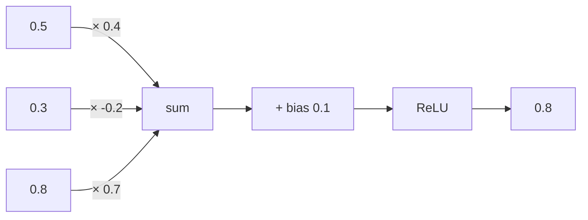
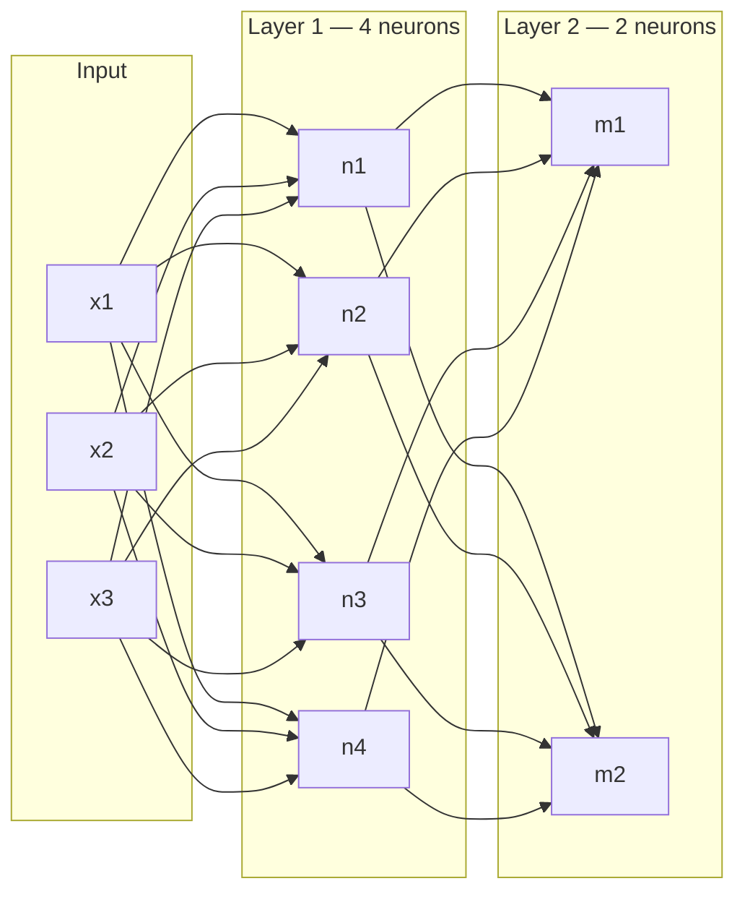
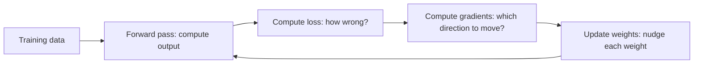

# 0.1 What a neural network actually is

Before we can talk about LLMs, agents, or any of that — we need to understand the actual machine sitting underneath all of it. Not "it's inspired by the brain." The real thing. The actual math, shown simply.

A neural network is a function. It takes numbers in, does some arithmetic, and produces numbers out. That's genuinely all it is. The "intelligence" comes entirely from which arithmetic it does — and those operations are *learned* from data.

Let's build one from scratch so there's nothing mysterious about it.

## Start with one neuron

The smallest possible unit is a single neuron. It does this:

```python
def neuron(inputs, weights, bias):
    # Step 1: multiply each input by its weight, add them all up
    total = sum(x * w for x, w in zip(inputs, weights))
    # Step 2: add a bias (a learned shift)
    total = total + bias
    # Step 3: apply an activation function
    return max(0, total)   # this specific one is called ReLU
```

Run it:

```python
inputs  = [0.5, 0.3, 0.8]   # e.g. three features from some data
weights = [0.4, -0.2, 0.7]  # learned during training
bias    = 0.1               # also learned during training

output = neuron(inputs, weights, bias)
# total = (0.5×0.4) + (0.3×-0.2) + (0.8×0.7) + 0.1
# total = 0.2 - 0.06 + 0.56 + 0.1 = 0.8
# ReLU(0.8) = 0.8
print(output)   # 0.8
```



That's it. A neuron is: weighted sum of inputs, plus a bias, passed through an activation function.

## What is the activation function doing?

If we removed it, the neuron would just be `output = w1*x1 + w2*x2 + ... + b`. That's a linear function. Stack one hundred of these and you still get a linear function — they just collapse into a single multiplication. You'd never be able to learn anything non-linear (like "if input is between 3 and 5, output 1, otherwise output 0").

The activation function introduces a **bend** in the computation. ReLU says: if the total is below zero, output exactly zero; otherwise pass it through unchanged. That one simple bend, repeated across millions of neurons, lets the network carve out arbitrarily complicated shapes in the space of possible inputs.

Other activation functions exist (sigmoid, tanh, GELU) — they make different-shaped bends. LLMs use GELU. The principle is the same.

## From one neuron to a layer

One neuron reads all the inputs and produces one number. A **layer** is just many neurons reading the same inputs in parallel:

```python
def layer(inputs, weight_matrix, biases):
    # Each row of weight_matrix is one neuron's weights
    outputs = []
    for weights, bias in zip(weight_matrix, biases):
        out = neuron(inputs, weights, bias)
        outputs.append(out)
    return outputs
```

If the layer has 4 neurons, it takes some inputs and produces 4 numbers. The next layer takes those 4 numbers as its inputs and produces more numbers.



Every neuron in a layer is connected to every neuron in the next layer. That's a **fully connected** (or dense) layer. The "deep" in deep learning just means there are many layers stacked.

## What does learning mean?

Here is the honest answer: learning means **adjusting the weights and biases until the network's output matches what we wanted it to output**, across many examples.

Concretely:

1. You feed the network an input — say, the pixels of an image
2. It produces an output — say, `[0.2, 0.8]` (probabilities for "cat" and "dog")
3. You know the correct answer — the image is a dog, so correct output is `[0, 1]`
4. You compute a **loss**: how wrong was the output? `(0.2-0)² + (0.8-1)² = 0.08`
5. You compute the **gradient**: for each weight, how much does a tiny change in that weight change the loss?
6. You nudge each weight in the direction that reduces the loss

Step 5 is the hard part (it's called backpropagation), but you don't need to implement it yourself — PyTorch or any framework does it automatically. What matters is the idea: the loss measures wrongness, and we use calculus to find which direction to push each weight to be less wrong.

Repeat this across millions of examples, and the weights converge to something that performs well.



This loop is called **gradient descent**. It runs thousands to millions of times. Each pass through all the data is called an **epoch**. LLMs are trained for many epochs on hundreds of billions of tokens.

## Why does this actually work?

Here is something that surprises people: there is no guarantee from the math that gradient descent should produce a useful network. Yet in practice, for neural networks, it almost always does. The reason isn't fully understood theoretically, but empirically: deep networks have enormous numbers of parameters (~billions for LLMs), and in high-dimensional spaces, local minima tend to be almost as good as global minima. The network finds something close to optimal simply by following gradients.

## What a neural network "knows"

After training, the weights encode everything the network learned about the data. When you run the network on a new input, you're not doing any learning — you're just doing the arithmetic. The knowledge is entirely in the weights.

For LLMs, the weights encode statistical patterns from hundreds of billions of words of text — syntax, facts, reasoning patterns, writing styles, code, mathematics. Not because anyone programmed these things in, but because the network had to compress all that text into weight values that could predict the next token.

That's the raw machine. Now let's see what it needs to process language.

**Next →** [Tokens — the alphabet of a language model](./02-tokens.md)
