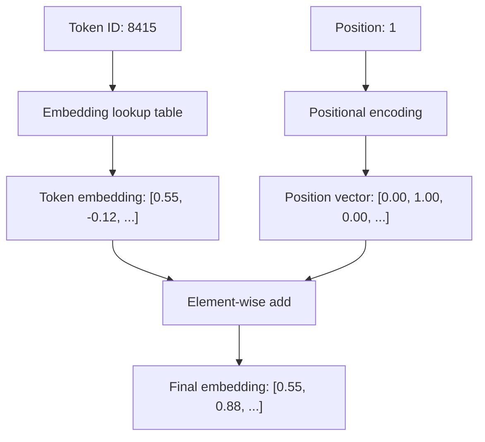

# 0.3 Embeddings — turning integers into meaning

We left off with the model receiving a list of integers like `[791, 8415, 9139]`. Now we need to convert those into something a neural network can actually do math with.

The problem is that integers, as integers, have an unhelpful structure. Token 792 is not "more" than token 791. Token 3332 is not the square of token 57.7. The numbers are arbitrary IDs — they carry no useful information about the meaning of the tokens they represent.

We need to replace each integer with a richer representation. That's what embeddings do.

## The embedding table

An embedding table is just a matrix. It has one row for every token in the vocabulary, and each row is a vector of floating-point numbers:

```
embedding_table[791]  →  [0.21, -0.44, 0.87, 0.02, -0.31, ...]   # "The"
embedding_table[8415] →  [0.55, -0.12, 0.44, 0.71, -0.08, ...]   # " cat"
embedding_table[9139] →  [0.48, -0.09, 0.41, 0.68, -0.11, ...]   # " sat"
```

Each row has the same number of dimensions — in GPT-2 this is 768; in GPT-4 it's probably around 12,288. We call this the **embedding dimension** or `d_model`.

The lookup is trivially simple:

```python
def embed(token_ids, embedding_table):
    return [embedding_table[token_id] for token_id in token_ids]
```

Token 791 → look up row 791 in the table → get a 768-dimensional vector. That's the embedding.

## The critical thing: the table is learned

This is the key. We don't hand-design these vectors. They start as random numbers and get adjusted during training, just like any other weights in the network.

As the model trains on text, it needs to predict the next token given all previous tokens. To do that well, it learns to put tokens that appear in similar contexts close together in the embedding space. Not because we told it to — but because it discovers that nearby vectors make prediction easier.

Let's make this concrete. The tokens for "king", "queen", "man", "woman" end up positioned such that:

```
embedding("king") - embedding("man") ≈ embedding("queen") - embedding("woman")
```

The model didn't learn the concept of "royalty" explicitly. It learned that the *same relationship* (removing the gender component) holds between these pairs, because they appear in analogous contexts in the training data. The arithmetic fell out of the objective.

## Visualizing embedding space

Imagine a coordinate system. In 2D, you might have:

```
                  king ●          queen ●
                  
     man ●                 woman ●
```

Words that appear in similar contexts cluster together. Verbs cluster with verbs. Days of the week cluster together. Country capitals cluster near each other.

In reality, the space is 768-dimensional or larger — we can't visualize it directly, but the clustering behavior is real and measurable.

Let's measure it using cosine similarity (how aligned two vectors are, on a scale from -1 to 1):

```python
import math

def cosine_similarity(a, b):
    dot = sum(x * y for x, y in zip(a, b))
    norm_a = math.sqrt(sum(x*x for x in a))
    norm_b = math.sqrt(sum(x*x for x in b))
    return dot / (norm_a * norm_b)

# With real embeddings from a trained model:
# cosine_similarity(embed("cat"), embed("dog"))  → ~0.85  (both: small animals, pets)
# cosine_similarity(embed("cat"), embed("car"))  → ~0.40  (share only: three-letter words)
# cosine_similarity(embed("cat"), embed("cat"))  → 1.00   (identical)
```

The model puts "cat" and "dog" close together because they appear in similar sentences ("my _ is sleeping", "I fed my _", "_s and _s are common pets").

## Embeddings are not just for words

Everything the model needs to represent gets embedded:

- **Token embeddings** — the meaning of each token
- **Positional embeddings** — where in the sequence this token sits

The positional embedding is added to the token embedding:

```python
final_embedding = token_embedding[token_id] + positional_embedding[position]
```

Why? Because the model processes all tokens simultaneously (we'll see this in the attention chapter). Without positional information, the model would have no idea that "cat" at position 3 is different from "cat" at position 47. The positional embedding injects that information.



## What flows into the rest of the network

After embedding, the input to the neural network is a **matrix** — not a list of integers, not a list of words, but a matrix with shape `[sequence_length × embedding_dim]`:

```
sequence "The cat sat" → 3 tokens → 3 rows → shape: [3 × 768]

row 0: [0.21, -0.44, 0.87, ...]   ← embedding of "The"
row 1: [0.55, -0.12, 0.44, ...]   ← embedding of " cat"
row 2: [0.48, -0.09, 0.41, ...]   ← embedding of " sat"
```

This matrix is what the transformer layers operate on. Each layer transforms it into another matrix of the same shape. The final matrix, after all layers, is used to predict the next token.

## What embeddings cannot capture on their own

Embeddings represent the meaning of a token in isolation — its average context across all of training. But the word "bank" means something different in "river bank" vs. "savings bank". A static embedding table can only store one vector for "bank" — it can't tell you which meaning applies in a given sentence.

This is exactly what the attention mechanism solves. Each layer of the transformer modifies the embeddings based on what surrounds them. After several layers, the vector for "bank" in "river bank" looks completely different from the vector for "bank" in "savings bank" — the static embedding has been transformed by context.

The embedding table is the starting point. The transformer layers are the computation that refines those representations.

**Next →** [Attention — how tokens look at each other](./04-attention.md)
