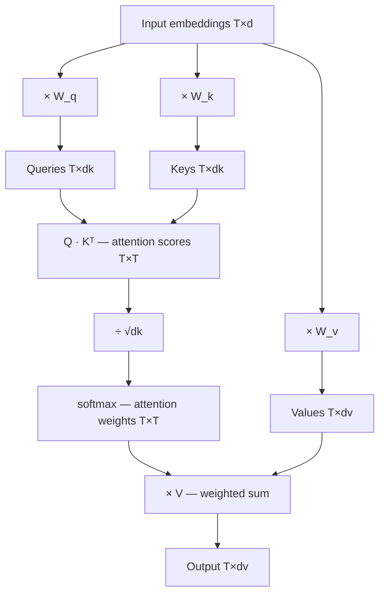

# 4. Attention — how tokens look at each other

This is the chapter that makes LLMs work. Attention is the mechanism that lets every token in a sequence look at every other token and decide how much to learn from it. Without attention, the network processes each token independently with no knowledge of context. With attention, "bank" in "river bank" can reach back to "river" and adjust its representation accordingly.

Let me build up to the formula step by step, starting from the problem.

## The problem attention is solving

Consider the sentence: "The cat sat on the mat because it was tired."

What does "it" refer to? The cat. But the model, processing tokens left to right, sees "it" at position 9 without automatically knowing it connects back to "cat" at position 2.

More subtly: the meaning of "bank" is different in these two sentences, even though the token is identical:

- "She walked to the river bank to fish."
- "She went to the bank to deposit money."

A fixed embedding can't capture this. The representation of "bank" needs to be updated based on the surrounding words. Attention is the mechanism that does that updating.

## The setup

After embedding, we have a matrix where each row is a token's vector. Let's call it `X`, with shape `[T × d]` where T is the number of tokens and d is the embedding dimension.

For each token position, we want to compute a new, context-aware vector by looking at all other token positions and mixing their information in, weighted by relevance.

The question is: how do we compute relevance between two tokens?

## Queries, Keys, and Values

Here is the central idea of attention, stated plainly:

**Every token plays three roles simultaneously:**

1. It asks a question about what information it needs: its **Query**
2. It advertises what information it has: its **Key**
3. It provides the actual information if attended to: its **Value**

These are three different linear projections of the same embedding vector:

```python
# Three learned weight matrices — the model learns these during training
W_q = # shape [d × d_k]
W_k = # shape [d × d_k]
W_v = # shape [d × d_v]

# For each token's embedding vector x:
query = x @ W_q   # "What am I looking for?"
key   = x @ W_k   # "What do I have?"
value = x @ W_v   # "What I'll give you if you attend to me"
```

The queries and keys have dimension `d_k`. The values have dimension `d_v`. In practice these are often the same.

**The analogy:** imagine a library. Each book has a title (Key) and its contents (Value). You walk in with a search query (Query). Attention finds how much your query matches each book's title, then gives you a mixture of the books' contents, weighted by how well your query matched their titles.

The difference from a real library: it's not a binary match/no-match. It's a continuous, differentiable score for every pair. And both the keys and the queries are learned — the model learns what "questions" are useful to ask, and what "titles" are useful to advertise.

## Computing the attention scores

Let's compute it numerically. Suppose we have 3 tokens, each with 4-dimensional embeddings:

```python
import math

# The embeddings of our 3 tokens (already after W_q, W_k, W_v projections)
Q = [
    [1.0, 0.0, 1.0, 0.0],   # token 0's query
    [0.0, 1.0, 0.0, 1.0],   # token 1's query
    [1.0, 1.0, 0.0, 0.0],   # token 2's query
]
K = [
    [1.0, 0.0, 1.0, 0.0],   # token 0's key
    [0.0, 1.0, 0.0, 1.0],   # token 1's key
    [0.0, 0.0, 1.0, 1.0],   # token 2's key
]
V = [
    [1.0, 2.0, 3.0, 4.0],   # token 0's value
    [5.0, 6.0, 7.0, 8.0],   # token 1's value
    [9.0, 10.0, 11.0, 12.0],# token 2's value
]

d_k = 4  # dimension of keys/queries

# Step 1: dot product of every query with every key
# scores[i][j] = how much token i should attend to token j
scores = []
for i in range(3):
    row = []
    for j in range(3):
        dot = sum(Q[i][k] * K[j][k] for k in range(d_k))
        row.append(dot)
    scores.append(row)

# scores = [[2.0, 0.0, 1.0],   ← Q[0]·K[0]=2, Q[0]·K[1]=0, Q[0]·K[2]=1
#            [0.0, 2.0, 1.0],   ← Q[1]·K[0]=0, Q[1]·K[1]=2, Q[1]·K[2]=1
#            [1.0, 1.0, 0.0]]   ← Q[2]·K[0]=1, Q[2]·K[1]=1, Q[2]·K[2]=0
#
# Token 0's query perfectly matches token 0's key (score=2.0)
# Token 0 also partially matches token 2's key (score=1.0 — shared dim 2)
```

## Why divide by √d_k?

Before applying softmax, we divide every score by the square root of `d_k`:

```python
# Step 2: scale by 1/sqrt(d_k)
scaled_scores = [[s / math.sqrt(d_k) for s in row] for row in scores]
# [[1.0, 0.0, 0.5],   ← 2.0/2, 0.0/2, 1.0/2
#  [0.0, 1.0, 0.5],
#  [0.5, 0.5, 0.0]]
```

Why? When `d_k` is large (say 64), the dot products grow roughly as √d_k, because you're summing `d_k` products. Without scaling, these scores become very large, which causes softmax to produce near-zero gradients (the softmax "saturates"). Dividing by √d_k keeps the scores in a range where softmax behaves well.

This scaling was added by the "Attention Is All You Need" paper. It's one of those tiny details that turns out to matter a lot.

## Softmax — turning scores into a probability distribution

We want to know: for each token, what fraction of its attention should go to each other token? The scores are raw numbers. Softmax converts them into a probability distribution that sums to 1.

```python
def softmax(xs):
    # Subtract max for numerical stability
    max_x = max(xs)
    exps = [math.exp(x - max_x) for x in xs]
    total = sum(exps)
    return [e / total for e in exps]

# Step 3: apply softmax to each row
attention_weights = [softmax(row) for row in scaled_scores]
# [[0.506, 0.186, 0.307],   ← token 0 attends mostly to itself, some to token 2
#  [0.186, 0.506, 0.307],   ← token 1 attends mostly to itself, some to token 2
#  [0.384, 0.384, 0.233]]   ← token 2 splits evenly between 0 and 1
```

Each row sums to 1. This is the attention pattern — how much each token attends to each other token.

## Using the weights to mix the Values

Now we use these weights to compute a weighted average of the Value vectors:

```python
# Step 4: weighted sum of values
outputs = []
for i in range(3):
    # Token i's new representation = weighted sum of all values
    out = [0.0, 0.0, 0.0, 0.0]
    for j in range(3):
        for dim in range(4):
            out[dim] += attention_weights[i][j] * V[j][dim]
    outputs.append(out)

# outputs[0] ≈ [0.506×[1,2,3,4] + 0.186×[5,6,7,8] + 0.307×[9,10,11,12]]
#            ≈ [4.20, 5.20, 6.20, 7.20]
```

Token 0's new representation is a mixture of all token values, but heavily weighted toward itself and less toward the others. The mixture is exactly how relevant each token was to token 0.

## The full formula

Everything above, written compactly:

```
Attention(Q, K, V) = softmax( Q · Kᵀ / √d_k ) · V
```

Let's decode each piece one more time, now that you've seen the code:

| Symbol | Shape | Meaning |
|--------|-------|---------|
| `Q` | [T × d_k] | All queries — one per token |
| `K` | [T × d_k] | All keys — one per token |
| `V` | [T × d_v] | All values — one per token |
| `Q · Kᵀ` | [T × T] | All pairwise attention scores |
| `/ √d_k` | — | Scale to prevent saturation |
| `softmax(...)` | [T × T] | Normalize to probability distributions |
| `· V` | [T × d_v] | Weighted sum of values |

The output has the same shape as the input: `[T × d_v]`. Each token now has a new representation that incorporates information from all other tokens it attended to.



## Causal masking — why the model can't see the future

During training, the model processes the whole sequence at once for efficiency. But during generation, we want the model to predict the next token only from the tokens before it — not from the tokens after it.

We enforce this by masking out future positions before softmax: setting their scores to −∞ so they become zero after softmax.

```python
# Before softmax, for a 4-token sequence:
#
# Position 0 can only see:  [0, -∞, -∞, -∞]
# Position 1 can only see:  [×,  0, -∞, -∞]
# Position 2 can only see:  [×,  ×,  0, -∞]
# Position 3 can only see:  [×,  ×,  ×,  0]
```

This causal mask means the attention pattern is lower-triangular. Each token can attend to all previous tokens and itself, but not to any future tokens.

## What this actually computes

Let's step back and appreciate what just happened. For the sentence "The cat sat because it was tired":

- When computing the representation of "it", the model can look back at all previous tokens
- It learns to assign high attention weight to "cat" because "it" and "cat" appeared in coreferential relationships throughout training
- The output representation of "it" now incorporates information from "cat"'s value vector
- By the time this propagates through multiple layers, "it" "knows" it refers to "cat"

No explicit coreference rules were programmed. The model learned from statistics that when you see "it" in these kinds of sentences, "cat" and similar words are highly relevant. The attention weights are the learned evidence of that statistical pattern.

**Next →** [Transformer layers — stacking attention into depth](./05-transformer-layers.md)
