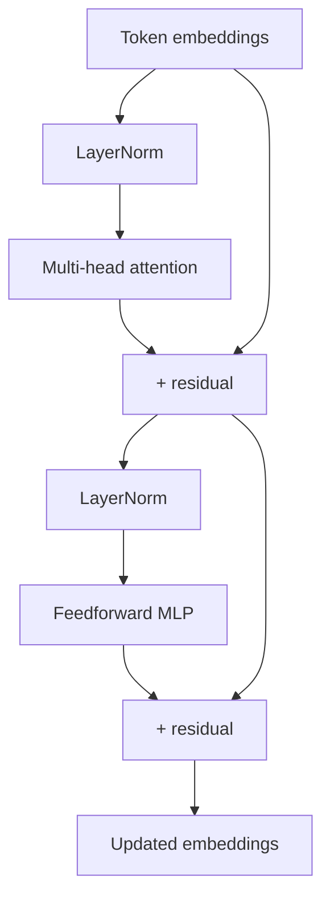
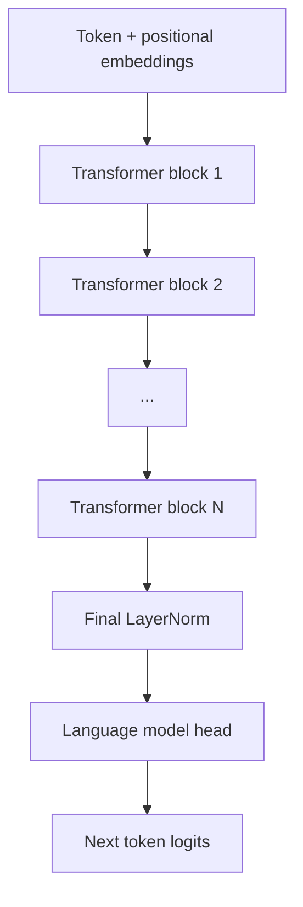

# 0.5 Transformer layers — stacking attention into depth

One round of attention gives each token a context-aware update. But one round isn't enough to capture the full complexity of language. Stacking multiple layers lets the model build progressively more abstract representations. Let's see how.

## What comes after attention

After the attention step, each token has a new vector that incorporates information from other tokens. But the attention mechanism only computes a weighted average of value vectors. To capture more complex transformations of that information — to add true expressiveness — we follow attention with a small feedforward neural network, applied independently at each position.

This feedforward block (also called a MLP, or multi-layer perceptron) typically works like:

```python
def feedforward(x, W1, b1, W2, b2):
    # First layer: expand to 4× the embedding size
    hidden = gelu(x @ W1 + b1)   # shape: [d_model] → [4 × d_model]
    # Second layer: project back down
    output = hidden @ W2 + b2    # shape: [4 × d_model] → [d_model]
    return output
```

The expansion to 4× the embedding size is a design choice from the original Transformer paper that has stuck. It's not magic — it just gives the network more room to compute. The GELU activation (a smoother version of ReLU) introduces non-linearity.

## The full transformer block

One transformer block is: attention, then feedforward, plus two stabilizing techniques we'll explain below:



Two new concepts here: **LayerNorm** and **residual connections**. Both are about making deep networks trainable.

## Residual connections — the skip

After each attention and feedforward sub-block, we add the input back to the output:

```python
# Attention with residual:
x = x + attention(layernorm(x))

# Feedforward with residual:
x = x + feedforward(layernorm(x))
```

The `+` is the residual connection. Why does this matter?

When you train a very deep network (say, 96 layers like GPT-3), gradients have to flow backward through all 96 layers during backpropagation. Without residuals, the gradients can vanish or explode — they either shrink to zero (the early layers learn nothing) or blow up to infinity (numerical instability). With residuals, there's always a "shortcut" path for the gradient: it can flow directly through the skip connection, bypassing any individual layer. This makes training deep networks much more stable.

There's also an intuitive interpretation: without residuals, each layer must compute its output from scratch. With residuals, each layer only needs to compute the *change* from the previous layer's output. Learning small corrections is easier than learning the whole function.

## LayerNorm — keeping activations in range

Layer normalization standardizes the values inside each token's vector before they enter attention or feedforward:

```python
def layernorm(x, gamma, beta, eps=1e-5):
    mean = sum(x) / len(x)
    variance = sum((xi - mean)**2 for xi in x) / len(x)
    normalized = [(xi - mean) / math.sqrt(variance + eps) for xi in x]
    # gamma and beta are learned scale and shift parameters
    return [gamma[i] * normalized[i] + beta[i] for i in range(len(x))]
```

Without this, activations can drift to very large or very small values over many layers. This makes training unstable and slow. LayerNorm keeps each token's vector near a consistent scale, layer by layer.

The original paper applied LayerNorm after attention (post-norm). Modern LLMs (GPT-2 and later) apply it before (pre-norm, as shown in the diagram). Pre-norm is more stable in practice.

## Multi-head attention — multiple views simultaneously

We've described single-head attention. Real LLMs run multiple attention heads in parallel:

```python
def multi_head_attention(X, W_q, W_k, W_v, W_o, num_heads):
    d_model = len(X[0])            # embedding dim from input shape
    d_head  = d_model // num_heads
    
    # Run H independent attention heads
    head_outputs = []
    for h in range(num_heads):
        # Each head has its own projections
        Q_h = X @ W_q[h]   # shape: [T × d_head]
        K_h = X @ W_k[h]
        V_h = X @ W_v[h]
        
        head_out = attention(Q_h, K_h, V_h)   # shape: [T × d_head]
        head_outputs.append(head_out)
    
    # Concatenate all heads and project back
    concatenated = concat(head_outputs)   # shape: [T × d_model]
    return concatenated @ W_o             # shape: [T × d_model]
```

Why multiple heads? Each head learns to attend to different types of relationships simultaneously:

- One head might learn to connect pronouns to their antecedents ("it" → "cat")
- Another might learn syntactic structure (subject → verb agreement)
- Another might learn semantic similarity (synonyms)
- Another might track positional relationships (nearby words)

No one assigns these roles — they emerge from training. GPT-2 small has 12 heads; GPT-3 has 96 heads per layer.

## Stacking layers

The full GPT architecture is N of these transformer blocks stacked sequentially:



| Model | Layers | Heads | d_model | Parameters |
|-------|--------|-------|---------|------------|
| GPT-2 small | 12 | 12 | 768 | 117M |
| GPT-2 large | 36 | 20 | 1280 | 774M |
| GPT-3 | 96 | 96 | 12288 | 175B |
| GPT-4 | ~120 (estimated) | — | ~12288+ | ~1.8T (estimated) |

The pattern is clear: more layers, more heads, larger embeddings. More parameters means more capacity to store patterns from training data — but also more computation per inference.

## What each layer is computing

Here's a way to think about what the layers are doing, moving from shallow to deep:

- **Early layers** (1–4): Local patterns. The model learns that spaces precede words, that punctuation ends sentences, that common suffixes like "-ing" or "-ed" follow verbs.

- **Middle layers** (5–8): Syntactic structure. Subject-verb relationships, noun phrase boundaries, prepositional phrase attachment.

- **Late layers** (9–12): Semantic content. What this sentence is about, what entities are mentioned, what relationships hold between them.

This is not perfectly clean — attention heads across all layers participate in all kinds of representations. But interpretability research consistently finds this kind of progression: early layers build syntax, late layers build semantics.

## The computation cost

There's a cost to all this. For a sequence of T tokens with embedding dimension d:

- Attention: O(T² × d) — every token attends to every other token
- Feedforward: O(T × d²) — applied to each position independently

The T² term in attention is why long contexts are expensive. Doubling the sequence length quadruples the attention computation. This is why context windows were limited for so long, and why efficient attention variants (sparse attention, flash attention) are active research areas.

For a 128k-token context window, T = 128,000. T² = 16 billion. Even with optimizations, processing a full-length context is genuinely expensive.

## The output of the last layer

After N transformer blocks, we have an updated matrix of the same shape as the input: `[T × d_model]`. Every token now has a deeply contextualized representation.

For language modeling, we care especially about the last token's vector (for generation) or specific token vectors (for classification). The final LayerNorm is applied, and then a linear projection — called the language model head — maps the last token's vector to logits over the vocabulary.

That logit-to-token step is the next chapter.

**Next →** [Generation — from logits to text](./06-generation.md)
