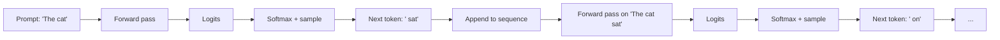

# 0.6 Generation — how the model produces text

We've built up the full forward pass: tokens → embeddings → N transformer layers → a matrix of contextualized vectors. Now we need to turn those vectors into actual text. This chapter covers the final step: how a vector becomes the next word, and how that loop produces a paragraph.

## From vector to logits

After the last transformer layer, the final token position has a vector of shape `[d_model]` — say, 768 numbers. We want to convert this into a probability distribution over the entire vocabulary — which token should come next?

This is done with a linear projection called the **language model head**:

```python
# W_lm_head has shape [d_model × vocab_size]
# In GPT-2: [768 × 50257]
logits = final_token_vector @ W_lm_head   # shape: [vocab_size]
```

The result is `vocab_size` numbers called **logits**. A logit is just a raw score — not a probability yet, just a measure of how strongly the model "votes" for each token.

Large logit = the model thinks this token is likely next.
Small or negative logit = the model thinks this token is unlikely.

## From logits to probabilities

We apply softmax to convert logits to probabilities:

```python
def softmax(logits):
    max_l = max(logits)
    exps = [math.exp(l - max_l) for l in logits]
    total = sum(exps)
    return [e / total for e in exps]

probabilities = softmax(logits)
# Now probabilities[i] = probability that token i is the next token
# sum(probabilities) = 1.0
```

For a vocabulary of 50,000 tokens, we now have 50,000 probabilities summing to 1.

## Sampling — picking the next token

We have a probability distribution. Now we need to pick one token. There are several strategies:

**Greedy (argmax):** Always pick the most probable token.

```python
next_token = probabilities.index(max(probabilities))
```

Simple, but produces repetitive, robotic text. The most likely word at each step doesn't make for natural language — natural text includes variety and surprise.

**Temperature sampling:** Before softmax, divide the logits by a temperature T:

```python
def apply_temperature(logits, temperature):
    return [l / temperature for l in logits]

# Temperature < 1.0 (e.g. 0.3): makes probabilities more peaked
# → confident, deterministic, sometimes repetitive
# Temperature = 1.0: use probabilities as-is
# Temperature > 1.0 (e.g. 1.5): flattens probabilities
# → more random, creative, sometimes incoherent
```

Why does dividing by a small T make the distribution more peaked? If logits are [2.0, 1.0, 0.5] and T=0.1, the scaled logits become [20.0, 10.0, 5.0]. The differences are amplified. After softmax, the top choice dominates overwhelmingly. Conversely, T=2.0 gives [1.0, 0.5, 0.25] — the differences shrink, so probabilities are more equal.

**Top-k sampling:** Sample only from the k most probable tokens, ignoring the rest.

```python
# Keep only the top 50 tokens, set the rest to -infinity before softmax
```

This prevents the model from ever picking very unlikely tokens that could derail the text.

**Nucleus (top-p) sampling:** Include the smallest set of tokens whose cumulative probability exceeds p (say, 0.9). This adapts to how confident or uncertain the model is — if one token has probability 0.95, nucleus gives just that one token; if the distribution is flat, nucleus includes many tokens.

Modern LLMs typically use nucleus sampling with p=0.9 or p=0.95 and temperature ~0.7–1.0.

## The generation loop

Put it all together. Generation is a loop:

```python
def generate(prompt_tokens, model, max_new_tokens=100, temperature=1.0):
    tokens = list(prompt_tokens)
    
    for _ in range(max_new_tokens):
        # Forward pass: tokens → logits for the next position
        logits = model.forward(tokens)   # returns logits for last position
        
        # Apply temperature
        scaled_logits = [l / temperature for l in logits]
        
        # Sample next token
        probs = softmax(scaled_logits)
        next_token = sample_from(probs)   # weighted random draw
        
        # Append and continue
        tokens.append(next_token)
        
        # Stop if we hit the end-of-sequence token
        if next_token == EOS_TOKEN_ID:
            break
    
    return tokens
```

Every iteration: run the full forward pass on the accumulated tokens, get the probability distribution for the next position, sample, append. The model sees its own previous outputs and conditions on them.

This is why we say LLMs are **autoregressive**: each output is fed back as input for the next step.



## The KV cache — why generation is expensive to start but cheap to continue

A subtlety: every time we call `model.forward(tokens)`, we recompute the attention keys and values for all previous tokens. But they haven't changed — why recompute them?

In practice, production systems cache the keys and values from all previous positions (the "KV cache") and only compute the new token's attention. This makes incremental generation fast — only one new forward pass per token, not a full recomputation.

This is why the first token from a long context is slow (you're computing the full KV cache) but subsequent tokens are fast (you're only adding one row to the cache).

## What "chat" actually is

When you use ChatGPT, there's no special "conversation" mechanism. The entire conversation history is concatenated into one sequence of tokens and fed to the model:

```
[system prompt] [user message 1] [assistant response 1] [user message 2] [assistant response 2] ...
```

Special tokens (like `<|im_start|>`, `<|im_sep|>`) mark the boundaries between speakers. The model learned from training on conversations to respond in the "assistant" style when it sees these patterns.

There is no memory outside this window. Every API call is stateless. If your conversation exceeds the context window, earlier messages are dropped (or summarized, in some implementations), and the model literally cannot access them anymore.

## The model is only ever predicting the next token

This is worth dwelling on. The entire architecture — billions of parameters, attention heads, residual connections, layer norms — exists to do one thing extremely well: predict which token is most likely to come next, given all previous tokens.

Everything else — answering questions, writing code, reasoning through problems, following instructions — emerges from doing that one thing very well on a very large amount of data. There is no separate "reasoning module" or "knowledge store". All of it is expressed through the probability distribution over the next token.

This is also why the model can be confidently wrong. It's not retrieving verified facts — it's producing the statistically likely continuation of text. If the most plausible-sounding continuation of "The capital of Australia is" happens to be "Sydney" because Sydney appeared in more training contexts than Canberra, that's what it produces, regardless of truth.

**Next →** [What the model cannot do alone](./07-llm-limits.md)
