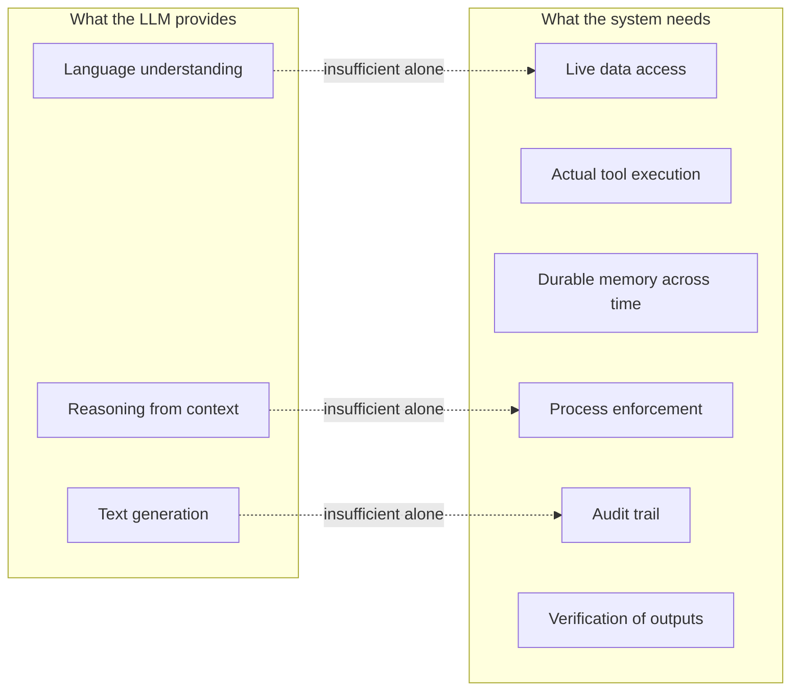

# 0.7 What the model cannot do alone

We now understand what an LLM is: a function that takes a sequence of tokens and produces a probability distribution over the next token. Run it in a loop and you get generated text.

That's genuinely powerful. But there are things it structurally cannot do — not because the model isn't smart enough, but because of what the architecture is. Understanding these limits is the entire motivation for the rest of this book.

## Limit 1: Knowledge frozen at training time

The model's weights encode everything it learned from training data. That data has a cutoff date. After that date, the model knows nothing.

```
User: What is the latest version of Python?
Model: Python 3.11 is the latest stable release.
# (If the training cutoff was before Python 3.12 was released, this is wrong)
```

There's no way around this without architecture changes. The weights are fixed after training. If you want the model to know about something recent, you have to include it in the prompt.

This is why RAG (retrieval-augmented generation) exists: fetch the current information from a database, include it in the prompt, and let the model reason over it. The model can't retrieve — it can only read what you put in front of it.

## Limit 2: No external actions

The model produces text. Text is not an action.

"Send an email to Alice" is a sequence of tokens. It is not a POST request to a mail server. "Transfer $500 to account 789" is text. It is not a bank transaction.

For the model's output to cause something to happen in the world, there must be code outside the model that reads the output and executes the action. The model cannot execute code, make API calls, write files, or change any external state.

This seems obvious but it's worth being explicit about: every agent framework, every tool-calling system, every "do this in the real world" feature of any LLM product is code that the developers wrote, not something the model does. The model proposes; external code acts.

## Limit 3: No memory across sessions

Every call to the model starts fresh. The model has no state between calls.

```python
# Call 1:
response1 = model("My name is Alice. Remember this.")

# Call 2 (a different call, minutes later):
response2 = model("What is my name?")
# The model has no idea. It never saw call 1.
```

Within a single context window, the model has perfect recall — it attends to every prior token. But across calls, nothing persists unless you explicitly feed the conversation history back into the prompt.

"ChatGPT remembers things about me" — only because OpenAI stores your preferences and inserts them into the system prompt. The model itself is stateless.

This is a fundamental architectural property. The weights are fixed. There is no write operation that stores new information into the model during inference.

## Limit 4: No process enforcement

The model cannot guarantee that it follows a specific sequence of steps.

Imagine a compliance requirement: "Before flagging account 456, you must first call getAccount to read the account data." You can write this in the prompt. The model might follow it. But you cannot make it structurally impossible for the model to skip this step.

If the model, due to context or a subtle prompt, decides to flag first and ask questions later — nothing stops it. The instruction is text. The model's response is text. There is no enforcement layer.

In a regulated financial system, "the model might follow the rule" is not good enough. You need it to be architecturally impossible to flag without a prior lookup. That requires code outside the model — a tool registry, a compliance check — that refuses to execute the flag until the precondition is satisfied.

This is the central motivation for CaseBot's architecture.

## Limit 5: No audit trail

The model produces text. That text tells you the answer, but not how the model got there.

"Account 456 has been flagged for suspicious activity." Did the model call getAccount first? Did it read the transaction history? Did it check if there was already an open investigation? You don't know. The output is a conclusion with no record of the reasoning path.

In regulated industries (finance, healthcare, legal), you must be able to show your work. "The AI said so" is not a sufficient audit log. You need: what data was accessed, in what order, with what results, at what timestamp, by what agent.

None of this comes from the model. All of it must be built around the model.

## Limit 6: Context window is finite — and position matters

The model can process at most N tokens at once. For GPT-4, N ≈ 128,000. For many open-source models, N is much smaller. Once you exceed this limit, the model can no longer see the beginning of the conversation.

But there's a subtler problem even within the window: **the model doesn't treat all positions equally**. Research has consistently found that:

- Information at the very beginning of the context is well-attended
- Information at the very end (most recent) is well-attended
- Information in the middle degrades — significantly, at depth ~50–70% of the window

This is called "lost in the middle." A constraint written in the first turn of a long conversation might be technically "in the context" but effectively invisible by turn 50.

We'll measure this precisely in Book 2. For now: being in the context window is necessary but not sufficient for the model to "remember" something.

## Limit 7: Hallucination

The model produces statistically likely continuations of text. Sometimes those continuations are factually wrong, and the model produces them with high confidence and fluent prose.

This is not a bug that will be fixed. It is a structural property of the architecture. The model optimizes for plausibility, not truth. In domains where plausible-sounding text is well-correlated with true text (common knowledge, well-documented topics), the model performs well. In domains where that correlation breaks down (recent events, niche facts, precise numbers), it hallucinates.

The practical implication: you cannot use the model's output directly for safety-critical decisions without an external verification step.

## The gap between what the model can do and what a system needs to do

Let's map each limit to what a real agent system needs:



Every item on the right side requires code outside the model:

| Gap | Solution |
|-----|----------|
| Live data | Tools that fetch current data |
| Tool execution | A registry that validates and executes |
| Durable memory | A typed memory store (memcell-rl) |
| Process enforcement | Stop conditions, property checks |
| Audit trail | Trajectory logging |
| Output verification | Property-based evaluation |

Book 1 builds each of these. The LLM sits inside the system as a reasoning component. Everything else is the system around it.

**Next →** [Workflows vs agents — when to use each](./08-workflows-vs-agents.md)
