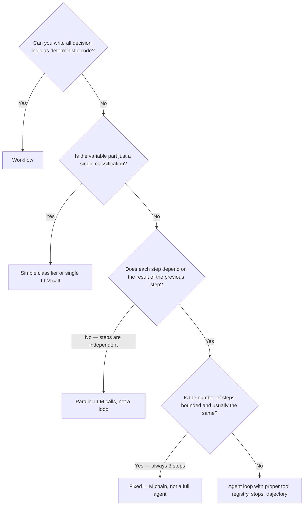

# 0.8 Workflows vs agents — when to use each

We understand what an LLM can and can't do. Now the design question: when do you need an agent — a loop where the LLM decides each step — and when is a simpler workflow enough?

This question matters more than most people realize. Agents are powerful but expensive, slow, and hard to make reliable. Using an agent where a workflow would do is one of the most common mistakes in production AI systems.

## What is a workflow?

A workflow is a **fixed sequence of steps** determined before runtime. You know exactly what will happen: step 1 always runs, then step 2, then step 3. Conditions might skip steps, but the graph is fully specified in advance.

```python
def payment_workflow(payment_id):
    # Step 1: always runs
    payment = database.get_payment(payment_id)
    
    # Step 2: always runs
    receipt = render_receipt(payment)
    
    # Step 3: conditional, but the condition is deterministic
    if payment.amount > 10000:
        compliance_check(payment)
    
    # Step 4: always runs
    email.send(payment.customer_email, receipt)
```

No LLM. No judgment between steps. The logic is in code, not in a model.

Workflows are:
- **Fast**: no LLM inference cost
- **Deterministic**: same input → same behavior every time
- **Easy to test**: you can write a unit test for each step
- **Easy to audit**: the code shows exactly what happened

## What is an agent?

An agent is a **loop where the next step is determined at runtime** by a reasoning component (usually an LLM). The model looks at what has happened so far and decides what to do next. The number of steps, the specific tools called, and the order all depend on the model's judgment.

```python
def agent_loop(task):
    trajectory = []
    context = fetch_context(task)
    
    for step in range(MAX_STEPS):
        # The model decides what to do next
        action = model.decide(task, trajectory, context)
        
        if action.type == "answer":
            return action.text
        
        if action.type == "tool_call":
            result = tools.run(action.tool, action.args)
            trajectory.append((action, result))
            context = refresh_context(task)
```

The agent is more flexible. If the task is "review this account and decide if it looks suspicious", the model might call one tool or five, depending on what it finds.

But agents are:
- **Slow**: each step requires an LLM inference
- **Non-deterministic**: different runs can produce different sequences
- **Hard to test**: you can't easily predict which tools will be called
- **Expensive**: every decision costs tokens
- **Failure-prone**: the model might make wrong decisions at any step

## The key question: where is the judgment?

The right framework is simple: **where in the process is judgment required?**

If every branch and decision can be expressed as a deterministic rule or condition in code, you don't need an agent. If some step requires genuine open-ended judgment that can't be encoded as a rule, you might.

Let's walk through examples.

### Example 1: Sending a confirmation email after payment

```
Payment confirmed → Generate receipt → Send email
```

Every step here is determined by the payment data. There's no point where you need to ask "hmm, what should I do next?" The sequence is fixed. The conditions (if refund, send different email) are deterministic.

**Use a workflow.** Adding an agent here means paying for LLM inference on every payment, introducing non-determinism, and adding a failure mode where the model decides to do something unexpected.

### Example 2: Customer support triage

```
New ticket → Categorize → Route to correct team
```

The categorization step requires judgment. Is "my app won't open" a billing problem, a technical problem, or an account problem? A simple keyword classifier might work for 80% of cases, but the long tail requires understanding context. And the categories can change as the product changes.

You might use an LLM here. But notice: you might also start with a classifier and only escalate to an LLM for cases the classifier isn't confident about. **Use the simplest tool that works.**

### Example 3: Fraud review for account 456

```
Review account 456 → Determine if suspicious → Flag or close
```

This is CaseBot. The task requires:
- Accessing real account data (how much, recent transactions)
- Applying judgment about what "suspicious" means given the data
- Potentially following different paths (no transactions → close immediately vs. large unusual transactions → deeper investigation)
- All while respecting compliance rules (lookup before flag)

The number of steps isn't fixed. The decision at each step depends on what the previous step found. The judgment required (is this pattern suspicious?) can't easily be encoded as rules.

**Use an agent.** But build it carefully: tool registry to prevent unsafe actions, trajectory logging for compliance, property checks to verify behavior.

### Example 4: Data pipeline — extract, transform, load

```
Fetch records from API → Transform schema → Write to database
```

Fixed steps, deterministic transformations, no judgment needed. Even if the transformation is complex, it can be expressed as code.

**Use a workflow (or just code).**

### Example 5: Research assistant

```
Given a question, find relevant papers, synthesize findings, produce a report
```

The number of papers to read isn't fixed. The relevance judgment requires semantic understanding. The synthesis requires combining information from multiple sources with no predefined template. The path depends on what's found.

**Use an agent** — but set tight bounds on maximum steps and token budget. Open-ended research agents are notoriously hard to keep focused.

## The decision framework



The key insight: **agent** is the most expensive option, not the default. Work through the decision tree before reaching for it.

## The mistake that gets made

Most teams reach for agents because they're impressive and flexible. The result is:

- A payment workflow rewritten as an agent that "decides" which emails to send → more tokens, more latency, occasional wrong decisions
- A data pipeline where an agent "decides" how to transform each row → unpredictable transformations, hard to debug
- A classification step replaced by an agent that "decides" the category → slower than a simple classifier with no improvement in quality

**The right question is not "can an agent do this?" — an agent can do almost anything. The right question is "is an agent the appropriate tool for this?"**

An agent is appropriate when:
1. The task requires open-ended judgment that varies case by case
2. The number or sequence of steps isn't known in advance
3. The task accesses real-world data whose structure affects what to do next
4. You can define properties to verify the agent behaved correctly (Book 2)

## What CaseBot teaches

CaseBot is an agent because:
- The same account might need 1 tool call or 5, depending on what the data shows
- The decision to flag vs close requires reading the data and applying judgment
- Compliance requires that the lookup always precedes the flag — enforced by code, not trust
- The process must be auditable — every step logged

These conditions don't hold for sending confirmation emails. They do hold for regulated financial case review. The architecture is chosen to match the requirements, not to seem sophisticated.

---

You now understand the complete picture: what an LLM is, how it produces text, what it structurally cannot do, and when to build an agent around it vs. when a simpler system is enough.

Book 1 builds the agent for CaseBot, layer by layer. Every architectural decision points back to a specific limit from chapter 0.7.

| Limit (0.7) | Book 1 chapter |
|-------------|----------------|
| No external actions | 1.3 Tools |
| No audit trail | 1.4 Trajectory |
| No durable memory | 1.5–1.7 Memory |
| No process enforcement | 1.3 Permissions + 1.9 Stops |
| Context window finite | 1.5–1.7 Budget assembly |

**Next →** [Book 1 Roadmap — start building CaseBot](../book1/00-roadmap.md)
