# Book 1 Roadmap — Building CaseBot

One case. One build path. Ten chapters. Each chapter adds **one layer** to the same system.

**Case:** Review account 456 for fraud in a regulated workflow.  
**Artifact:** [`casebot_regulated.py`](https://github.com/adu3110/memcell-rl/blob/main/examples/casebot_regulated.py) — you reach it in chapter 1.10, not on day one.

## How to read this book

1. Run the command at the top of each chapter.
2. Read the output — especially the failure.
3. Read why that failure happens.
4. Move to the next chapter, which fixes exactly that failure.

Do not skip ahead. The failures are the curriculum.

## The build path

```bash
cd repos/memcell-rl   # or your cloned memcell-rl repo

python3 examples/build/step01_task.py      # ch 1.1
python3 examples/build/step02_loop.py       # ch 1.2
python3 examples/build/step03_tools.py     # ch 1.3
python3 examples/build/step04_trajectory.py # ch 1.4
python3 examples/build/step05_chat_memory.py # ch 1.5
python3 examples/build/step06_typed_memory.py # ch 1.6
python3 examples/build/step07_memcell.py   # ch 1.7
python3 examples/build/step08_planner.py   # ch 1.8
python3 examples/build/step09_stops.py       # ch 1.9
python3 examples/casebot_regulated.py --dry-run  # ch 1.10
```

## The system grows chapter by chapter

```mermaid
flowchart TB
  subgraph ch11 [After 1.1 — task only]
    T1[Task string]
  end
  subgraph ch12 [After 1.2 — loop]
    T2[Task] --> L[Loop: decide → act → observe]
  end
  subgraph ch13 [After 1.3 — tools]
    L2[Loop] --> TR[ToolRegistry]
  end
  subgraph ch14 [After 1.4 — audit]
    L3[Loop] --> TR2[Tools] --> TJ[Trajectory JSON]
  end
  subgraph ch1517 [After 1.5–1.7 — memory]
    L4[Loop] --> MC[Typed memory + context assembly]
  end
  subgraph ch1819 [After 1.8–1.9 — planner + stops]
    L5[Loop] --> PL[Planner] --> ST[Stop conditions]
  end
  subgraph ch110 [After 1.10 — CaseBot]
    CB[casebot_regulated.py]
  end
```



## Chapter map — what each layer fixes

| Ch | Title | Run | What CaseBot gains | What breaks without it |
|----|-------|-----|-------------------|------------------------|
| [1.1](./02-philosophy.md) | A task is not an agent | step01 | The problem statement | Nothing runs — no lookup, no log |
| [1.2](./03-agent-loop.md) | The minimal loop | step02 | decide → act → observe | `tool not defined` on step 1 |
| [1.3](./07-tools.md) | Tools from scratch | step03 | ToolRegistry + permissions | Unknown tools, no permission gate |
| [1.4](./10-trajectory.md) | Trajectory logging | step04 | Audit JSON per run | Can't prove lookup-before-flag |
| [1.5](./04-state.md) | Chat history is not memory | step05 | Understanding the memory problem | Constraint dropped after 12 turns |
| [1.6](./05-typed-memory.md) | Typed memory cells | step06 | constraint / fact / episode types | Constraints compete with tool output |
| [1.7](./06-context-assembly.md) | Context under a budget | step07 | memcell-rl `decide()` API | Wrong facts in prompt under pressure |
| [1.8](./08-planning.md) | Planning and scratchpads | step08 | Swappable planner (script → LLM) | Can't swap reasoning without rewriting loop |
| [1.9](./09-stop-escalate.md) | Stop conditions | step09 | duplicate / error / max-steps stops | Infinite loops, silent failures |
| [1.10](./11-together.md) | Putting it together | casebot | Full regulated CaseBot | — |

## Why memory comes after trajectory (on purpose)

Chapter 1.4 adds **audit** before chapter 1.5 adds **memory**. That order matches the build scripts — and it's intentional:

- First you need to *prove* what the agent did (trajectory).
- Then you discover that chat history drops constraints (memory problem).
- Then you fix memory properly (typed cells + context assembly).

If we taught memory first, you'd fix a problem you hadn't seen fail yet.

## Connection to Book 0

If you read [Book 0](../book0/00-introduction-to-book0.md), each limit maps to a chapter here:

| LLM limit (Book 0) | Book 1 chapter |
|--------------------|----------------|
| No external actions | 1.3 Tools |
| No audit trail | 1.4 Trajectory |
| No durable memory | 1.5–1.7 Memory + context |
| No process enforcement | 1.3 Permissions + 1.9 Stops |
| Context window finite | 1.5–1.7 Budget assembly |

**Start →** [1.1 A task is not an agent](./02-philosophy.md)
