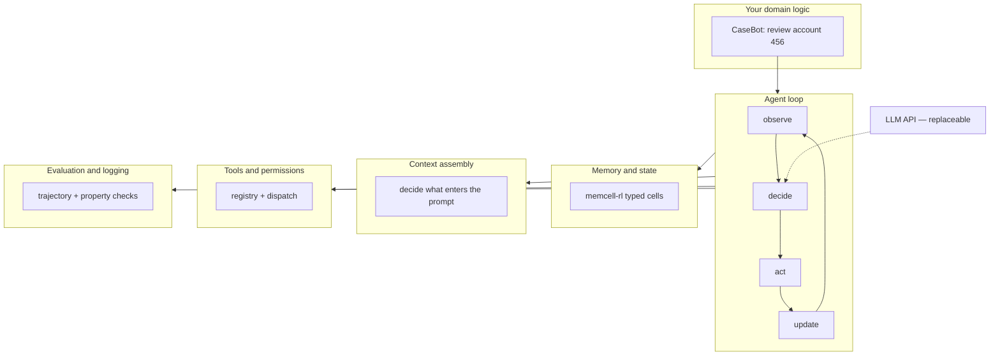
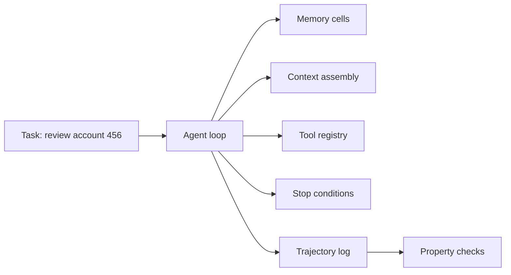

# 1. Overview and Philosophy

Before we write any code, I want you to see the whole machine. Every agent — whether it's a coding assistant, a customer-support bot, or a regulated case-resolution system — is built from the same six layers. Frameworks bundle them together and hide the seams. We're going to expose every seam.

## The agent stack



CaseBot sits at the top. The loop orchestrates everything. The LLM is one component inside "decide" — not the architecture.

## What breaks in production

I've debugged agent failures in regulated workflows. They almost never look like "the model is dumb." They look like this:

| Incident | Real cause | Layer |
|----------|------------|-------|
| Agent "forgot" the constraint from turn 2 | Constraint was a chat message, not a typed cell | Memory |
| Agent called `flagAccount` before reading transactions | No step-order enforcement | Loop / eval |
| Agent waived a fee without supervisor approval | Permission gate missing on tool | Tools |
| Agent looped `getAccount("456")` six times | No duplicate detection | Loop |
| Correct data stored, wrong answer produced | Wrong cells injected into context | Context assembly |
| Passed demo, failed at 50 messages | Unbounded transcript growth | Context assembly |

You cannot fix a memory bug by changing the system prompt. You need to know which layer failed.

## Design principles

### 1. State is a program, not a transcript

The naive approach: append every message to a list and send the list to the LLM. That list grows forever. Constraints from turn 1 get buried under forty tool outputs. The model doesn't "forget" — **you never stored the constraint as durable state.**

In CaseBot, a fraud-review rule is a **typed memory cell** with `criticality: 0.95`. It survives forty turns because the context assembler always injects it first — not because the model has a good memory.

### 2. Actions are typed and validated before dispatch

The LLM proposes actions. Your code decides whether they're allowed.

```python
# Never do this
result = eval(llm_response)

# Do this
result = registry.run("flagAccount", {"accountId": "456"}, permissions=agent_permissions)
# → ToolResult(success=False, error="permission_denied: write:accounts required")
```

CaseBot's investigator agent has `read:accounts` but not `write:accounts`. A destructive action fails at the registry — before it touches production systems.

### 3. The unit of evaluation is the trajectory, not the final answer

Two runs can produce the same final answer. One is a compliance failure.

**Run A** — answer: "Flagged" ✓  
Step 0: `flagAccount("456")` — no prior lookup.

**Run B** — answer: "Flagged" ✓  
Step 0: `getAccount("456")`  
Step 1: `getTransactions("456")`  
Step 2: `flagAccount("456")` — after full protocol.

Run A scores 100% on naive accuracy. Run A is a compliance failure. We measure **trajectories**, not strings.

Try it:

```bash
python examples/casebot_regulated.py --dry-run --bad-run
# FAIL  lookup_before_flag: flagAccount without prior getAccount
```

### 4. The LLM is a component, not the architecture

```
LLM decides WHAT to do.
Python decides WHETHER it's allowed.
Python decides WHAT state is updated.
Python decides WHAT gets logged.
```

Swap `gpt-4o-mini` for another model without touching the loop, memory, tools, or eval.

### 5. Build naive first, measure the failure, add the layer

This book follows that progression:

| Week | What you have | What breaks | What you add |
|------|---------------|-------------|--------------|
| 1 | Chat-only loop | Works on demos | — |
| 2 | First constraint violation | Rules buried in chat | Typed memory |
| 3 | Context overflow at 40 turns | Old constraints invisible | Context assembly |
| 4 | Tool loop in production | Same call repeated | Duplicate detection + step budget |

Each chapter adds one layer to CaseBot. By chapter 10, you have a system you can audit.

## The spine diagram

We will extend this diagram every chapter. Highlighted boxes are added in that chapter.



**Next →** [The Minimal Agent Loop](./03-agent-loop.md)
