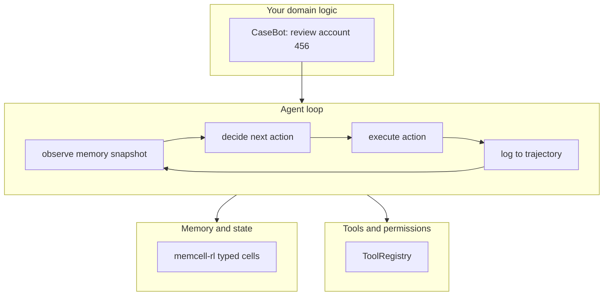

# 9. Overview — a task is not an agent

Run this first:

```bash
cd repos/memcell-rl   # or cd memcell-rl if you cloned it standalone
python3 examples/build/step01_task.py
```

```
Task: Review account 456 for fraud indicators. Flag only if suspicious after full lookup.

Nothing happens. No lookup. No audit trail. No stop condition.
```

That's the whole point of this chapter. A task description is not an agent. The gap between the two is everything we'll build in this book.

## What just happened

`step01_task.py` prints a string. That's it. You have a task — a sentence describing what needs to be done. But:

- Nobody looked up account 456
- Nobody checked the transaction history
- No decision was made about whether to flag
- Nothing was logged

If you called an LLM with just that task string, it would produce text — maybe "I would look up account 456 and check for suspicious patterns." But it would not *actually* look up account 456. It doesn't have access to your database. It cannot execute code. It generates a plausible-sounding response based on its training data.

The LLM's output is text. Actions require code.

## The five things an agent needs that a task string lacks

**1. A loop that acts and observes**

A task string describes what to do. An agent *does* it, observes the result, and decides what to do next. The loop is fundamental — the agent doesn't know in advance exactly how many steps it will take or what each step will reveal.

**2. Tool access**

Looking up account 456 means calling a function that queries a database. The agent needs access to these functions (tools), a way to call them with validated arguments, and a way to receive structured results.

**3. Memory**

During a case review, the agent learns things: the account balance, the transaction history, whether a constraint is active. These facts need to be available for later steps. Not just in the LLM's context window — in a structured store that survives process restarts and can be shared across multiple agents.

**4. A trajectory log**

Every action must be recorded: which tool was called, with what arguments, what result came back, at what time. This is the audit trail. Without it, you cannot answer "did the agent look up the account before flagging it?" — the compliance question that regulators will ask.

**5. Stop conditions**

The agent needs to know when to stop and how to stop safely. Maximum steps. Duplicate tool calls. Tool failures. Each of these should produce a named, logged escalation — not a crash, not an infinite loop, not silent failure.



## Why CaseBot?

Throughout this book, we build one agent: CaseBot. It reviews case 456 — a financial account flagged for potential fraud in a regulated workflow.

Why this specific example? Because it's simple enough to build completely in one book, and complex enough to require every mechanism we're going to add:

- It needs to access data (tool calls)
- It operates under compliance constraints (memory, process enforcement)
- Its decisions must be auditable (trajectory logging)
- It must handle failures safely (stop conditions)
- The sequence of actions it takes affects whether it passes compliance review (property checks)

The underlying case is always account 456:

```python
# This is the complete "case data" for the whole book
ACCOUNTS = {
    "456": {
        "account_id": "456",
        "status": "active",
        "balance_usd": 142.50,
        "fraud_review": True,
    }
}

TRANSACTIONS = {
    "456": [
        {"id": "tx1", "amount": 45.00, "status": "settled"},
        {"id": "tx2", "amount": 12.50, "status": "settled"},
    ]
}
```

Two settled transactions, a small balance, an account under fraud review. Everything fits in a few lines. The complexity isn't in the data — it's in the *process* of reviewing it correctly.

## What usually breaks first (so you know where we're going)

Before we build the right architecture, it's worth understanding what the wrong architectures fail at:

| If you try | It breaks when |
|-----------|----------------|
| One-shot LLM call ("just ask the LLM") | The LLM says what it would do, but can't do it — no tool access |
| LLM with tools but no logging | Compliance asks for the audit trail — there isn't one |
| LLM with tools and logging but no memory | A constraint from the system prompt gets buried under tool output in long cases |
| All of the above but no stop conditions | The agent loops, retries the same tool, burns tokens and money |
| Everything above but no property checks | The agent passes 92% of cases correctly but has silent compliance failures in 8% |

Each chapter adds one piece. By chapter 10, we have a system that handles all five.

## The rules for this book

1. **Run the code before you read the explanation.** See the output, then understand why.
2. **One mechanism per chapter.** If a chapter covers two things, the second thing belongs in the next chapter.
3. **Scripts before LLMs.** Every build step uses a hardcoded plan — not an LLM. If the system fails with a hardcoded plan, the bug is in the infrastructure, not the model.
4. **Same case throughout.** Account 456. Same fixture data. Same compliance rules. The architecture is what changes.

**Next →** [The minimal loop](./03-agent-loop.md)
