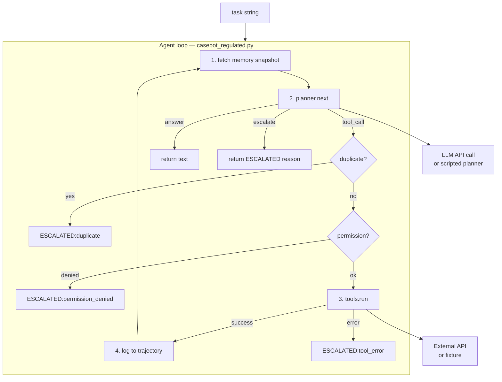
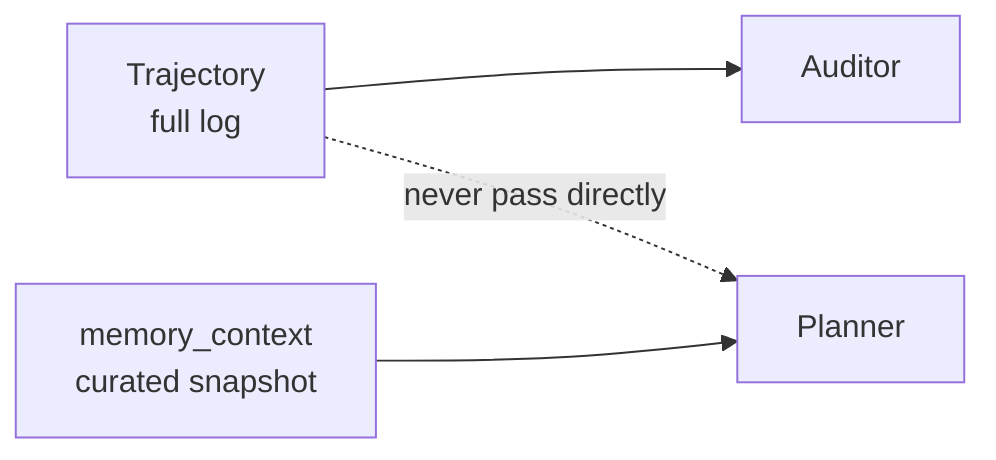
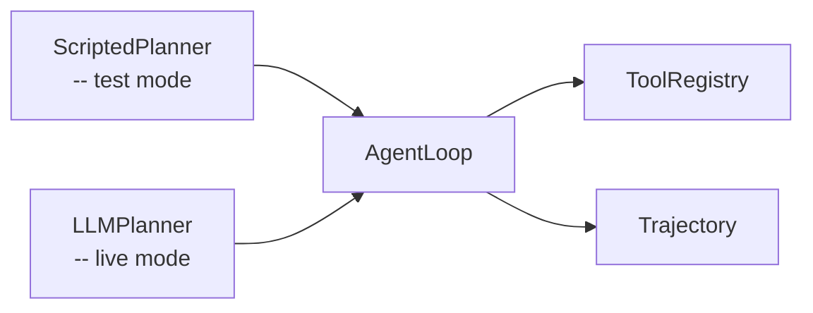

# 2. The Minimal Agent Loop

Let me start with the claim that I think is underappreciated: an agent loop is not complicated. The core is maybe 50 lines. Every complexity you will encounter building real agent systems comes from **what goes around the loop** — memory, tools, planning, evaluation — not from the loop itself.

But those 50 lines have to be exactly right. The decisions baked into them determine everything else: whether you can test without an LLM, whether trajectories are replayable, whether escalation works under token pressure. This chapter walks through every line of CaseBot's loop and explains why each one is the way it is.

## The problem the loop solves

CaseBot receives a task: *"Review account 456 for fraud indicators."*

It needs to:
1. Look up account data
2. Look up transaction history
3. Decide whether to flag the account or close the case
4. Report its conclusion with an audit trail

None of those steps happen at once. The agent has to act, see results, decide again, act again. That sequential decision-making over multiple steps with external state is what the loop provides.

The naive approach: send the task to an LLM, get back a response, done. That breaks immediately when the response needs to include real account data (the LLM doesn't have it), when you need an audit trail of specific API calls (not a chat transcript), and when you need to enforce compliance rules that prevent the agent from taking unsafe actions.

The loop is the scaffolding that makes all of those things possible.

## Architecture



Every iteration does exactly four things: read state, decide next action, dispatch it, record it. The loop doesn't call the LLM directly. It calls the planner. The planner may call an LLM, or it may be a scripted sequence for testing. The loop doesn't know and doesn't care.

## The code, line by line

From `memcell-rl/examples/casebot_regulated.py`:

```python
MAX_STEPS = 10

class AgentLoop:
    def __init__(
        self,
        task: str,
        tools: ToolRegistry,
        planner: Callable,
        memory_context: str = "",
    ):
        self.task = task
        self.tools = tools
        self.planner = planner
        self.memory_context = memory_context
        self.seen_calls: set[str] = set()           # duplicate detection
        self.trajectory = Trajectory(case_id="456", task=task)
```

`seen_calls` is a set of JSON-serialized `(tool, args)` signatures. If the planner issues the same tool call twice, we catch it before it goes to the API.

`trajectory` is the log — every step gets recorded here. It's what compliance auditors read when they ask "what exactly did the agent do?"

```python
    def run(self) -> str:
        for step in range(MAX_STEPS):
            # ── 1. Decide ──────────────────────────────────────────────────────
            action = self.planner(step, self.trajectory, self.memory_context)

            # ── 2. Dispatch ────────────────────────────────────────────────────
            if action.type == ActionType.TOOL_CALL:

                # Duplicate detection
                sig = json.dumps(
                    {"tool": action.tool, "args": action.args},
                    sort_keys=True,
                )
                if sig in self.seen_calls:
                    self.trajectory.log(step, action, None)
                    return f"ESCALATED:duplicate_tool_call at step {step}"
                self.seen_calls.add(sig)

                # Dispatch to registry (permission checked inside)
                result = self.tools.run(action.tool, action.args)
                self.trajectory.log(step, action, result)

                if not result.success:
                    return f"ESCALATED:tool_error:{result.error}"

                # Update memory context for next iteration
                self.memory_context = fetch_memcell_context(self.task)

            elif action.type == ActionType.ANSWER:
                self.trajectory.log(step, action, None)
                return action.text or ""

            elif action.type == ActionType.ESCALATE:
                self.trajectory.log(step, action, None)
                return f"ESCALATED:{action.reason}"

        # Fell off the loop — step cap hit
        return "ESCALATED:max_steps_exceeded"
```

Notice that after every successful tool call, we refresh `memory_context`. This is the point where new observations become available to the planner. The planner on the next iteration sees the fresh balance and transaction data. Without this, the planner is flying blind after step 0.

## Action types

An agent can only do three things. Making them explicit is important because it stops you from accidentally adding a fourth:

```python
class ActionType(str, Enum):
    TOOL_CALL = "tool_call"   # call an external tool
    ANSWER    = "answer"      # give a final response and stop
    ESCALATE  = "escalate"    # hand off to a human and stop
```

When the planner returns an action, it must be one of these three. The loop pattern-matches on the type. If the LLM returns garbage, it gets `ESCALATED:tool_error:unknown_tool:garbage`. The loop never breaks — it escalates.

## The two runs

Run the good path:

```bash
python examples/casebot_regulated.py --dry-run
```

```
[step 0] tool_call: getAccount {'accountId': '456'}
  → success: balance $142.50, fraud_review=True

[step 1] tool_call: getTransactions {'accountId': '456'}
  → success: 2 settled transactions

[step 2] answer
  → Account 456 reviewed. Balance $142.50. Two settled transactions. No fraud indicators. Case closed.

Outcome: Account 456 reviewed. ...
Tools used: ['getAccount', 'getTransactions']
Steps: 3
  PASS  lookup_before_flag
  PASS  bounded_steps
```

Run the bad path:

```bash
python examples/casebot_regulated.py --dry-run --bad-run
```

```
[step 0] tool_call: flagAccount {'accountId': '456', 'reason': 'suspicious'}
  → FAIL: permission_denied: write:accounts required

Outcome: ESCALATED:tool_error:permission_denied: write:accounts required
Tools used: ['flagAccount']
Steps: 1
  FAIL  lookup_before_flag: flagAccount without prior getAccount
```

Both runs hit different stop conditions. The good run hits `answer`. The bad run hits `tool_error`. Neither runs forever. Neither silently produces a wrong answer.

## Failure mode 1: growing context

The most common production mistake I've seen: the loop passes `trajectory.full_text()` to the planner every iteration.

```
step  1: 50 tokens  (initial context)
step  5: 600 tokens
step 10: 1800 tokens
step 20: 5000 tokens  ← constraint from step 1 is now ~4800 tokens deep
step 40: budget overflow or silent truncation
```

The correct approach: pass `memory_context` to the planner — a curated snapshot assembled by the context assembler (Chapter 5). The trajectory is for audit. The memory context is for the planner. They are not the same thing.



## Failure mode 2: the planner is an afterthought

When teams start with LangChain or similar, the "planner" is implicit — the framework calls the LLM and parses function calls. This hides a very important question: *how does the agent know what step it's on?*

In CaseBot, the planner receives `(step, trajectory, memory_context)`. It knows the step number and can read what already happened from the trajectory. A new LLM call at step 3 includes this history, so it doesn't re-discover step 0.

If you skip this — if the planner just receives a static system prompt and the latest tool result — the agent has no idea whether it's making progress.

## Failure mode 3: missing termination

```python
# Broken loop — no ceiling
while True:
    action = planner(step, traj, ctx)
    if action.type == ActionType.ANSWER:
        break
    result = tools.run(action.tool, action.args)
    # What if result.success is never True?
```

Add `MAX_STEPS`. Make it a first-class parameter per task type. Make the step-exceeded path an escalation, not a crash.

## Why I start with a scripted planner

Before adding an LLM to CaseBot, I verified the loop works with hardcoded actions:

```python
def good_run_planner(step: int, traj: Trajectory, memory: str) -> Action:
    SCRIPT = [
        Action(type=ActionType.TOOL_CALL, tool="getAccount",
               args={"accountId": "456"}),
        Action(type=ActionType.TOOL_CALL, tool="getTransactions",
               args={"accountId": "456"}),
        Action(type=ActionType.ANSWER,
               text="Account 456 reviewed. Case closed."),
    ]
    return SCRIPT[step]
```

This runs in under a second, requires no API key, and tests everything except the LLM: the loop control flow, the tool dispatch, the trajectory logging, the property checks. If a property fails with a scripted planner, the bug is in the loop or tools — not the LLM.

Only after the scripted planner passes all property checks do I swap in the LLM.

## The separation that makes testing possible



The loop is deterministic and testable. The planners are swappable. The same property checks run on both. This is the architecture decision I care most about in Book 1.

## Exercise

1. Run `--dry-run --bad-run` and read `logs/case456.json`. Which step triggered the property failure? What would you add to the loop to stop the agent *before* the tool call, not just fail the check after?

2. Add a third planner that returns `escalate` immediately (simulating a confused agent). Confirm the loop terminates with `ESCALATED:agent_confused` and logs one step to the trajectory.

3. Modify `MAX_STEPS` to 2. Run `--dry-run`. What happens? Check the outcome string and the trajectory file.

**Next →** [State: Chat History Is Not Memory](./04-state.md)
