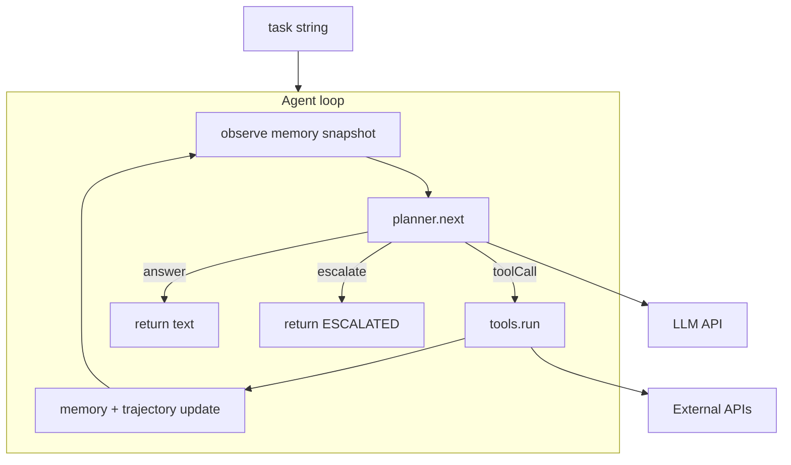
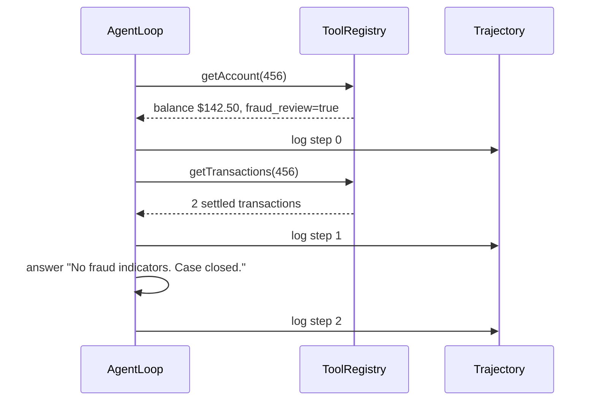

# 2. The Minimal Agent Loop

The agent loop is the heartbeat of every agentic system. It's embarrassingly simple on paper:

**observe → decide → act → update → repeat**

But the details matter enormously. This chapter builds the smallest loop that actually works for CaseBot — and shows the three ways it breaks in production.

## Architecture



Every iteration: read state, decide the next action, dispatch it, log it, loop.

## Action types

An agent can only do a few things. Make them explicit:

```python
class ActionType(str, Enum):
    TOOL_CALL = "tool_call"
    ANSWER = "answer"
    ESCALATE = "escalate"
```

| Action | What happens |
|--------|----------------|
| `tool_call` | Validated against registry; result stored |
| `answer` | Loop terminates; text returned |
| `escalate` | Loop terminates; human queue notified |

No free-form strings. No `eval()`. The LLM emits JSON; Python parses it into an `Action`.

## The loop

Here is the core of CaseBot — from `casebot_regulated.py`:

```python
class AgentLoop:
    def __init__(self, task, tools, planner, memory_context=""):
        self.task = task
        self.tools = tools
        self.planner = planner
        self.seen_calls: set[str] = set()
        self.trajectory = Trajectory(case_id="456", task=task)

    def run(self) -> str:
        for step in range(MAX_STEPS):
            action = self.planner(step, self.trajectory, self.memory_context)

            if action.type == ActionType.TOOL_CALL:
                sig = json.dumps({"tool": action.tool, "args": action.args}, sort_keys=True)
                if sig in self.seen_calls:
                    return f"ESCALATED:duplicate_tool_call at step {step}"
                self.seen_calls.add(sig)

                result = self.tools.run(action.tool, action.args)
                self.trajectory.log(step, action, result)
                if not result.success:
                    return f"ESCALATED:tool_error:{result.error}"

            elif action.type == ActionType.ANSWER:
                self.trajectory.log(step, action)
                return action.text or ""

            elif action.type == ActionType.ESCALATE:
                self.trajectory.log(step, action)
                return f"ESCALATED:{action.reason}"

        return "ESCALATED:max_steps_exceeded"
```

Notice what the loop **does not** do: it does not call the LLM directly. The `planner` decides the next action. In `--dry-run` mode, the planner is a scripted sequence — so you can test the loop without an API key. In `--live` mode, the planner wraps an LLM call. Same loop. Different planner.

That's the separation I care about.

## A compliant run

Case 456: review for fraud. The good planner executes three steps:



```bash
python examples/casebot_regulated.py --dry-run
```

```
Outcome: Account 456 reviewed. Balance $142.50. Two settled transactions. No fraud indicators. Case closed.
Tools:   ['getAccount', 'getTransactions']
Steps:   3
  PASS  lookup_before_flag
  PASS  bounded_steps
```

## Failure mode 1: duplicate tool calls

Without duplicate detection:

```
step 0: getAccount("456") → ok
step 1: getAccount("456") → ok   ← LLM confused
step 2: getAccount("456") → ok   ← burning tokens, no progress
```

The fix is three lines: hash the `(tool, args)` pair, check the set, escalate on repeat. You saw this in the loop above.

## Failure mode 2: silent context overflow

If you pass the entire growing transcript to the planner every turn:

```
step  1:  user message           ~  50 tokens
step 10:  10 observations        ~ 800 tokens
step 20:  20 observations        ~2000 tokens  ← quality drops
step 40:  40 observations        ~4000 tokens  ← old constraints invisible
```

The loop must pass a **bounded snapshot** to the planner — never the raw growing array. Chapter 5 handles what goes into that snapshot. Chapter 3 handles what gets stored.

## Failure mode 3: no termination

Always set `max_steps`. Always handle escalate. A loop without a ceiling will run until your API budget runs out.

```python
MAX_STEPS = 12  # case resolution, not open-ended chat
```

## Why I start with a scripted planner

When I build a new agent system, I don't start with an LLM. I start with a hard-coded planner that returns a fixed sequence of actions. If the loop, tools, and trajectory logging don't work with a script, they won't work with an LLM either.

```python
def good_run_planner(step, traj, memory):
    script = [
        Action(type=ActionType.TOOL_CALL, tool="getAccount", args={"accountId": "456"}),
        Action(type=ActionType.TOOL_CALL, tool="getTransactions", args={"accountId": "456"}),
        Action(type=ActionType.ANSWER, text="Account 456 reviewed. Case closed."),
    ]
    return script[step]
```

Once this passes property checks, swap in an LLM planner. The loop doesn't change.

## Exercise

Run the bad path and read the trajectory file:

```bash
python examples/casebot_regulated.py --dry-run --bad-run
cat logs/case456.json | python -m json.tool
```

Why does `lookup_before_flag` fail? What would you add to stop the agent before the tool call, not after?

**Next →** [State: Chat History Is Not Memory](./04-state.md)
