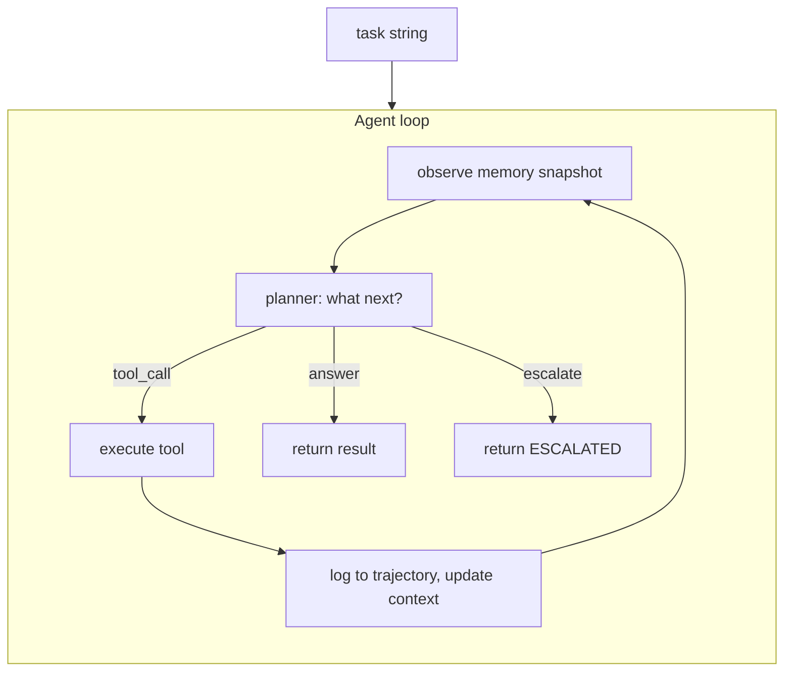

# 1.2 The minimal loop

## Where we are

After chapter 1.1: you have a task string for account 456. Nothing executes.

## What we're fixing this chapter

An agent needs to **act and observe in a loop** — not just describe what it would do. We add the smallest loop that runs steps in sequence.

An agent loop is: **decide → act → observe → repeat**.

Four words. But each one hides decisions that matter. Let's build the smallest version that actually works, see what it produces, and then understand each part.

Run step 2:

```bash
python3 examples/build/step02_loop.py
```

```
Task: Review account 456 for fraud indicators.

step 0: getAccount {'accountId': '456'}
  → {'balance_usd': 142.5, 'status': 'active'}
step 1: getTransactions {'accountId': '456'}
  → ERROR: tool not defined

We have a loop shape. Next: a tool registry so dispatch is explicit.
```

Step 0 succeeds. Step 1 fails with "tool not defined." We have a loop shape. The failure shows exactly where the next layer goes.



## The code, explained line by line

```python
# The full step02_loop.py

ACCOUNTS = {"456": {"balance_usd": 142.50, "status": "active"}}

# The plan: what to do, in order
# In later chapters, this becomes a planner function (or an LLM)
script = [
    ("getAccount",      {"accountId": "456"}),
    ("getTransactions", {"accountId": "456"}),
    ("answer",          {"text": "Case closed."}),
]

for step, (name, args) in enumerate(script):
    print(f"step {step}: {name} {args}")
    
    if name == "getAccount":
        data = ACCOUNTS.get(args["accountId"])
        if data is None:
            print("  → ERROR: account not found")
            break
        print(f"  → {data}")
    
    elif name == "answer":
        print(f"  → {args['text']}")
        break   # loop ends on answer
    
    else:
        print(f"  → ERROR: tool not defined")
        break   # loop ends on unknown tool
```

Three things to notice:

**1. `script` is the planner.** Right now the plan is hardcoded. In chapter 1.8, we replace this with a function. In `--live` mode, we replace it with an LLM call. But the loop itself doesn't change — only what produces the next action changes.

**2. The loop ends when it gets an answer or an error.** This is a stop condition. The loop doesn't run forever. It terminates on completion or failure. We'll make these termination conditions more sophisticated in chapter 1.9.

**3. Step 1 fails because `getTransactions` has no handler.** This is intentional — the loop fails gracefully (it prints the error and stops) rather than crashing or silently skipping the step. Chapter 1.3 builds the tool registry that makes dispatch explicit.

## Why not just call the LLM once?

This question comes up constantly: "Why build a loop? Why not just ask the LLM once and have it give me the answer?"

For CaseBot specifically, three reasons:

**The LLM doesn't have account 456's data.** The model was trained on general text; it doesn't know that account 456 has a balance of $142.50 and two transactions. You have to go get that data. That requires a tool call. A tool call requires a loop — you have to run the tool, get the result, then decide what to do next.

**Compliance requires a record of what happened.** If a regulator asks "did the agent look at the account data before flagging?", you need evidence. An evidence trail requires logging each step. Logging requires the loop.

**The number of steps isn't fixed.** Maybe this case needs 2 tool calls. Maybe it needs 5 because of suspicious patterns that require additional investigation. You don't know in advance. A loop handles variable numbers of steps naturally; a single call cannot.

This tradeoff is real: the loop is more expensive and more complex than a single call. But for a regulated workflow with real tool calls, there's no alternative.

## Action types: the vocabulary of the loop

The loop needs to know what kind of action the planner returned. There are exactly three possibilities:

```python
from enum import Enum

class ActionType(str, Enum):
    TOOL_CALL = "tool_call"   # execute a tool, observe the result, continue
    ANSWER    = "answer"      # the task is complete, return this text
    ESCALATE  = "escalate"    # something went wrong, route to a human
```

No free-form strings. No `eval()`. No "maybe do this". The planner returns one of these three types, and the loop handles each one:

- `TOOL_CALL`: validate the tool name, check permissions, execute, log result, continue
- `ANSWER`: log the final text, return from the loop
- `ESCALATE`: log the reason, return from the loop with an `ESCALATED:` prefix

This enum is enforced at the loop level. The planner can't return "do something creative" — it returns one of these three options.

## What the loop is not

The loop is not an LLM. It is not intelligence. It is a control structure — the scaffolding that runs around the reasoning component. The loop:

- Keeps track of which step we're on
- Checks stop conditions (duplicate calls, max steps)
- Logs every action and result
- Routes actions to the right handler

The reasoning (deciding which tool to call, when to stop, what the answer is) can be scripted (hardcoded list) or LLM-driven. The loop works the same either way.

This separation — reasoning component vs. control structure — is the most important architectural principle in this book. It means you can test the control structure without an LLM, swap different planners in and out without touching the loop, and diagnose failures by looking at the trajectory rather than the model's outputs.

## Change one thing and see what breaks

A good way to build intuition: in `step02_loop.py`, change one thing in the script:

```python
# Change: add a second getAccount at the start
script = [
    ("getAccount",      {"accountId": "456"}),   # added
    ("getAccount",      {"accountId": "456"}),   # duplicate
    ("getTransactions", {"accountId": "456"}),
    ("answer",          {"text": "Case closed."}),
]
```

Now the same tool is called twice with the same arguments. This runs fine right now. But when a human reviews the trajectory: why was the account looked up twice? If the case took 15 minutes and two tool calls, and someone doubled the cost for no reason, that's a problem. Chapter 1.9 adds duplicate detection that catches this automatically.

## What changed in CaseBot

```
Task string → Loop (hardcoded script) → inline getAccount handler only
```

The loop exists. Only one tool works. Everything else returns `tool not defined`.

## What breaks next

Step 02 fails on `getTransactions` because there is no registry — tools are hardcoded inside the loop. Chapter 1.3 adds `ToolRegistry`.

**Next →** [1.3 Tools from scratch](./07-tools.md)
