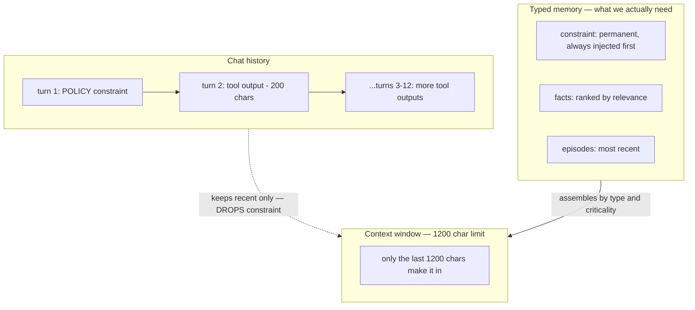

# 1.5 Chat history is not memory

## Where we are

After chapter 1.4: CaseBot has loop + tools + trajectory. The agent can act and prove what it did. But **what the agent knows each turn** is still undefined — most tutorials just append chat messages.

## What we're fixing this chapter

We run step 05 and watch a fraud constraint disappear from context after 12 turns — not because anyone deleted it, but because chat history truncation dropped it. This chapter names the problem. Chapters 1.6–1.7 fix it.

Most tutorials on LLM agents treat "memory" as a growing list of messages that gets appended to the prompt. Let's see exactly why this breaks, and what to do instead.

Run step 5:

```bash
python3 examples/build/step05_chat_memory.py
```

```
turn  1: context  1214 chars  constraint visible=True
turn  2: context  1214 chars  constraint visible=False
turn  3: context  1214 chars  constraint visible=False
...
turn 12: context  1214 chars  constraint visible=False

Constraint from turn 1 is gone. Agent can violate policy.
```

Turn 1 adds: `POLICY: no outbound transfers until fraud review closes`.  
Turns 2–12 add large tool outputs (account data, transaction lists). The assembler keeps only the last 1200 characters of the chat history. The constraint, at the start, was pushed out.

The model was never told "forget the constraint." The code never deleted it. But it's not in the context anymore. The agent can now violate the policy without any indication that it's doing something wrong.



## Three things that look the same but aren't

This is the core confusion that the chat-history approach causes:

```
chat history   = everything that happened (grows forever, unstructured)
context window = what the LLM sees this turn (budget-capped, curated)
memory         = typed state you deliberately manage (scoped, ranked, lifecycle)
```

**Chat history** is a log — it records everything. If you use it directly as the prompt, you eventually run out of context window. If you truncate it, you drop things. If you summarize it, you lose precision.

**The context window** is what actually goes to the LLM. It has a token budget. You choose what goes in it. Choosing poorly means the model doesn't see things it needs to see.

**Memory** is what you, the system designer, are deliberately managing. A constraint is a fact with a specific type, scope, and lifecycle. It should be injected into the context window unconditionally, before anything else, regardless of how long the conversation has been running.

The mistake is treating these three as the same thing. They're not.

## Why naive truncation fails

The naive assembler looks like this:

```python
def build_context_naive(messages: list[str], max_chars: int = 1200) -> str:
    full = "\n".join(messages)
    return full[-max_chars:]   # keep only the last N characters
```

This keeps recent content and drops old content. That's fine for episode data (what happened in the last few turns). It's catastrophic for constraints (rules that must always apply).

"No outbound transfers until fraud review closes" is not episode data. It's not something that becomes less relevant as more turns pass. It's a hard constraint with policy authority. But a naive truncator doesn't know the difference between a constraint and a tool result — it just counts characters.

## The fix: separate type from recency

The right architecture stores different things differently:

```python
# Not just messages:
memory = {
    "constraints": ["no outbound transfers until fraud review closes"],
    "facts": {
        "account_456_balance": 142.50,
        "account_456_status": "active"
    },
    "episodes": [   # recent tool calls — can be dropped if budget is tight
        "turn 1: getAccount returned {'balance': 142.50}",
        "turn 2: getTransactions returned [...]",
    ]
}

def build_context(memory: dict, task: str, budget: int) -> str:
    parts = []
    
    # 1. Constraints first — always included, regardless of budget
    for c in memory["constraints"]:
        parts.append(f"CONSTRAINT: {c}")
    
    # 2. Relevant facts — include until budget is used up
    for key, value in memory["facts"].items():
        if remaining_budget_allows():
            parts.append(f"FACT: {key} = {value}")
    
    # 3. Recent episodes — fill remaining budget with most recent first
    for episode in reversed(memory["episodes"]):
        if remaining_budget_allows():
            parts.append(f"EPISODE: {episode}")
    
    return "\n".join(parts)
```

Constraints are always included. Everything else competes for remaining budget, ranked by type and recency.

## The deeper problem: constraints aren't messages

A constraint isn't a message from a user. It's not an observation about the world. It's a typed fact with:

- **Authority**: it comes from a policy engine, not from user input
- **Scope**: it applies to case 456, not to all cases
- **Lifecycle**: it's active until the fraud review closes, then superseded
- **Criticality**: it should never be dropped under budget pressure

None of these properties can be represented in a list of strings. You need a typed store.

This is what memcell-rl provides: memory cells with type (`constraint`, `fact`, `episode`), scope (`{"case": "456"}`), criticality (0.0–1.0), and status (`active`, `superseded`, `expired`). The context assembler uses these properties to decide what goes into the prompt, in what order, up to what budget.

The next two chapters build this.

## What to take from this chapter

**Memory is not the context window.** The context window is assembled from memory on demand. They're not the same thing.

**Not all memory is equal.** Constraints, facts, and episodes have different lifetimes, different priorities, and different rules for when they can be dropped.

**Truncation is a policy.** Deciding what to drop when the budget is tight is a decision that should be made deliberately, based on the type and criticality of each piece of information — not by blindly keeping the last N characters.

## What changed in CaseBot

Nothing new in the running system yet — this chapter **defines the failure** that chapters 1.6–1.7 fix. You now know: chat history ≠ memory ≠ context.

## What breaks next

Naive truncation drops constraints. Chapter 1.6 adds typed memory cells — constraints, facts, episodes — with different lifetimes and priorities.

**Next →** [1.6 Typed memory cells](./05-typed-memory.md)
