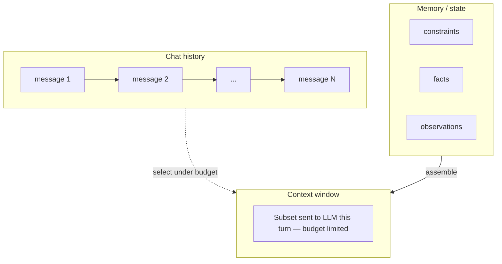
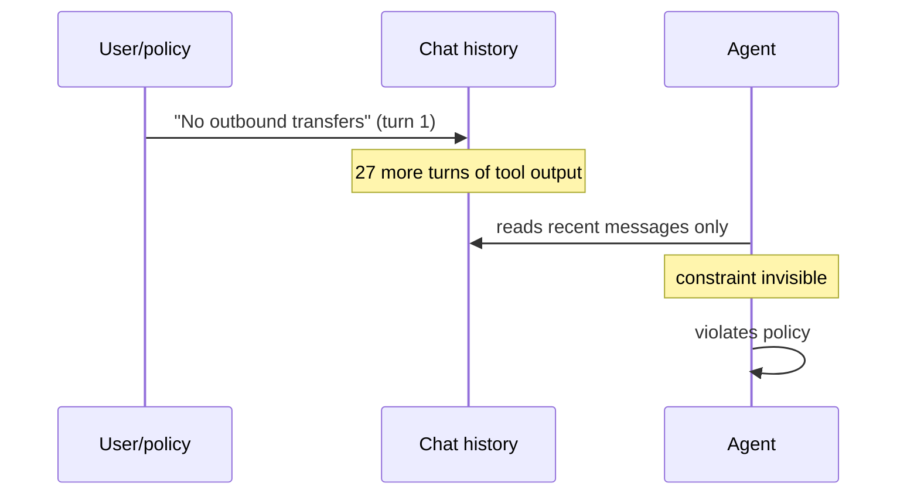
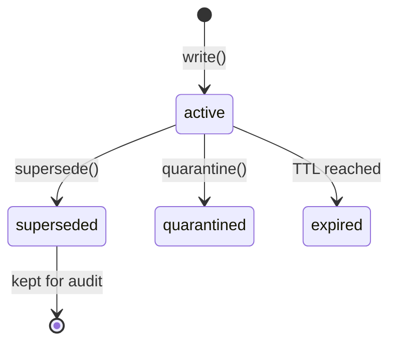

# 3. State: Chat History Is Not Memory

This is the most common mistake I see in agent systems: treating the chat transcript as memory. It's not. Let me show you why — and what to use instead.

## Three different things

```
chat history  ≠  context window  ≠  memory
```



| Concept | What it is | Grows? |
|---------|-----------|--------|
| Chat history | Ordered messages | Yes, unbounded |
| Context window | What the LLM sees this turn | Fixed budget |
| Memory | Typed state the agent maintains | Controlled |

Chapter 5 controls context assembly. This chapter is about memory.

## Why chat history fails

Case 456 opens. Turn 1:

> "Account 456 is under fraud review. No outbound transfers."

Turn 28: the agent initiates an outbound transfer.

What happened? Turn 1's constraint is now four thousand tokens back. Recent tool outputs dominate attention. The constraint was never stored as a durable object — it was a message that got buried.

This is not a prompt engineering problem. **It is a memory architecture problem.**



## The fix: typed memory cells

In CaseBot, memory is stored in **memcell-rl** — an HTTP service that holds typed, scoped cells. Each cell has:

- `type`: constraint, fact, preference, episode
- `scope`: e.g. `{"case": "456"}`
- `content`: the actual data
- `policy_features.criticality`: retention priority under token pressure

When case 456 opens, we write the fraud-review constraint:

```python
memcell_post("/v1/cells/write", {
    "type": "constraint",
    "scope": {"case": "456"},
    "content": "account_456_under_fraud_review: no_outbound_transfers until review closes",
    "confidence": 0.99,
    "sensitivity": "restricted",
    "source_refs": ["policy:fraud_engine"],
    "policy_features": {
        "criticality": 0.95,
        "compressibility": 0.05,
        "staleness": 0.0,
        "future_utility_estimate": 0.95,
    },
})
```

Forty turns later, `decide()` still selects this cell. The constraint didn't disappear — because it was never a chat message.

## Memory lifecycle

Cells don't get deleted when updated. They transition:



Example: account balance changes mid-case.

```python
# Initial balance from getAccount
cell = write_fact(scope={"case": "456"}, content={"balance_usd": 142.50})

# Later refresh — supersede, never delete
supersede(old_cell_id=cell["cell_id"], new_content={"balance_usd": 97.25})
# Old cell: status=superseded (audit trail preserved)
# New cell: status=active
```

Compliance teams ask: *what did the agent know at decision time?* Superseded cells answer that.

## What belongs in each cell type

| Type | Purpose | Example | Dropped under pressure? |
|------|---------|---------|------------------------|
| `constraint` | Hard rule | no outbound transfers | **Never** |
| `fact` | World state | balance, transaction list | Ranked by criticality |
| `preference` | Soft guidance | user prefers concise answers | Often |
| `episode` | Turn summary | "user asked about balance" | Compressible |

## Anti-pattern: summarise-to-remember

```python
# Feels like memory. Loses structure, provenance, timestamps, auditability.
memory = llm.summarise(entire_chat_history)
```

Summarisation is a **compression** technique for context (chapter 5). It is not a memory architecture. If your agent's only memory is a summary string, you cannot answer: *which policy was active at step 14?*

## Run it

Start memcell-rl and seed case 456:

```bash
uvicorn memcell_rl.app:app --port 8000
python examples/casebot_regulated.py --dry-run
```

The script calls `seed_case_memory()` before the loop runs. Inspect what was written:

```bash
curl "http://localhost:8000/v1/cells/list?scope=%7B%22case%22%3A%22456%22%7D"
```

## Exercise

Add a second constraint: `"flagAccount requires supervisor approval"`. Write it via the API. Re-run CaseBot. Does `fetch_memcell_context()` include both constraints?

**Companion:** [`memcell-rl`](https://github.com/adu3110/memcell-rl) — `POST /v1/cells/write`, `POST /v1/cells/decide`

**Next →** [Typed Memory Objects](./05-typed-memory.md)
