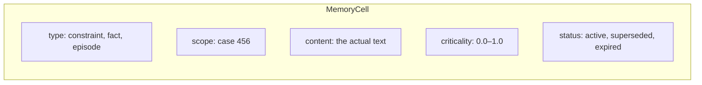

# 14. Typed memory cells

The previous chapter showed what breaks when memory is just a list of strings. This chapter builds the alternative: a typed cell store where every piece of information has a type, a scope, a criticality, and a lifecycle.

Run step 6:

```bash
python3 examples/build/step06_typed_memory.py
```

```
Selected cells under budget=800:
  [constraint] criticality=0.95  no_outbound_transfers until review closes...
  [fact]       criticality=0.60  balance $142.50 from getAccount...
  [fact]       criticality=0.10  episode turn 0: ...

Constraint always selected: True
Episode cells selected: 3 / 12
```

The constraint is selected even though it has much lower character count than the episodes. It's selected because its *type* tells the assembler "this one is non-negotiable." The episodes compete for remaining budget. Three of twelve make it in; the rest are suppressed.



## The cell structure

```python
from dataclasses import dataclass, field
from typing import Any
import uuid

@dataclass
class MemoryCell:
    cell_id: str = field(default_factory=lambda: str(uuid.uuid4()))
    cell_type: str = ""        # "constraint" | "fact" | "episode"
    scope: dict = field(default_factory=dict)   # e.g. {"case": "456"}
    content: str = ""
    criticality: float = 0.5   # 0.0 = always drop first; 1.0 = never drop
    status: str = "active"     # "active" | "superseded" | "expired"
    source_refs: list[str] = field(default_factory=list)  # e.g. ["policy:fraud_engine"]
```

Each field has a specific purpose:

**`cell_type`** — The most important field. The assembler uses this to decide how to treat the cell. Constraints are injected unconditionally. Facts are ranked by relevance and criticality. Episodes are kept recency-first and dropped first under budget pressure.

**`scope`** — Which case, user, or session does this cell belong to? `{"case": "456"}` means this cell only appears in contexts for case 456. It will never leak into case 789's context. This is fundamental for systems that handle many parallel cases.

**`content`** — The actual information. This is what appears in the prompt.

**`criticality`** — A float from 0 to 1 indicating how important it is that this cell appears in context. 0.95 means "drop this only if the budget is truly zero." 0.1 means "drop this whenever budget is tight."

**`status`** — Whether the cell is current. When you get a new account balance from `getAccount`, you don't delete the old fact — you mark it `superseded` and create a new one. The old record stays for audit purposes; the assembler only injects active cells.

## Three types and when to use each

| Type | What it stores | Lifecycle |
|------|----------------|-----------|
| `constraint` | Rules, policies, hard requirements | Lasts until explicitly superseded by the policy engine |
| `fact` | Observations, data, tool results | Superseded when the same fact is refreshed |
| `episode` | What happened in recent turns | Expires after N turns; dropped first under budget |

For case 456:
- **Constraint**: "no outbound transfers until fraud review closes" — this never drops
- **Fact**: "account balance is $142.50, status active" — superseded when we refresh from the database
- **Episode**: "turn 0: called getAccount, got {'balance': 142.50}" — fine to drop under pressure

## The assembler: constraints first, then competition

```python
def decide(store: list[MemoryCell], scope: dict, budget_chars: int) -> list[MemoryCell]:
    # Filter to relevant scope and active status
    active = [
        c for c in store
        if c.scope == scope and c.status == "active"
    ]
    
    # Separate constraints from everything else
    constraints = [c for c in active if c.cell_type == "constraint"]
    rest = sorted(
        [c for c in active if c.cell_type != "constraint"],
        key=lambda c: c.criticality,
        reverse=True
    )
    
    # Build selection list
    selected = []
    used_chars = 0
    
    # 1. Constraints always go in first — they don't compete
    for c in constraints:
        selected.append(c)
        used_chars += len(c.content)
    
    # 2. Everything else fills remaining budget, highest criticality first
    for c in rest:
        if used_chars + len(c.content) <= budget_chars:
            selected.append(c)
            used_chars += len(c.content)
        # else: suppressed (budget exhausted)
    
    return selected
```

This is a simplified version of what memcell-rl's `baseline_v0` policy does. The real policy uses token estimates rather than character counts, handles quarantined cells, and has more sophisticated criticality scoring — but the core principle is the same.

**Constraints don't compete.** They're injected unconditionally (within reasonable budget). Everything else competes for the remaining budget.

## Why cells survive supersession

When the account balance changes from $142.50 to $0 (suspicious!), you don't delete the old cell:

```python
def supersede(store, old_cell_id: str, new_content: str) -> MemoryCell:
    # Mark the old cell as superseded — don't delete it
    old_cell = find_cell(store, old_cell_id)
    old_cell.status = "superseded"
    
    # Create a new cell with the updated content
    new_cell = MemoryCell(
        cell_type=old_cell.cell_type,
        scope=old_cell.scope,
        content=new_content,
        criticality=old_cell.criticality,
    )
    store.append(new_cell)
    return new_cell
```

The old cell stays in the store with `status = "superseded"`. The assembler skips superseded cells when building the context. But for audit purposes, the full history of facts is preserved: you can see that the balance was $142.50 at turn 1 and $0 at turn 8.

This is the principle of **no destructive updates** in memory. You don't overwrite facts; you supersede them. The audit trail is intact.

## Scope prevents cross-case contamination

Imagine the agent is processing 100 cases simultaneously. Case 456's constraint ("no outbound transfers") must not appear in case 789's context. Case 789 might have completely different constraints.

Every cell has a scope. The assembler queries only cells matching the current case's scope:

```python
active = [
    c for c in store
    if c.scope == {"case": "456"}   # only case 456's cells
    and c.status == "active"
]
```

This is a critical safety property in multi-case or multi-user systems. Memory cells from one context cannot contaminate another.

## Production: memcell-rl

`step06_typed_memory.py` implements a minimal in-process version — about 50 lines. CaseBot uses memcell-rl, which runs as an HTTP server and provides:

- **Persistence**: cells survive process restarts
- **HTTP API**: multiple agents can share the same cell store
- **Full baseline_v0 policy**: handles all edge cases (quarantine, expiry, budget enforcement)
- **RL transitions**: logs every `decide()` call as a training example for future policy improvement

The semantics are identical to what we built here. The same types, the same scope filtering, the same constraint-first ordering. The difference is that the production version is durable and shared.

```bash
uvicorn memcell_rl.app:app --port 8000
python3 examples/build/step07_memcell.py
```

**Next →** [Context assembly under a budget](./06-context-assembly.md)
