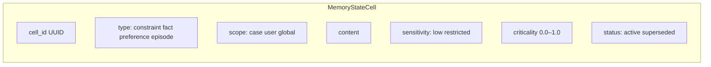
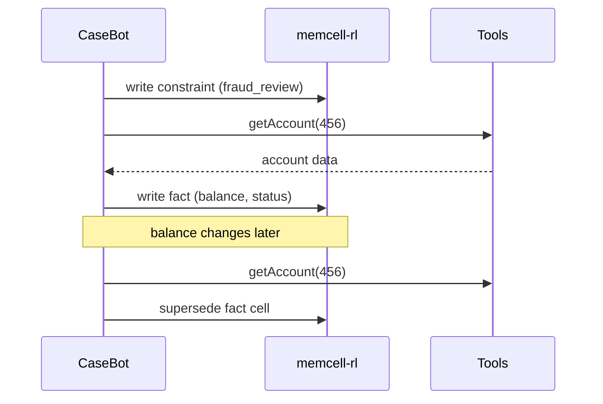

# 4. Typed Memory Objects

Chapter 3 introduced memory cells. This chapter goes deeper into the fields that matter in production — especially in regulated workflows where **scope**, **sensitivity**, and **lifecycle** are not optional.

## The cell schema

Every cell in memcell-rl is a `MemoryStateCell`:



From the actual schema in memcell-rl:

```python
class WriteCellRequest(BaseModel):
    type: CellType                    # constraint | fact | preference | episode
    scope: dict[str, Any]             # {"case": "456"}
    content: str
    confidence: float = 1.0
    sensitivity: Sensitivity          # low | medium | high | restricted
    source_refs: list[str]            # ["policy:fraud_engine"]
    policy_features: PolicyFeatures   # criticality, staleness, etc.
```

The fields I care most about:

| Field | Why it matters |
|-------|----------------|
| `scope` | Prevents cross-case leakage |
| `sensitivity` | Controls who can read the cell |
| `policy_features.criticality` | Determines survival under token pressure |
| `status` | Enables audit without deletion |

## Scoping: the most-missed feature

Every cell has a scope. Case 456 and case 457 must not share constraints.

```python
# Case 456
write(type="constraint", scope={"case": "456"}, content="fraud_review_active")

# Case 457 — different customer
write(type="constraint", scope={"case": "457"}, content="fee_waiver_allowed")
```

**Never query memory without a scope in production.**

```python
# Wrong — returns cells from all cases
cells = list_all_active()

# Right — case 457 agent sees only 457 + global
decide(query=task, scope={"case": "457"})
```

Cross-case leakage is one of the most common production bugs I see. An agent working on case 457 accidentally reads case 456's fraud flag and blocks a legitimate transaction.

## Sensitivity gating

Not every agent should see every cell. An investigator agent may read `internal` data. A summary bot may not read `restricted` PII.

```python
write(
    type="fact",
    scope={"case": "456"},
    content="Customer SSN on file: ***-**-1234",
    sensitivity="restricted",
)
```

memcell-rl's `decide()` respects scope and policy. Your application layer can further filter by agent role.

## CaseBot: complete write sequence

When case 456 opens:



```python
# 1. Policy fires at case open
memcell_post("/v1/cells/write", {
    "type": "constraint",
    "scope": {"case": "456"},
    "content": "account_456_under_fraud_review: no_outbound_transfers",
    "source_refs": ["policy:fraud_engine"],
    "policy_features": {"criticality": 0.95, ...},
})

# 2. Tool returns account data → write fact
result = registry.run("getAccount", {"accountId": "456"})
memcell_post("/v1/cells/write", {
    "type": "fact",
    "scope": {"case": "456"},
    "content": json.dumps(result.data),
    "source_refs": ["tool:getAccount"],
    "policy_features": {"criticality": 0.6, ...},
})

# 3. Balance changes → supersede, never delete
memcell_post("/v1/cells/supersede", {
    "old_cell_id": fact_cell_id,
    "new_content": json.dumps(updated_balance),
})
```

The old fact remains in the database with `status: superseded`. Auditors can reconstruct what the agent knew at each step.

## memcell-rl vs in-process memory

For Book 1, CaseBot calls memcell-rl over HTTP. That separation matters:

- Memory survives agent process restarts
- Multiple agents can share scoped cells (Book 3)
- Every `decide()` creates an RL-ready transition (Book 2)
- Memory policy is testable independently of the loop

```bash
# Start the memory service
uvicorn memcell_rl.app:app --port 8000

# Write a constraint
curl -X POST http://localhost:8000/v1/cells/write \
  -H "Content-Type: application/json" \
  -d '{"type":"constraint","scope":{"case":"456"},"content":"no_outbound_transfers","policy_features":{"criticality":0.95}}'
```

## Exercise

Write two facts for case 456 with different criticality scores (0.9 and 0.3). Call `decide()` with a small `budget_tokens`. Which fact gets selected? What does that tell you about how context assembly will behave in the next chapter?

**Companion:** [`memcell-rl/memcell_rl/models/schemas.py`](https://github.com/adu3110/memcell-rl/blob/main/memcell_rl/models/schemas.py)

**Next →** [Context Assembly Under a Token Budget](./06-context-assembly.md)
