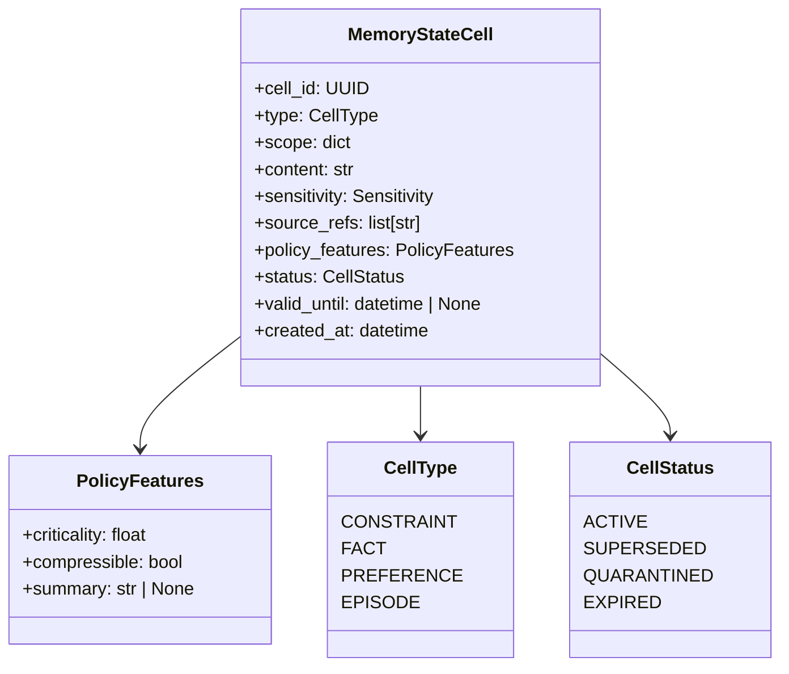
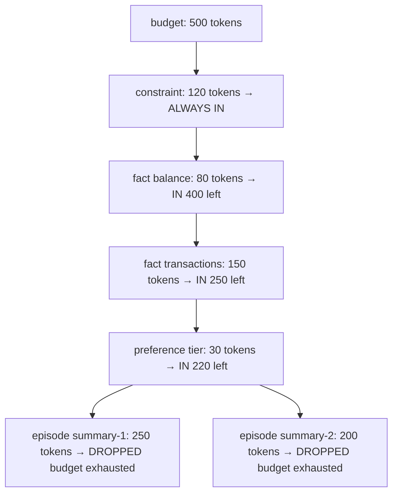
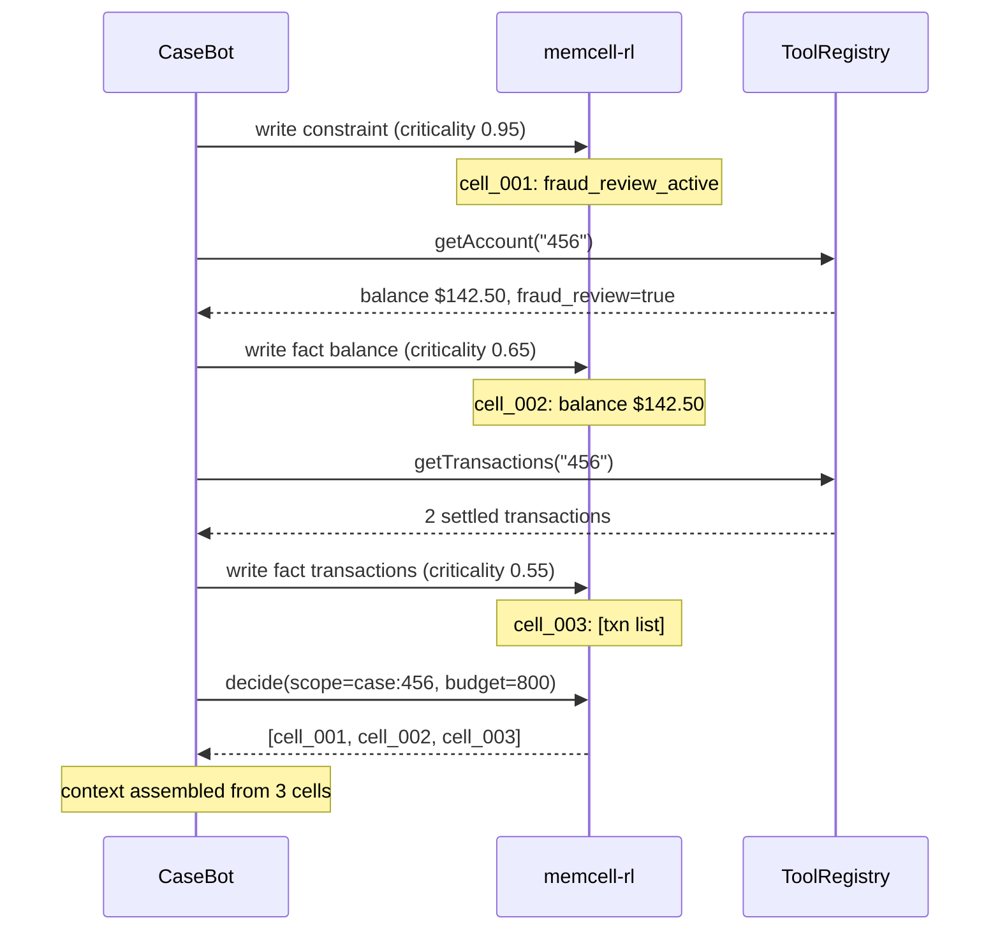

# 4. Typed Memory Objects

Chapter 3 established that chat history is not memory. But "what should memory be instead?" is a harder question than it looks. The answer I've arrived at, after building several production agent systems: typed, scoped, lifecycle-managed objects. Not a database. Not a vector store. Not a set of messages. Named cells with explicit types, explicit owners, and explicit expiry.

This chapter explains what each field is for and why it exists — not just what the API looks like.

## The problem with untyped memory

The simplest thing you can do is store everything in a dict:

```python
memory = {}
memory["balance"] = 142.50
memory["constraint"] = "no_outbound_transfers"
memory["note"] = "balance looks normal"
```

This fails in production in three ways:

**Type confusion.** A constraint is not the same kind of information as a balance. A constraint must always be present in context — dropping it under token pressure is a compliance incident. A balance is a fact that should be superseded when it changes. A note is ephemeral reasoning that should be discarded after the case closes. An untyped dict treats all three identically.

**Scope leakage.** If you have multiple cases in flight, a shared dict has no concept of which facts belong to which case. Account 789's constraint can appear in account 456's context. This happens more often than you'd think.

**No lifecycle.** Superseding a balance means adding a new entry. But what happens to the old one? In a dict, you either delete it (losing the audit trail) or keep it (letting stale data compete with fresh data in context). Neither is right.

Typed memory cells solve all three.

## The cell schema

Each cell in memcell-rl is a `MemoryStateCell`:



Each field earns its existence:

| Field | What it is | Why it exists |
|-------|-----------|---------------|
| `type` | constraint, fact, preference, episode | Determines inclusion policy under token pressure |
| `scope` | `{"case": "456"}` | Prevents cross-case leakage |
| `content` | The actual information | What the agent knows |
| `sensitivity` | low, medium, high, restricted | Controls which agents can read this cell |
| `source_refs` | `["tool:getAccount"]` | Audit — where did this information come from? |
| `policy_features.criticality` | 0.0–1.0 | Higher = harder to drop from context |
| `status` | active, superseded, quarantined, expired | Lifecycle without deletion |
| `valid_until` | ISO timestamp | PII retention policy; auto-expires from context |

## Cell types and what they mean

```python
class CellType(str, Enum):
    CONSTRAINT  = "constraint"   # always included, hardest to drop
    FACT        = "fact"         # typed data fetched from tools
    PREFERENCE  = "preference"   # user/account settings, sticky
    EPISODE     = "episode"      # summaries of past interactions, compressible
```

**Constraint cells** model hard rules: *account 456 is under fraud review, no outbound transfers*. They have `criticality: 0.95+` and are injected first by the context assembler, unconditionally. The assembler does not respect token pressure for constraints.

**Fact cells** model observed data: *balance is $142.50, two transactions settled*. They have criticality around 0.5–0.8 and are ranked under token pressure. A fact from two turns ago may be suppressed to make room for a newer one.

**Preference cells** model persistent context: *customer prefers English, account tier: Gold*. They have moderate criticality and rarely change.

**Episode cells** model compressed history: *"in the last session, the agent confirmed the account was active"*. They have low criticality (0.1–0.3) and are compressible — the assembler can drop them when under pressure without losing compliance-critical information.

## Criticality: the most important field

Criticality is what separates "this is important, always include it" from "this is background, drop if needed." It is not a semantic relevance score — it's a policy setting you control explicitly.

```python
# Fraud constraint — cannot be dropped, ever
write(type="constraint", content="no_outbound_transfers",
      policy_features={"criticality": 0.95})

# Balance — important but supersedable
write(type="fact", content="balance: $142.50",
      policy_features={"criticality": 0.65})

# Past session summary — background, compressible
write(type="episode", content="Previously confirmed account active",
      policy_features={"criticality": 0.15, "compressible": True})
```

Under a 500-token context budget, the assembler selects: constraints first (0.95), then facts (0.65), then preferences, then episodes — stopping when the budget is full. The constraint is never dropped. The episode is the first to go.



## Scope: the most-skipped feature

Every cell has a scope. A scope is a dict that scopes the cell to a specific case, user, or global context:

```python
# Case-specific — only visible to agents working on case 456
{"case": "456"}

# User-specific — preferences for customer 789
{"user": "cust_789"}

# Global — applies to all cases
{"global": True}
```

When the context assembler runs `decide()`, it queries by scope:

```python
decide(query=task, scope={"case": "456"})
# Only returns: case:456 cells + global cells
# Never returns: case:457 cells, case:789 cells
```

Cross-case leakage is one of the most common and least obvious bugs in multi-case agent systems. An agent working case 457 reads a fraud flag from case 456 (different customer) and blocks a legitimate transaction. The fix is enforcing scope at query time.

## Lifecycle: supersede instead of delete

When account balance changes:

```
Step 0: getAccount → balance $142.50
  → write fact cell id=cell_001: balance $142.50, status=active

[later in the case]
Step 4: getAccount → balance $95.00 (payment received)
  → supersede cell_001
  → write fact cell id=cell_002: balance $95.00, status=active
  → cell_001: status=superseded
```

```python
# Supersede the old balance
memcell_post("/v1/cells/supersede", {
    "old_cell_id": cell_001_id,
    "new_content": json.dumps({"balance_usd": 95.00}),
    "source_refs": ["tool:getAccount:refresh"],
})
```

After supersession:
- `cell_001` has `status: superseded` — auditors can still read it
- `cell_002` has `status: active` — only this one appears in context
- No information is lost. No stale data competes.

The audit trail shows: at step 0, balance was $142.50. At step 4, it changed to $95.00 because of a payment. The agent at step 5 sees only the current balance.

**Never delete memory cells in a regulated workflow.** Deletion destroys the audit trail. Supersession preserves history while keeping the active context clean.

## CaseBot's full write sequence

When case 456 opens and the first tool calls return:



The final `decide()` call selects exactly the cells the planner needs — constraint first, then facts, within budget.

## Querying memcell-rl from Python

CaseBot's `fetch_memcell_context()` wraps all of this:

```python
MEMCELL = "http://localhost:8000"

def memcell_post(path: str, body: dict) -> dict:
    data = json.dumps(body).encode()
    req = urllib.request.Request(
        MEMCELL + path,
        data=data,
        headers={"Content-Type": "application/json"},
        method="POST",
    )
    try:
        with urllib.request.urlopen(req, timeout=5) as r:
            return json.loads(r.read())
    except urllib.error.URLError:
        return {}   # graceful degradation if memory service is down

def fetch_memcell_context(task: str) -> str:
    resp = memcell_post("/v1/cells/decide", {
        "query": task,
        "scope": {"case": "456"},
        "budget_tokens": 800,
        "k": 10,
    })
    if not resp or "selected_cells" not in resp:
        return "[memory unavailable]"

    lines = []
    for sel in resp["selected_cells"]:
        cell = memcell_post("/v1/cells/get", {"cell_id": sel["cell_id"]})
        if not cell:
            continue
        prefix = "CONSTRAINT" if sel["mode"] == "constraint" else "CONTEXT"
        lines.append(f"{prefix}: {cell.get('content', '')}")
    return "\n".join(lines) if lines else "[no context]"
```

If memcell-rl is unreachable, the function returns `[memory unavailable]` and the planner continues with degraded context. The agent doesn't crash.

## Exercise

1. Start memcell-rl (`uvicorn memcell_rl.app:app --port 8000`). Write one constraint cell and one fact cell for case 456 with different criticality scores (0.9 and 0.3). Call `decide()` with `budget_tokens: 50`. Which cell is selected? Change the budget to 500 — does the result change?

2. Write a fact cell for case 456 with a balance. Then call `supersede` to update it. Call `decide()` again. Confirm the old cell does not appear in `selected_cells`. Then query the database directly to confirm the old cell is still there with `status: superseded`.

3. Write a constraint cell for case 456 and a different constraint cell for case 789. Call `decide()` scoped to case 456. Confirm the case 789 cell does not appear. This is the scope isolation test.

**Companion:** [`memcell-rl/memcell_rl/models/schemas.py`](https://github.com/adu3110/memcell-rl/blob/main/memcell_rl/models/schemas.py)

**Next →** [Context Assembly Under a Token Budget](./06-context-assembly.md)
