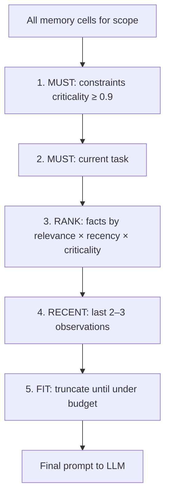
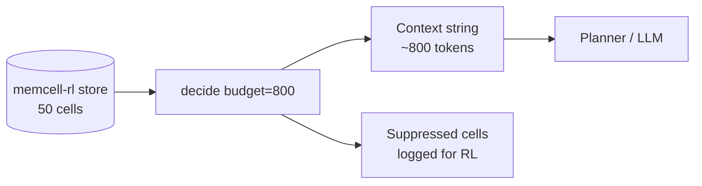

# 5. Context Assembly Under a Token Budget

At step 15 of case 456, you might have:

```
System prompt:            300 tokens
Active constraints:       150 tokens   ← must always include
Current task:             200 tokens   ← must always include
20 tool observations:    4000 tokens   ← most can be dropped
50 memory facts:         3000 tokens   ← rank by relevance
───────────────────────────────────────
Total:                   7650 tokens   ← exceeds budget
```

"Send everything" is not a strategy. Context assembly is the deterministic process of deciding **what the LLM sees this turn** — under a fixed token budget.

## The pipeline



In CaseBot, memcell-rl's `decide()` endpoint implements steps 1–5:

```python
decision = memcell_post("/v1/cells/decide", {
    "query": task,
    "scope": {"case": "456"},
    "budget_tokens": 800,
    "k": 10,
})
```

The response tells you exactly what was selected and what was suppressed:

```python
for sel in decision["selected_cells"]:
    print(sel["mode"], sel["score"], sel["reason"])
# constraint  0.950  hard rule — always inject
# context     0.620  relevant to query
# suppressed  expired cell dropped by policy
```

CaseBot builds the planner's memory context from this:

```python
def fetch_memcell_context(task: str) -> str:
    decision = memcell_post("/v1/cells/decide", {...})
    lines = []
    for sel in decision["selected_cells"]:
        cell = fetch_cell(sel["cell_id"])
        if sel["mode"] == "constraint":
            lines.append(f"CONSTRAINT: {cell['content']}")
        else:
            lines.append(f"CONTEXT: {cell['content']}")
    return "\n".join(lines)
```

The agent loop passes this string to the planner every step. Constraints always appear. Low-criticality background cells get dropped first.

## Why this is separate from memory

Memory answers: **what does the agent know?**  
Context assembly answers: **what does the LLM see right now?**

They are related but not the same. You might have fifty facts in memory and inject five into context. The other forty-five still exist for audit, supersession, and future turns.



## Failure mode: constraints dropped under pressure

If you implement context assembly naively — "take the most recent N messages" — constraints from turn 1 get pushed out by tool output from turns 2–40.

The fix: **constraints are injected first, unconditionally**, before any ranking or truncation. memcell-rl's `baseline_v0` policy enforces this. If you roll your own assembler, enforce it in code:

```python
def assemble(store, task, budget):
    parts = [SYSTEM_PROMPT, f"Task: {task}"]
    # Step 1: constraints — never dropped
    for c in store.constraints(scope):
        parts.append(f"CONSTRAINT: {c.content}")
    remaining = budget - estimate_tokens(parts)
    # Step 2: rank everything else by score, fit in remaining budget
    ...
```

## Failure mode: stale facts competing with fresh ones

Account balance at 10:00 AM and balance at 2:30 PM should not both be `active`. Chapter 4's supersede lifecycle prevents this. Context assembly should only see active cells — but auditors can still read superseded ones.

## Run it

```bash
uvicorn memcell_rl.app:app --port 8000
python examples/casebot_regulated.py --dry-run
```

Look for the memcell line in output:

```
[memcell] context loaded (85 chars)
```

That string is what the planner sees. Expand it by adding more cells and watch `decide()` select and suppress.

## Exercise

Seed ten low-criticality episode cells and one constraint. Call `decide()` with `budget_tokens: 200`. Confirm the constraint is always in `selected_cells` and most episodes are in `suppressed_cells`.

**Next →** [Tools from Scratch](./07-tools.md)
