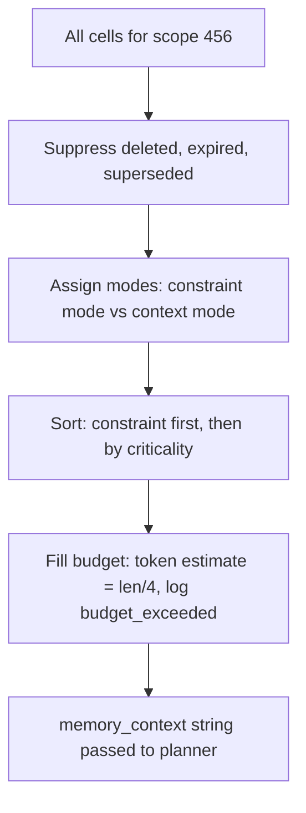

# 1.7 Context assembly under a budget

## Where we are

After chapter 1.6: CaseBot has typed memory cells in-process. Constraints are selected first. The assembler logic exists — but not yet as a durable HTTP service.

## What we're fixing this chapter

We connect to **memcell-rl** and call `POST /v1/cells/decide` each turn. Memory is what the agent knows; context is what the LLM sees. This chapter closes the gap.

Memory is what the agent knows. Context is what the LLM sees this turn. These are two different things, and the gap between them is where many agents go wrong.

Memory can hold thousands of cells accumulated over time. The context window can hold maybe 800 tokens for the relevant memory portion (leaving the rest for the prompt, the task, and the model's response). You have to choose which cells to include. This chapter shows how to make that choice well.

Run step 7 (requires memcell server running):

```bash
# Terminal 1:
uvicorn memcell_rl.app:app --port 8000

# Terminal 2:
python3 examples/build/step07_memcell.py
```

```
budget_tokens=100:
CONSTRAINT: account_456_under_fraud_review: no_outbound_transfers
  suppressed: 8 cells

budget_tokens=400:
CONSTRAINT: account_456_under_fraud_review: no_outbound_transfers
CONTEXT: balance $142.50 from getAccount...
  suppressed: 7 cells

budget_tokens=800:
CONSTRAINT: account_456_under_fraud_review: no_outbound_transfers
CONTEXT: balance $142.50 from getAccount...
CONTEXT: turn 0 filler...
CONTEXT: turn 1 filler...
  suppressed: 6 cells
  → constraint present=True
```

At budget 100, only the constraint fits — but it's there. At budget 800, facts and some episodes fit too. What never happens: the constraint gets dropped to make room for episodes.



## The decide() API

```python
decision = memcell_post("/v1/cells/decide", {
    "query": task,          # the current task — used for semantic relevance scoring
    "scope": {"case": "456"},
    "budget_tokens": 800,
    "k": 10,                # max candidates to consider
})

# Response:
# {
#   "selected_cells": [{"cell_id": "...", "mode": "constraint", "score": 0.92}, ...],
#   "suppressed_cells": [{"cell_id": "...", "reason": "budget_exceeded"}, ...],
#   "policy": {"policy_id": "baseline_v0", ...}
# }
```

The response includes both selected and suppressed cells. This is deliberate: you can audit what the planner *didn't* see. If the agent made a wrong decision, one of the first things to check is whether the relevant constraint was suppressed.

The `mode` field on each selected cell tells you how the assembler classified it:
- `constraint` — high-criticality constraint, injected unconditionally
- `context` — fact or episode included within budget
- `reverify_before_use` — quarantined cell, present but flagged for human review

## Building the context string

After `decide()`, we fetch the content of each selected cell and format it:

```python
def fetch_memcell_context(task: str) -> str:
    decision = memcell_post("/v1/cells/decide", {
        "query": task,
        "scope": CASE_SCOPE,
        "budget_tokens": 800,
        "k": 10,
    })
    
    lines: list[str] = []
    for sel in decision["selected_cells"]:
        # Fetch the cell content
        req = urllib.request.Request(f"{MEMCELL_BASE}/v1/cells/{sel['cell_id']}")
        with urllib.request.urlopen(req, timeout=5) as r:
            cell = json.loads(r.read())
        
        # Format based on mode
        if sel["mode"] == "constraint":
            lines.append(f"CONSTRAINT: {cell['content']}")
        else:
            lines.append(f"CONTEXT: {cell['content']}")
    
    return "\n".join(lines) if lines else "(no cells selected)"
```

The constraint gets the `CONSTRAINT:` prefix. The planner can scan for this prefix to identify which information is non-negotiable.

## Why refresh context after every tool call

A subtle but important design choice: CaseBot calls `fetch_memcell_context()` again after each successful tool call, not just once at the start of the loop. This is why `AgentLoop` accepts a `refresh_memory` callback.

Why? Because tool calls change the world and generate new facts. When `getAccount` returns the current balance, that fact should be written to memcell-rl and available for the next step. Without refresh, the planner at step 2 still sees the empty context from step 0.

```python
class AgentLoop:
    def _refresh_context(self) -> None:
        if self.refresh_memory is None:
            return
        try:
            self.memory_context = self.refresh_memory(self.task)
        except (urllib.error.URLError, TimeoutError):
            pass   # server unreachable — keep existing context, continue
    
    def run(self) -> str:
        for step in range(MAX_STEPS):
            action = self.planner(step, self.trajectory, self.memory_context)
            
            if action.type == ActionType.TOOL_CALL:
                # ... execute tool ...
                result = self.tools.run(action.tool, action.args)
                self.trajectory.log(step, action, result)
                if not result.success:
                    return f"ESCALATED:tool_error:{result.error}"
                
                # After successful tool: refresh memory context
                self._refresh_context()
```

This is why the account balance, once fetched from `getAccount`, is available for the planner to reason about at step 2 when deciding whether to flag or close the case.

## What "suppressed" means and why it matters

The `suppressed_cells` list in the `decide()` response tells you what didn't make it into context. This information is as important as what did make it.

If you're diagnosing why the agent made a wrong decision, check what was suppressed:

- Was a constraint suppressed with reason `budget_exceeded`? → your budget is too low
- Was a fact suppressed because it was `superseded`? → normal, the old cell was replaced
- Was a high-criticality cell suppressed? → something is misconfigured

In production, suppression events should be logged and monitored. A constraint being suppressed on any turn is a high-severity event.

## The wrong approach and why it feels easier

The "easy" approach is: stuff everything into the prompt. Include all tool results, the full conversation history, all policies. Don't think about what to include.

This works until:
- The context fills up and you have to start truncating (and you don't know what to drop)
- Costs become unsustainable (more context = more tokens = more money)
- The model degrades because the important signal is buried under noise
- You can't audit what the model knew at each step because you don't know what was in the context

Budget-aware context assembly is more work upfront but prevents all of these problems. The constraint always appears. The cost is predictable. The context is curated.

## What changed in CaseBot

```
fetch_memcell_context() → POST /v1/cells/decide
Per-step memory refresh after each successful tool call
```

Context is assembled from typed cells under a token budget — not from raw chat history.

## What breaks next

Infrastructure is solid. The **planner** is still a hardcoded script. Chapter 1.8 makes it a swappable function (script today, LLM with `--live` later) without touching the loop.

**Next →** [1.8 Planning and scratchpads](./08-planning.md)
