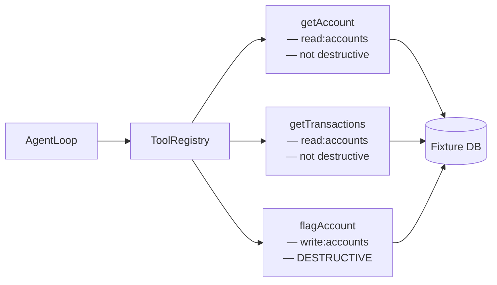
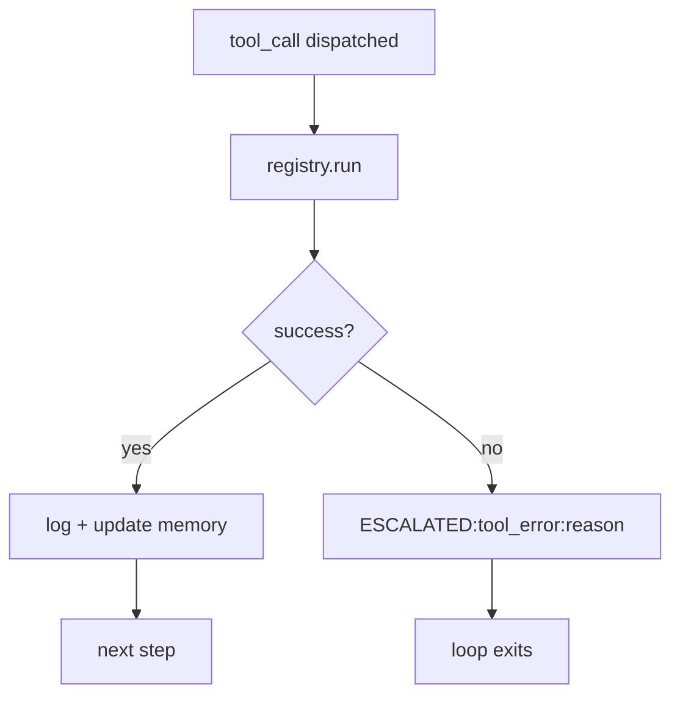

# 6. Tools from Scratch

Every action an agent takes on the world goes through a tool. Tools are not helper functions you scatter across the codebase — they are a defined surface with names, schemas, permissions, and structured results. If you skip any of those four things, you get agents that call APIs they shouldn't, with arguments that don't validate, and errors that silently corrupt the trajectory.

This chapter builds CaseBot's tool registry from scratch and shows exactly what breaks when each safeguard is missing.

## What a tool is

A tool is a named function that:
1. Requires specific permissions to call
2. Takes typed, validated arguments
3. Always returns a structured result — never throws to the LLM

That last point is the one people skip. If a tool throws an exception and you let it propagate, you have two bad options: catch it and inject the stack trace into the LLM's context (terrible), or crash the loop (also terrible). The correct option is to catch it inside the tool and return `ToolResult(success=False, error="...")`. The loop decides what to do with failures.

## CaseBot's tool surface

Case 456 needs exactly three tools:



| Tool | Permission required | Destructive? | Idempotent? |
|------|---------------------|--------------|-------------|
| `getAccount` | `read:accounts` | No | Yes |
| `getTransactions` | `read:accounts` | No | Yes |
| `flagAccount` | `write:accounts` | **Yes** | No |

Read tools are safe to call twice. `flagAccount` is not — calling it twice on the same account is a bug, possibly a compliance incident. The registry enforces this distinction. The agent loop adds duplicate-call detection on top of it.

## ToolResult

The return type is always this:

```python
@dataclass
class ToolResult:
    success: bool
    data: dict | None = None
    error: str | None = None
```

Simple. The loop checks `result.success`. If `False`, it escalates with `result.error`. If `True`, it writes `result.data` to memory and logs the step.

The agent loop **never** receives raw exceptions. Tools intercept them:

```python
def get_account_handler(args: dict) -> ToolResult:
    account_id = str(args.get("accountId", ""))
    if not account_id:
        return ToolResult(success=False, error="missing_argument:accountId")
    if account_id not in ACCOUNTS:
        return ToolResult(success=False, error=f"account_not_found:{account_id}")
    try:
        return ToolResult(success=True, data=ACCOUNTS[account_id])
    except Exception as e:
        return ToolResult(success=False, error=f"internal:{e}")
```

Every path returns a `ToolResult`. The caller doesn't need try/except.

## The registry

```python
READ_TOOLS = {"getAccount", "getTransactions"}
DESTRUCTIVE_TOOLS = {"flagAccount"}

class ToolRegistry:
    def __init__(self, permissions: set[str]):
        self.permissions = permissions
        self._handlers = {
            "getAccount":      self._get_account,
            "getTransactions": self._get_transactions,
            "flagAccount":     self._flag_account,
        }

    def run(self, name: str, args: dict) -> ToolResult:
        # ── 1. Permission check ────────────────────────────────────────────────
        if name in DESTRUCTIVE_TOOLS and "write:accounts" not in self.permissions:
            return ToolResult(
                success=False,
                error="permission_denied: write:accounts required",
            )
        if name in READ_TOOLS and "read:accounts" not in self.permissions:
            return ToolResult(
                success=False,
                error="permission_denied: read:accounts required",
            )

        # ── 2. Known tool? ─────────────────────────────────────────────────────
        if name not in self._handlers:
            return ToolResult(success=False, error=f"unknown_tool:{name}")

        # ── 3. Argument validation ─────────────────────────────────────────────
        validation_error = self._validate_args(name, args)
        if validation_error:
            return ToolResult(success=False, error=validation_error)

        # ── 4. Dispatch ────────────────────────────────────────────────────────
        return self._handlers[name](args)
```

Three checks before any business logic touches the outside world:

1. **Permission check** — does this agent have the right to call this tool?
2. **Known tool** — did the LLM hallucinate a tool name?
3. **Argument validation** — are required fields present?

The LLM is one step removed from everything real.

## Argument validation

For production, I'd use pydantic. For Book 1, a lightweight check:

```python
REQUIRED_ARGS = {
    "getAccount":      ["accountId"],
    "getTransactions": ["accountId"],
    "flagAccount":     ["accountId", "reason"],
}

def _validate_args(self, name: str, args: dict) -> str | None:
    for required in REQUIRED_ARGS.get(name, []):
        if required not in args:
            return f"missing_argument:{required}"
    return None
```

When the LLM returns `{"type": "tool_call", "tool": "flagAccount", "args": {}}`, the registry catches the missing `reason` and `accountId` fields before anything happens. The loop logs the failure and escalates.

## Fixture data

Book 1 uses in-memory fixtures. No database, no network:

```python
ACCOUNTS = {
    "456": {
        "account_id": "456",
        "status": "active",
        "balance_usd": 142.50,
        "fraud_review": True,
        "owner": "Test Customer",
    }
}

TRANSACTIONS = {
    "456": [
        {"txn_id": "t1", "amount_usd": 50.00, "status": "settled", "merchant": "Grocery"},
        {"txn_id": "t2", "amount_usd": 92.50, "status": "settled", "merchant": "Pharmacy"},
    ]
}
```

Replace these with real API calls in production. The registry interface stays the same. The loop doesn't change at all.

## The compliance failure demo — two failures at once

Run the bad path:

```bash
python examples/casebot_regulated.py --dry-run --bad-run
```

```
[step 0] tool_call: flagAccount {'accountId': '456', 'reason': 'suspicious'}
  → FAIL: permission_denied: write:accounts required

Outcome: ESCALATED:tool_error:permission_denied: write:accounts required
Tools used: ['flagAccount']
Steps: 1

Property results:
  FAIL  lookup_before_flag: flagAccount without prior getAccount
```

Two distinct failures:

**Permission failure** — `flagAccount` requires `write:accounts`. The dry-run agent runs with read-only permissions. The registry catches this at dispatch time, before any external API call.

**Process failure** — `flagAccount` was called before `getAccount`. Even if we granted `write:accounts`, this would be a compliance violation: you're flagging an account without reading the data that justifies the flag.

These are different problems with different fixes. The permission failure is fixed in the registry (grant or deny the permission). The process failure is fixed in the planner (enforce lookup-before-action protocol) and caught by the property check.

Grant the permission and the outcome changes, but the property check still fails:

```python
# Modified dry-run: agent has write:accounts
registry = ToolRegistry(permissions={"read:accounts", "write:accounts"})
```

```
[step 0] tool_call: flagAccount {'accountId': '456', 'reason': 'suspicious'}
  → success: {'account_id': '456', 'flagged': True}

Outcome: Account 456 flagged.
  FAIL  lookup_before_flag: flagAccount without prior getAccount
```

The account got flagged without data. The accuracy metric says "success" (agent produced an outcome). The property check says "fail" (compliance violated). This is exactly why chapter 11 is titled "Why Final-Answer Accuracy Lies."

## Adding a new tool

To add `escalateToSupervisor`:

```python
# 1. Define schema
REQUIRED_ARGS["escalateToSupervisor"] = ["caseId", "reason"]

# 2. Add to permission mapping
# (escalation is not destructive, but requires its own permission)
ESCALATION_TOOLS = {"escalateToSupervisor"}
# add permission check in run()

# 3. Write handler
def _escalate_to_supervisor(self, args: dict) -> ToolResult:
    case_id = args["caseId"]
    reason  = args["reason"]
    # write to notification queue, webhook, etc.
    return ToolResult(success=True, data={"escalated": True, "case": case_id})

# 4. Register it
self._handlers["escalateToSupervisor"] = self._escalate_to_supervisor
```

The loop does not change. The planner gets a new tool in its available-tools list. That's the point of the registry pattern.

## What happens when the tool errors in production

Real tools fail: the API is down, the account ID doesn't exist, the response times out. The loop needs to handle all of these gracefully:



On error, the loop exits. The trajectory has the failed step logged. The outcome string contains the error reason. A human can read the trajectory, see that `getAccount` returned `account_not_found:789`, and determine whether the planner was hallucinating an account ID or whether the data is genuinely missing.

## Exercise

1. Add a fourth tool: `getAccountHistory(accountId, months)` that returns 12 months of transaction history. Write the fixture data, handler, and required args. Confirm the registry dispatches it correctly.

2. Add a validation rule: `flagAccount.reason` must be one of `["fraud_indicator", "suspicious_activity", "policy_violation"]`. Return an error if the LLM returns a free-form reason string.

3. Run `--dry-run --bad-run`. The permission error escalates the loop. Now modify the planner to try `getAccount` first, then `flagAccount`. What changes in the trajectory? Does `lookup_before_flag` pass now?

**Next →** [Planning and Scratchpads](./08-planning.md)
