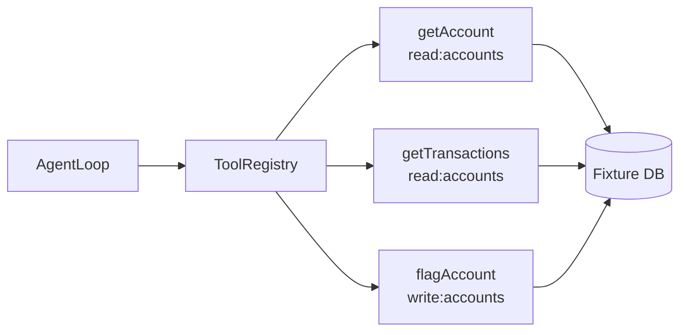

# 6. Tools from Scratch

Tools are how an agent acts on the world. Every tool call is a contract: a name, a schema, a permission gate, and a structured result. If you skip any of those, you get agents that call APIs they shouldn't, with arguments that don't validate, and errors that don't propagate.

## CaseBot's tool surface

Case 456 needs three tools:



| Tool | Permission | Destructive? |
|------|------------|--------------|
| `getAccount` | `read:accounts` | No |
| `getTransactions` | `read:accounts` | No |
| `flagAccount` | `write:accounts` | **Yes** |

The investigator agent in our demo runs with read-only permissions. That is intentional.

## ToolResult: always structured

Never return raw exceptions to the LLM. Always return a `ToolResult`:

```python
@dataclass
class ToolResult:
    success: bool
    data: dict | None = None
    error: str | None = None
```

The loop checks `result.success`. On failure, it escalates — it does not silently continue.

## The registry

```python
DESTRUCTIVE_TOOLS = {"flagAccount"}

class ToolRegistry:
    def __init__(self, permissions: set[str]):
        self.permissions = permissions

    def run(self, name: str, args: dict) -> ToolResult:
        if name in DESTRUCTIVE_TOOLS and "write:accounts" not in self.permissions:
            return ToolResult(success=False, error="permission_denied: write:accounts required")
        if name in READ_TOOLS and "read:accounts" not in self.permissions:
            return ToolResult(success=False, error="permission_denied: read:accounts required")

        if name == "getAccount":
            aid = str(args.get("accountId", ""))
            if aid not in ACCOUNTS:
                return ToolResult(success=False, error=f"account_not_found:{aid}")
            return ToolResult(success=True, data=ACCOUNTS[aid])

        if name == "flagAccount":
            return ToolResult(success=True, data={
                "account_id": args["accountId"],
                "flagged": True,
                "reason": args.get("reason", "unspecified"),
            })

        return ToolResult(success=False, error=f"unknown_tool:{name}")
```

Three things happen before any business logic:

1. **Permission check** — does this agent have the required scope?
2. **Schema validation** — is `accountId` present? (extend with pydantic for production)
3. **Dispatch** — call the handler

The LLM never touches the fixture database directly.

## The compliance failure demo

Run the bad path:

```bash
python examples/casebot_regulated.py --dry-run --bad-run
```

```
Outcome: ESCALATED:tool_error:permission_denied: write:accounts required
Tools:   ['flagAccount']
  FAIL  lookup_before_flag: flagAccount without prior getAccount
```

Two failures at once:

1. **Process failure** — flag attempted without prior lookup
2. **Permission failure** — agent lacks `write:accounts`

In production, you'd catch the permission error before the call reaches the API. The property check catches the process failure after the fact. You want both.

## Fixture data

Book 1 uses an in-memory fixture — not a real database:

```python
ACCOUNTS = {
    "456": {
        "account_id": "456",
        "status": "active",
        "balance_usd": 142.50,
        "fraud_review": True,
    }
}
```

Replace fixtures with real API calls in production. The registry interface stays the same.

## Adding a new tool

To add `escalateToSupervisor`:

1. Define permission: `escalate:cases`
2. Add to registry with handler
3. Add property check if ordering matters
4. Update planner prompt / script

The loop does not change. That is the point of a registry.

## Exercise

Grant `write:accounts` to the agent and re-run `--bad-run`. The permission error disappears — but `lookup_before_flag` still fails. Why is outcome-level accuracy insufficient?

**Next →** [Planning and Scratchpads](./08-planning.md)
