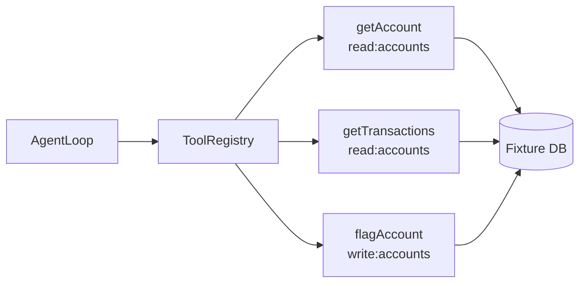

# 11. Tools from scratch

The agent needs to interact with the world — read account data, fetch transactions, flag an account. These interactions happen through tools. And tools need to be built carefully.

Run step 3:

```bash
python3 examples/build/step03_tools.py
```

```
getAccount:      success=True   data={'account_id': '456', 'balance_usd': 142.5, ...}  error=None
getTransactions: success=True   data={'transactions': [...]}                            error=None
flagAccount:     success=False  data=None                                               error=unknown_tool:flagAccount
```

`flagAccount` fails because we haven't registered it. That's exactly what we want. The registry rejects what you didn't explicitly allow.



## Why structure tool results

The simplest version of a tool is a function that either returns data or throws an exception. The loop catches the exception and... what? Pastes the stack trace into the prompt? Crashes? The LLM gets a traceback and tries to reason about it?

None of these are good. We need a contract: tools always return a structured result, success or failure, never an exception that leaks into the prompt.

```python
from dataclasses import dataclass
from typing import Any

@dataclass
class ToolResult:
    success: bool
    data: dict[str, Any] | None = None
    error: str | None = None
```

The loop checks `result.success`. On failure, it escalates. It never pastes raw exceptions into context. This is a small design choice with large consequences: the LLM context stays clean, failures are handled in code, and the error is logged in structured form for diagnosis.

## The registry: explicit surface, no surprises

The tool registry is the gatekeeper. It decides which tools exist, what permissions each requires, and how to execute them.

```python
DESTRUCTIVE_TOOLS = {"flagAccount"}
READ_TOOLS        = {"getAccount", "getTransactions"}

class ToolRegistry:
    def __init__(self, permissions: set[str]):
        self.permissions = permissions

    def run(self, name: str, args: dict[str, Any]) -> ToolResult:
        # 1. Permission check first, before any execution
        if name in DESTRUCTIVE_TOOLS and "write:accounts" not in self.permissions:
            return ToolResult(
                success=False,
                error="permission_denied: write:accounts required"
            )
        if name in READ_TOOLS and "read:accounts" not in self.permissions:
            return ToolResult(
                success=False,
                error="permission_denied: read:accounts required"
            )

        # 2. Dispatch to handler
        if name == "getAccount":
            aid = str(args.get("accountId", ""))
            if aid not in ACCOUNTS:
                return ToolResult(success=False, error=f"account_not_found:{aid}")
            return ToolResult(success=True, data=ACCOUNTS[aid])

        if name == "getTransactions":
            aid = str(args.get("accountId", ""))
            if aid not in TRANSACTIONS:
                return ToolResult(success=False, error=f"no_transactions:{aid}")
            return ToolResult(success=True, data={"transactions": TRANSACTIONS[aid]})

        if name == "flagAccount":
            aid  = str(args.get("accountId", ""))
            reason = args.get("reason", "unspecified")
            return ToolResult(success=True, data={"account_id": aid, "flagged": True, "reason": reason})

        # 3. Unknown tool: reject explicitly
        return ToolResult(success=False, error=f"unknown_tool:{name}")
```

Three properties this gives you:

**Explicit surface.** The registry only handles tools you added. `flagAccount` didn't work in step02 because the registry didn't have it. No accidental tool discovery.

**Validation before side effects.** Permission checks happen before any data access. A bad permission returns an error; it doesn't partially execute. This means the failure mode is clean: either the tool runs fully, or it fails before doing anything.

**LLM never touches the database.** The agent sends `("flagAccount", {"accountId": "456"})`. The registry handles all the actual database interaction. The model's output is a description of what to do — not code that executes.

## The separation matters: why the LLM never calls tools directly

This is worth explaining explicitly, because some frameworks blur this line.

If the LLM's output is Python code that directly calls `db.flag_account(456)`, then:
- Any injection in the prompt can execute arbitrary code
- You can't validate arguments before execution
- You can't enforce permissions without parsing the code
- The audit log has to parse code to understand what happened

If the LLM's output is structured data `{"type": "tool_call", "tool": "flagAccount", "args": {"accountId": "456"}}`, then:
- Permissions are checked by the registry, not by the model
- Arguments are validated in Python, not by trusting the model's output
- The audit log receives clean structured entries
- The model can be replaced without changing any of this

The model proposes. Python validates and executes.

## Permissions: why they're set at construction time

```python
# Good run: agent can read but not write
registry = ToolRegistry(permissions={"read:accounts"})

# If the task needs to flag accounts:
registry = ToolRegistry(permissions={"read:accounts", "write:accounts"})
```

Permissions are set when the registry is constructed — before the loop starts — not by the LLM during the loop. The LLM cannot grant itself permissions. This is the principle of least privilege applied to agents: the registry has exactly the permissions the task requires, no more.

In CaseBot's good run, the registry starts with only `read:accounts`. An attempt to call `flagAccount` fails immediately with `permission_denied: write:accounts required`. The agent doesn't have the wrong behavior because it can't — the system makes the wrong behavior impossible.

## What happens when a tool fails

The loop receives `ToolResult(success=False, error="permission_denied: ...")`. What should it do?

Option A: Ask the LLM what to do. "Tool failed, please decide." → the LLM reasons about it, might retry, might produce a different action, might hallucinate.

Option B: Escalate immediately. Log the failure, stop the loop, return `ESCALATED:tool_error:permission_denied`.

CaseBot uses option B. Here's why: in a regulated workflow, a permission failure is not a problem for the agent to solve — it's a problem that requires human review. Maybe the agent was misconfigured. Maybe someone tried to grant the agent permissions it shouldn't have. Either way, the right response is to stop, log, and hand off.

This is a recurring theme: not every failure should be fed back to the LLM for recovery. Some failures are system-level signals that require a different response entirely.

## Try it: add flagAccount and see what changes

In `step03_tools.py` (or copy it to `step03b.py`), the registry doesn't include `flagAccount`. Add it:

```python
if name == "flagAccount":
    aid = str(args.get("accountId", ""))
    reason = args.get("reason", "unspecified")
    return ToolResult(success=True, data={"account_id": aid, "flagged": True, "reason": reason})
```

Now run it. `flagAccount` succeeds. But there's no check that `getAccount` ran first. The tool executed, but the compliance constraint (lookup before flag) was not enforced.

Chapter 4 logs the order of tool calls. Book 2 checks that order automatically. For now, notice: the registry enforces permissions. It does not enforce process order. Those are two separate concerns that require separate mechanisms.

**Next →** [Trajectory logging](./10-trajectory.md)
