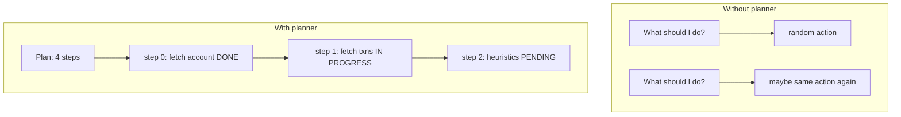

# 7. Planning and Scratchpads

"Ask the LLM what to do next" is not planning. It's improvisation. For case 456, I want the agent to follow a protocol: fetch account → fetch transactions → apply heuristics → flag or close. A planner holds that structure between loop iterations.

## Why open-ended prompts fail

Without a planner, every loop iteration asks the same vague question: *what should I do?*

That leads to:

- Non-deterministic step ordering
- Re-discovering the same next step repeatedly
- No progress tracking — the agent doesn't know it's on step 2 of 4
- No structured replan when a tool fails



## Planner as a replaceable function

In CaseBot, the planner is a function signature — not a framework:

```python
Planner = Callable[[int, Trajectory, str], Action]

def good_run_planner(step: int, traj: Trajectory, memory: str) -> Action:
    script = [
        Action(type=ActionType.TOOL_CALL, tool="getAccount", args={"accountId": "456"}),
        Action(type=ActionType.TOOL_CALL, tool="getTransactions", args={"accountId": "456"}),
        Action(type=ActionType.ANSWER, text="Account 456 reviewed. Case closed."),
    ]
    return script[step]
```

The loop calls `planner(step, trajectory, memory_context)`. In `--dry-run`, the planner is a script. In `--live`, it wraps an LLM call with the plan state in the prompt.

Same loop. Different planner. That is the separation from chapter 2.

## What a production planner holds

```
TaskPlanner state for case 456:
─────────────────────────────────
task:     "Review account 456 for fraud"
steps:
  [0] fetch account details      → DONE   (getAccount)
  [1] fetch transactions         → DONE   (getTransactions)
  [2] apply fraud heuristics     → IN_PROGRESS
  [3] flag or close with summary → PENDING
scratchpad:
  "balance $142.50, 2 settled txns, no unusual amounts"
replans_remaining: 2
```

The scratchpad is working memory for the planner — not durable agent memory. It gets discarded when the case closes. Constraints and facts live in memcell-rl. The scratchpad is ephemeral reasoning.

## Replanning when a tool fails

If `getAccount` returns `account_not_found`, a good planner:

1. Marks step 0 as `failed`
2. Writes the error to scratchpad
3. Either replans (try alternate ID) or escalates

```python
if not result.success:
    planner.mark_failed(step, result.error)
    if planner.replans_remaining > 0:
        planner.replan()
        return planner.next_action()
    return Action(type=ActionType.ESCALATE, reason=result.error)
```

CaseBot's `--dry-run` planner doesn't replan yet — that's an exercise. But the loop already handles tool failure by escalating:

```python
if not result.success:
    return f"ESCALATED:tool_error:{result.error}"
```

## LLM planner sketch

When you swap in an LLM, the prompt includes plan state:

```python
SYSTEM = """You are a case-resolution agent.
Current plan: {plan_json}
Scratchpad: {scratchpad}
Memory context: {memory_context}
Return JSON: {{"type": "tool_call", "tool": "...", "args": {{}}}}
           or {{"type": "answer", "text": "..."}}
           or {{"type": "escalate", "reason": "..."}}"""
```

The LLM proposes. Python validates. The registry dispatches.

## Exercise

Modify `good_run_planner` to add a fourth step: write an episode cell to memcell-rl summarising the case outcome. Does the trajectory change? What property checks still pass?

**Next →** [Stop Conditions and Escalation](./09-stop-escalate.md)
