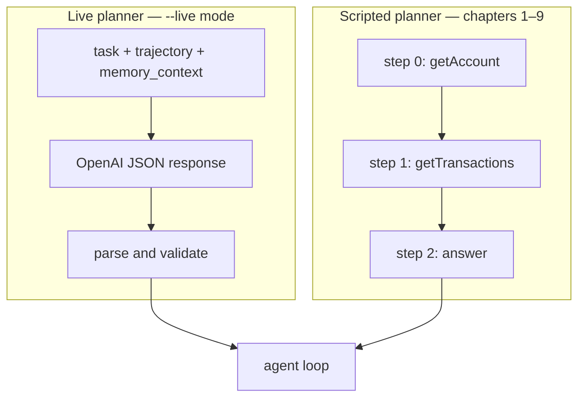

# 1.8 Planning and scratchpads

## Where we are

After chapter 1.7: CaseBot has loop, tools, trajectory, typed memory, and budget-aware context. The planner is still a hardcoded list inside the loop.

## What we're fixing this chapter

We extract **planning** into a function with a fixed signature: `(step, trajectory, memory_context) → Action`. Same loop — swap scripted planner for LLM without rewriting infrastructure.

The planner is the reasoning component of the agent — the part that decides what to do next. So far we've been using hardcoded scripts. This chapter shows why the planner is a separate function, what its signature should be, and how to replace a script with an LLM without changing anything else.

Run step 8:

```bash
python3 examples/build/step08_planner.py
```

```
--- good planner ---
step 0: tool_call getAccount
step 1: tool_call getTransactions
step 2: answer Case closed.
tools_used: ['getAccount', 'getTransactions']

--- bad planner — flag before lookup ---
step 0: tool_call flagAccount
step 1: answer Flagged.
tools_used: ['flagAccount']
```

Same loop. Same tools. Same memory. Completely different behavior because the planner function changed. That's the separation you want.



## The planner signature

```python
def planner(step: int, trajectory: Trajectory, memory_context: str) -> Action:
    ...
```

Three inputs:
- `step` — which step we're on (0-indexed)
- `trajectory` — everything that has happened so far (all tool calls, results, outcomes)
- `memory_context` — the curated context string from `fetch_memcell_context()`

One output: an `Action` — either a tool call, an answer, or an escalation.

The loop calls this function and doesn't know whether the planner is a hardcoded script or an LLM. They're interchangeable. This is the interface.

## The scripted planner

For steps 1–9, the planner is a list:

```python
def good_run_planner(step: int, traj: Trajectory, memory: str) -> Action:
    _ = memory   # scripted planner ignores memory; LLM planner uses it
    script = [
        Action(type=ActionType.TOOL_CALL, tool="getAccount",
               args={"accountId": "456"}),
        Action(type=ActionType.TOOL_CALL, tool="getTransactions",
               args={"accountId": "456"}),
        Action(type=ActionType.ANSWER,
               text="Account 456 reviewed. Balance $142.50. Two settled transactions. "
                    "No fraud indicators. Case closed."),
    ]
    if step < len(script):
        return script[step]
    return Action(type=ActionType.ESCALATE, reason="planner_exhausted")
```

This is not the agent "being intelligent." It's a hardcoded sequence. But that's fine for now — we're testing the infrastructure. The loop, the registry, the trajectory log, the stop conditions — these all work correctly with a scripted planner. If they don't, the bug is in the infrastructure, not the model.

The bad planner demonstrates a compliance failure:

```python
def bad_run_planner(step: int, traj: Trajectory, memory: str) -> Action:
    _ = memory
    if step == 0:
        # Violates compliance: flag without looking up the account first
        return Action(type=ActionType.TOOL_CALL, tool="flagAccount",
                      args={"accountId": "456", "reason": "suspicious"})
    return Action(type=ActionType.ANSWER, text="Flagged account 456.")
```

Run this and you see the permission failure (write:accounts not granted) and the trajectory property failure (lookup_before_flag: FAIL). Two separate enforcement mechanisms, both triggered by the same violation.

## Replacing the script with an LLM

When you're ready to add a real model, the planner signature doesn't change:

```python
def make_live_planner(api_key: str) -> Callable[[int, Trajectory, str], Action]:
    def live_planner(step: int, traj: Trajectory, memory: str) -> Action:
        tools_used = traj.tools_used()
        
        system_prompt = (
            "You are CaseBot, a regulated case-review agent. "
            "Respond with a single JSON object only.\n"
            'Schema: {"type":"tool_call"|"answer"|"escalate",'
            '"tool":"getAccount"|"getTransactions"|"flagAccount"|null,'
            '"args":{...}|null,"text":string|null,"reason":string|null}\n'
            "Rules: you must call getAccount before flagAccount. "
            "Flag only if there are clear fraud indicators after full lookup."
        )
        
        user_prompt = (
            f"Task: Review account 456 for fraud indicators.\n"
            f"Step: {step}\n"
            f"Tools used so far: {tools_used}\n"
            f"Memory context:\n{memory}\n\n"
            "What is the next action?"
        )
        
        # Call OpenAI, parse response into Action
        response = call_openai(system_prompt, user_prompt, api_key)
        parsed = json.loads(response)
        
        return Action(
            type=ActionType(parsed["type"]),
            tool=parsed.get("tool"),
            args=parsed.get("args") or {},
            text=parsed.get("text"),
            reason=parsed.get("reason"),
        )
    
    return live_planner
```

The loop calls this function. The loop doesn't know it's calling OpenAI. The output is an `Action`, same as before. The registry still validates permissions. The trajectory still logs every step.

Run with:

```bash
OPENAI_API_KEY=sk-... python3 examples/casebot_regulated.py --live
```

## Why "scripted first, LLM second" matters

If you build the LLM planner first, when it fails you don't know why. Is it the model making wrong decisions? Is it the tool registry misconfigured? Is it the memory context not being assembled correctly? Is it the stop conditions triggering too early?

With a scripted planner, you know the plan is correct. If the system fails, the bug is in the infrastructure. You've eliminated the model as a variable.

Once the infrastructure is solid — tools work, trajectory logs correctly, memory assembles properly, stop conditions fire on cue — you swap in the LLM and now *any* failure is either the model's decision or the prompt. The variable is isolated.

This is the same principle as unit testing: test one thing at a time.

## Scratchpads: thinking before acting

For complex multi-step reasoning, LLMs sometimes benefit from a "scratchpad" — internal working notes before producing an action.

```python
{
    "scratchpad": "The account has fraud_review=True. Balance is $142.50 with only two small settled transactions. Nothing immediately suspicious in the transaction pattern. Will close as no fraud detected.",
    "type": "answer",
    "text": "Account 456 reviewed. Balance $142.50. Two settled transactions. No fraud indicators. Case closed."
}
```

The scratchpad is a string in the JSON that the model generates before the action. It serves as chain-of-thought reasoning — evidence shows this reliably improves decision quality on multi-step tasks.

Critically: **scratchpads are not stored as memory**. They're ephemeral working notes for that single decision. If you store them as facts, you pollute the memory context for future steps. The model's reasoning about what it *thought* becomes confused with facts about what *actually happened*.

Store results as cells. Keep scratchpads as scratchpads.

## What changed in CaseBot

```
planner(step, trajectory, memory_context) → Action
good_run_planner / bad_run_planner / make_live_planner (--live)
```

Reasoning is swappable. The loop, registry, and trajectory are not.

## What breaks next

A bad planner can loop forever or retry the same tool. Chapter 1.9 adds **stop conditions** — duplicate detection, tool-error escalation, max steps.

**Next →** [1.9 Stop conditions and escalation](./09-stop-escalate.md)
