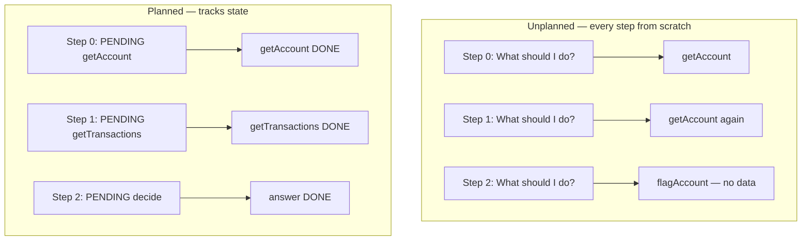
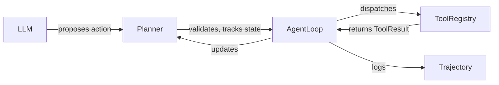

# 7. Planning and Scratchpads

The loop calls `planner(step, trajectory, memory_context)` every iteration and gets back an `Action`. What does the planner actually do? This chapter answers that question — and explains why "ask the LLM what to do next" is not a plan.

## What planning means here

An agent without a plan is reactive: every iteration it asks "what should I do?" from scratch. Two problems:

First, it doesn't know what it already did. If the LLM receives only the latest tool result and not the history, it may re-issue step 0 at step 3. This is the duplicate tool call problem from chapter 2 — the loop catches it, but the underlying cause is a planner with no memory of its own progress.

Second, it doesn't know what's still left to do. Case resolution has a protocol: get data, apply rules, decide, report. A planner that doesn't track which steps are complete will skip steps, re-order them, or invent unnecessary ones.



## The planner as a replaceable function

CaseBot's planner is typed as:

```python
Planner = Callable[[int, Trajectory, str], Action]
```

That's it. Takes the step index, the current trajectory (what happened so far), and the memory context (what the agent knows). Returns an `Action`. The loop doesn't need to know whether the planner is an LLM call, a scripted sequence, or a rule engine.

In `--dry-run` mode, the planner is hardcoded:

```python
def good_run_planner(step: int, traj: Trajectory, memory: str) -> Action:
    SCRIPT = [
        Action(type=ActionType.TOOL_CALL, tool="getAccount",
               args={"accountId": "456"}),
        Action(type=ActionType.TOOL_CALL, tool="getTransactions",
               args={"accountId": "456"}),
        Action(type=ActionType.ANSWER,
               text="Account 456 reviewed. Balance $142.50. "
                    "Two settled transactions. No fraud indicators. Case closed."),
    ]
    if step < len(SCRIPT):
        return SCRIPT[step]
    return Action(type=ActionType.ESCALATE, reason="script_exhausted")
```

In `--live` mode, the planner calls an LLM. The interface is the same. The loop does not change.

## What a production planner tracks

A more complete planner holds three things: a task decomposition, a scratchpad, and a replan counter.

```python
@dataclass
class PlanState:
    task: str
    steps: list[PlanStep]      # ordered subtasks
    scratchpad: str            # working notes, ephemeral
    replans_remaining: int = 2

@dataclass
class PlanStep:
    description: str
    tool: str | None           # None for reasoning steps
    status: str = "pending"    # pending | done | failed
```

A concrete plan for case 456:

```
PlanState(
  task="Review account 456 for fraud indicators",
  steps=[
    PlanStep("Fetch account data",         tool="getAccount",      status="done"),
    PlanStep("Fetch transaction history",  tool="getTransactions", status="done"),
    PlanStep("Apply fraud heuristics",     tool=None,              status="in_progress"),
    PlanStep("Flag or close with summary", tool=None,              status="pending"),
  ],
  scratchpad="balance $142.50, 2 settled txns, no unusual amounts",
  replans_remaining=2
)
```

At step 2, the planner knows exactly what it's analyzed and what's still pending. The scratchpad is working notes for the current case — not durable memory. When the case closes, the scratchpad is discarded. Important facts (balance, transaction count) live in memcell-rl as typed cells.

## The scratchpad: ephemeral reasoning

This is worth dwelling on. Teams often try to persist scratchpads — store them in memory cells, pass them back in future turns, treat them like durable facts. That's wrong.

A scratchpad is reasoning in progress. *"Balance looks normal, flagging the two-day gap in transactions"* is not a fact. It's a note-to-self during the current decision pass. If you persist it and inject it as context in the next case, you corrupt the context with stale reasoning from a different case.

```
What goes in typed memory cells (durable):
  - account balance: $142.50
  - fraud_review constraint: no_outbound_transfers
  - case status: active

What goes in the scratchpad (ephemeral):
  - "balance seems normal relative to 6-month average"
  - "two-day transaction gap — could be normal travel"
  - "need to check merchant categories next"
```

The distinction is: *could a future agent step on a different case usefully read this?* If yes, it might belong in memory. If no, scratchpad only.

## The LLM planner: what the prompt looks like

When the planner wraps an LLM, the system prompt includes the current plan state:

```python
def llm_planner(step: int, traj: Trajectory, memory: str) -> Action:
    history = "\n".join(
        f"Step {s.step}: {s.action_type} {s.action.get('tool', '')} → "
        f"{'ok' if (s.result or {}).get('success') else 'error'}"
        for s in traj.steps
    )

    prompt = f"""You are a case resolution agent.

Current task: {traj.task}
Step: {step}

What has happened:
{history if history else "(nothing yet)"}

Memory context (what you know about this case):
{memory}

Available tools: getAccount(accountId), getTransactions(accountId), flagAccount(accountId, reason)

Return JSON on one line:
  {{"type": "tool_call", "tool": "...", "args": {{...}}}}
  {{"type": "answer",    "text": "..."}}
  {{"type": "escalate",  "reason": "..."}}
"""

    raw = call_openai(prompt)
    return parse_action(raw)  # validated, never throws
```

The history section tells the LLM what it already did. Without it, the LLM cannot track progress across steps. With it, the LLM's decision at step 3 can reference "I already fetched the account at step 0."

## Replanning when tools fail

The current CaseBot doesn't replan — a tool error escalates immediately. That's safe for regulated workflows. But the pattern for replanning is worth knowing:

```python
def planner_with_replan(step: int, traj: Trajectory, memory: str) -> Action:
    last = traj.steps[-1] if traj.steps else None
    if last and not last.result.get("success"):
        # Previous tool failed — can we recover?
        error = last.result.get("error", "")
        if "account_not_found" in error and plan.replans_remaining > 0:
            plan.replans_remaining -= 1
            plan.scratchpad += f"\nRetrying with parent account ID"
            return Action(
                type=ActionType.TOOL_CALL,
                tool="getAccount",
                args={"accountId": "456-parent"},  # try alternate
            )
        # Can't recover — escalate
        return Action(type=ActionType.ESCALATE, reason=f"tool_failed:{error}")

    return plan.next_action()
```

Replanning is the difference between an agent that fails cleanly (escalates on first error) and one that tries alternatives before giving up. For CaseBot, the regulated workflow requires human approval before any recovery action on a sensitive account — so we escalate. Your domain may differ.

## The important mental model



The LLM proposes. The planner validates and tracks state. The loop dispatches and logs. This separation is what makes the system testable: replace the LLM with a scripted sequence and the rest works identically.

## Exercise

1. Modify `good_run_planner` to track which steps are complete using a `list[bool]` initialized to `[False, False, False]`. At each step, mark the previous step done. Add a check: if step 2 is requested but step 1 is not done, escalate instead of answering.

2. Write a planner that reads the memory context and adapts its step 2 action: if `fraud_review: True` appears in memory, the third step becomes `flagAccount` instead of `answer`. Confirm both paths produce different trajectories and that `lookup_before_flag` passes on both.

3. Implement a `Scratchpad` class with `add(note)` and `read()` methods. Pass it to the planner. After step 0 (getAccount), add the account balance to the scratchpad. Verify step 1's planner call receives the note.

**Next →** [Stop Conditions and Escalation](./09-stop-escalate.md)
