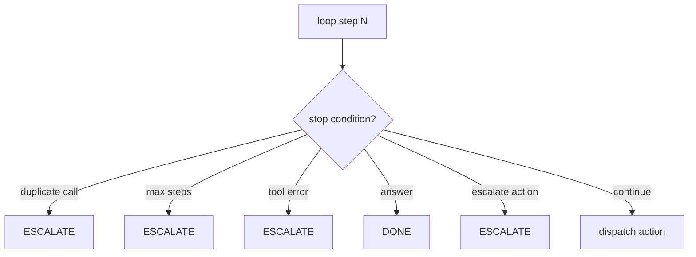

# 8. Stop Conditions and Escalation

An agent that never stops is not an agent — it's an infinite loop burning tokens. Stop conditions are the explicit rules that tell the loop when to exit. In regulated workflows, they are also compliance features.

## Where the loop can exit



CaseBot implements four exits in `AgentLoop.run()`:

| Condition | Trigger | Outcome |
|-----------|---------|---------|
| Answer | Planner returns `answer` | Return text |
| Duplicate tool call | Same `(tool, args)` seen before | `ESCALATED:duplicate_tool_call` |
| Tool error | `ToolResult.success == False` | `ESCALATED:tool_error:...` |
| Max steps | `step >= MAX_STEPS` | `ESCALATED:max_steps_exceeded` |
| Explicit escalate | Planner returns `escalate` | `ESCALATED:{reason}` |

## Duplicate detection

```python
sig = json.dumps({"tool": action.tool, "args": action.args}, sort_keys=True)
if sig in self.seen_calls:
    return f"ESCALATED:duplicate_tool_call at step {step}"
self.seen_calls.add(sig)
```

I've seen agents call `getAccount("456")` six times because the LLM lost track of what it already did. Three lines fixes that.

## Permission as stop condition

The bad-run demo stops at step 1:

```bash
python examples/casebot_regulated.py --dry-run --bad-run
# ESCALATED:tool_error:permission_denied: write:accounts required
```

You can also stop **before** dispatch — check permissions in the planner and return `escalate` instead of attempting the tool:

```python
if action.tool == "flagAccount" and "write:accounts" not in permissions:
    return Action(type=ActionType.ESCALATE, reason="approval_required")
```

Prevention beats logging. Both beat silent failure.

## Max steps by task type

```python
MAX_STEPS = {
    "simple_lookup": 5,
    "case_resolution": 12,
    "multi_agent": 30,  # Book 3
}
```

Case 456 uses 12. Open-ended chat would use a lower number or require explicit user input to continue.

## Escalation is a first-class outcome

`ESCALATED:` is not failure. It's the system working correctly — handing control to a human when the agent cannot proceed safely.

In production:

- Route `ESCALATED:approval_required` to supervisor queue
- Route `ESCALATED:duplicate_tool_call` to engineering alert
- Log all escalations to trajectory for audit

```python
if outcome.startswith("ESCALATED:"):
    notify_supervisor(case_id="456", reason=outcome)
```

## Pluggable stop conditions

For larger systems, extract checks into a list:

```python
STOP_CONDITIONS = [
    max_steps_condition(12),
    duplicate_tool_condition,
    constraint_violation_condition,
]

for check in STOP_CONDITIONS:
    if check.should_stop(step, action, trajectory):
        return escalate(check.reason)
```

CaseBot inlines the critical checks for clarity. Book 2 adds property checks that run **after** the loop — complementary, not redundant.

## Exercise

Add a stop condition: if `flagAccount` is called without a prior `getAccount` in the trajectory, escalate **before** dispatch — not just fail the property check after.

**Next →** [Trajectory Logging](./10-trajectory.md)
