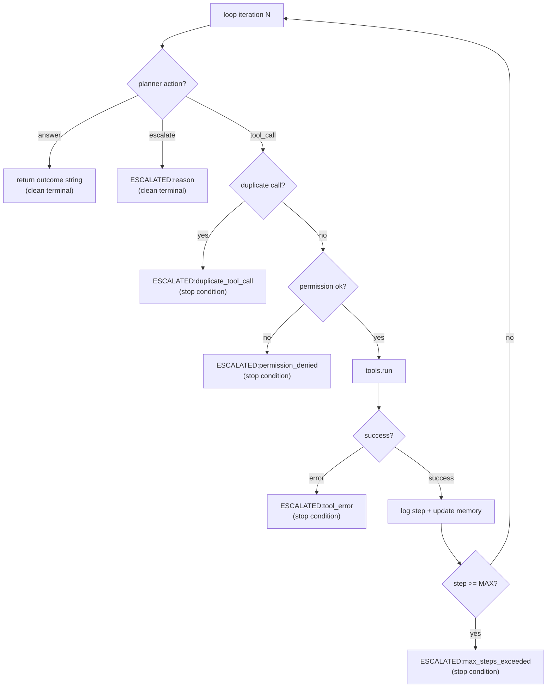
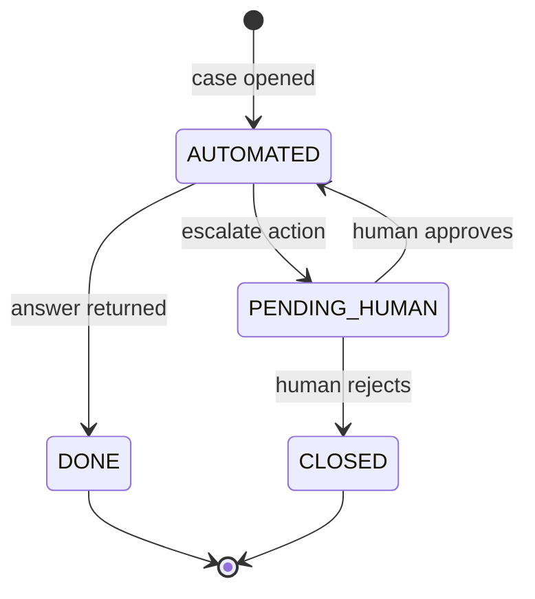

# 8. Stop Conditions and Escalation

An agent that never stops is not an agent — it's an infinite loop burning tokens while silently making progress toward nothing. Stop conditions are the explicit rules that tell the loop when to exit. In regulated workflows, they are not just engineering safeguards. They are compliance features.

Every exit from the loop is either a clean terminal state (answer or escalation) or a bug. There is no third category. An agent that stops with `ESCALATED:max_steps_exceeded` is behaving correctly. An agent that silently hangs or crashes is not.

## All the ways the loop can exit



Every exit path is named. Every exit path is logged to the trajectory. Nothing falls off silently.

## The four stop conditions in CaseBot

**1. Answer** — planner returns `ActionType.ANSWER`. Normal termination. The agent resolved the case.

**2. Explicit escalation** — planner returns `ActionType.ESCALATE` with a reason. The agent knows it needs human help (approval required, ambiguous data, explicit rule).

**3. Computed stop conditions** — checked by the loop, not the planner:

```python
# Duplicate tool call
sig = json.dumps({"tool": action.tool, "args": action.args}, sort_keys=True)
if sig in self.seen_calls:
    return f"ESCALATED:duplicate_tool_call at step {step}"

# Tool error
if not result.success:
    return f"ESCALATED:tool_error:{result.error}"
```

**4. Step cap** — the hard ceiling:

```python
MAX_STEPS = 10  # case resolution; use 5 for simple lookups

for step in range(MAX_STEPS):
    ...

return "ESCALATED:max_steps_exceeded"
```

## Why duplicate detection matters

Without it, a confused LLM planner can do this:

```
step 0: getAccount("456")       → balance $142.50
step 1: getTransactions("456")  → 2 transactions
step 2: getAccount("456")       ← LLM "forgot" it already fetched
step 3: getAccount("456")       ← still confused
step 4: getAccount("456")       ← MAX_STEPS hit
```

The loop terminates, but we burned four API calls to get back exactly where we were after step 1. Worse: if `getAccount` is a billable external API, this is a cost incident. If it has side effects (some APIs log reads for compliance), this is a compliance incident.

Three lines fixes it:

```python
sig = json.dumps({"tool": action.tool, "args": action.args}, sort_keys=True)
if sig in self.seen_calls:
    return f"ESCALATED:duplicate_tool_call at step {step}"
self.seen_calls.add(sig)
```

Hash the `(tool, args)` pair. Check the set before dispatch. Escalate on collision.

Note: `sort_keys=True` matters. `{"accountId": "456"}` and `{"accountId": "456", "extra": null}` should hash differently. Consistent serialization prevents false negatives.

## Why tool errors must stop the loop

If a tool returns `success: False` and the loop continues:

```
step 0: getAccount("456") → account_not_found:456
step 1: planner has no account data, doesn't know why
step 2: planner guesses — maybe flagAccount anyway?
step 3: flagAccount("456") → success (data was stale in a cache)
```

The account that doesn't exist in the primary API got flagged because a caching layer had stale data. The flag is wrong. The trajectory shows no error was handled. The audit team sees a planner that kept going after a failed lookup.

The correct behavior: tool error → log it → escalate. Don't continue. Let a human decide whether to retry or close the case.

```python
result = self.tools.run(action.tool, action.args)
self.trajectory.log(step, action, result)
if not result.success:
    return f"ESCALATED:tool_error:{result.error}"
# only reach here if success
```

## Escalation as a first-class outcome

Most agent system tutorials treat escalation as an error path — something went wrong, a human needs to fix it. That framing is wrong for regulated workflows.

CaseBot's escalation includes normal cases:

```python
# The planner escalates — not because something broke
return Action(
    type=ActionType.ESCALATE,
    reason="supervisor_approval_required:fee_waiver",
)
```

This is correct behavior. The agent identified that the next action requires human authorization. It stops, logs the reason, and routes to the approval queue. When the supervisor approves, the agent resumes.



Route outcomes based on the `ESCALATED:` prefix:

```python
outcome = loop.run()

if not outcome.startswith("ESCALATED:"):
    close_case(case_id, outcome)
elif "approval_required" in outcome:
    queue_for_supervisor(case_id, outcome)
elif "duplicate_tool_call" in outcome or "max_steps" in outcome:
    alert_engineering(case_id, outcome)
elif "tool_error" in outcome:
    alert_ops(case_id, outcome)
```

`duplicate_tool_call` and `max_steps_exceeded` are planner/model quality issues — engineering needs to look at them. `tool_error` may be infrastructure. `approval_required` is normal business flow.

## Pluggable stop conditions for larger systems

CaseBot inlines the stop condition checks for clarity. As you add more checks, extract them:

```python
from dataclasses import dataclass
from typing import Protocol

@dataclass
class StopResult:
    should_stop: bool
    reason: str = ""

class StopCondition(Protocol):
    def check(self, step: int, action: Action, traj: Trajectory) -> StopResult:
        ...

class DuplicateCallCondition:
    def __init__(self):
        self.seen: set[str] = set()

    def check(self, step: int, action: Action, traj: Trajectory) -> StopResult:
        if action.type != ActionType.TOOL_CALL:
            return StopResult(should_stop=False)
        sig = json.dumps({"tool": action.tool, "args": action.args}, sort_keys=True)
        if sig in self.seen:
            return StopResult(should_stop=True, reason=f"duplicate_tool_call at step {step}")
        self.seen.add(sig)
        return StopResult(should_stop=False)

class MaxStepsCondition:
    def __init__(self, max_steps: int):
        self.max_steps = max_steps

    def check(self, step: int, action: Action, traj: Trajectory) -> StopResult:
        return StopResult(
            should_stop=step >= self.max_steps,
            reason="max_steps_exceeded",
        )

class ConstraintViolationCondition:
    """Stop before dispatch if constraint would be violated."""
    DESTRUCTIVE_TOOLS = {"flagAccount", "waivedFee"}

    def check(self, step: int, action: Action, traj: Trajectory) -> StopResult:
        if action.type != ActionType.TOOL_CALL:
            return StopResult(should_stop=False)
        if action.tool not in self.DESTRUCTIVE_TOOLS:
            return StopResult(should_stop=False)
        # Check if a lookup happened before this destructive action
        prior_tools = [s.action.get("tool") for s in traj.steps]
        if "getAccount" not in prior_tools:
            return StopResult(
                should_stop=True,
                reason="constraint_violation:destructive_without_lookup",
            )
        return StopResult(should_stop=False)
```

```python
STOP_CONDITIONS: list[StopCondition] = [
    DuplicateCallCondition(),
    MaxStepsCondition(10),
    ConstraintViolationCondition(),
]

# In the loop:
for cond in STOP_CONDITIONS:
    result = cond.check(step, action, self.trajectory)
    if result.should_stop:
        return f"ESCALATED:{result.reason}"
```

`ConstraintViolationCondition` is particularly powerful: it stops the agent *before* the destructive tool call, not just flags it afterward. Prevention beats post-hoc property checks.

## The difference between prevention and detection

Property checks (Book 2) detect problems after the fact. Stop conditions prevent them during execution.

```
Prevention (stop condition):
  step 0: planner proposes flagAccount
  → ConstraintViolationCondition fires
  → ESCALATED:constraint_violation:destructive_without_lookup
  → flagAccount never called

Detection (property check, post-hoc):
  step 0: flagAccount succeeds
  step 1: property check lookup_before_flag → FAIL
  → account was already flagged, flag must be reversed
```

Use both. Stop conditions for runtime enforcement. Property checks for post-hoc audit and regression. They answer different questions.

## MAX_STEPS is per task type

```python
MAX_STEPS_BY_TYPE = {
    "simple_lookup": 4,     # get account, answer — done
    "case_resolution": 10,  # fetch, analyze, decide
    "multi_agent": 30,      # Book 3 — coordinator overhead
}
```

A simple lookup that hits 10 steps is running forever. A multi-agent orchestration hitting 4 steps would always fail.

## Exercise

1. Implement `ConstraintViolationCondition` from the code above and wire it into a `STOP_CONDITIONS` list in `casebot_regulated.py`. Run `--dry-run --bad-run`. Does the loop now escalate before `flagAccount` is dispatched? Compare the trajectory length to the original.

2. Add a stop condition: if `result.data` contains a key `"fraud_score"` and its value is `> 0.9`, escalate with `reason="high_risk_requires_approval"`. This models a situation where certain tool results require human review regardless of what the planner planned.

3. What happens if you set `MAX_STEPS = 0`? Does the loop still terminate cleanly? Check the trajectory file — how many steps does it log?

**Next →** [Trajectory Logging](./10-trajectory.md)
