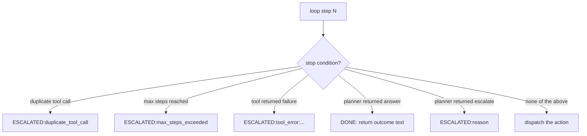

# 17. Stop conditions and escalation

An agent that never stops burns money. An agent that stops silently is worse. Every exit from the loop must be named, logged, and routed correctly.

Run step 9:

```bash
python3 examples/build/step09_stops.py
```

```
step 0: getAccount → ok
step 1: ESCALATED:duplicate_tool_call
```

Change the script to try flagAccount without write permission:

```
step 0: flagAccount → ESCALATED:tool_error:permission_denied: write:accounts required
```

Two different stops, one clean mechanism.



## The three stops CaseBot implements

**Stop 1: Duplicate tool call**

If the agent calls the same tool with the same arguments twice, something is wrong. Either the planner is looping, or the context assembly is failing to include the previous result, or the prompt is confused. Rather than let the agent burn tokens retrying identical work, we detect and escalate:

```python
sig = json.dumps({"tool": action.tool, "args": action.args}, sort_keys=True)
if sig in self.seen_calls:
    self.trajectory.outcome = f"ESCALATED:duplicate_tool_call at step {step}"
    self.trajectory.log(step, Action(type=ActionType.ESCALATE, reason="duplicate_tool_call"))
    return self.trajectory.outcome
self.seen_calls.add(sig)
```

We hash `(tool, args)` into a canonical JSON string and store it in a set. Before every tool call, we check the set. If it's already there, escalate.

Why `sort_keys=True`? So that `{"a":1,"b":2}` and `{"b":2,"a":1}` produce the same hash — they're the same call, just formatted differently.

**Stop 2: Tool error**

Any tool failure becomes an escalation:

```python
result = self.tools.run(action.tool, action.args)
self.trajectory.log(step, action, result)   # log the failure
if not result.success:
    self.trajectory.outcome = f"ESCALATED:tool_error:{result.error}"
    self.trajectory.log(step, Action(type=ActionType.ESCALATE, reason=result.error))
    return self.trajectory.outcome
```

The loop logs the failed tool call, then logs a separate escalation step. The trajectory shows: tool failed, agent escalated. Not: tool failed, agent retried, maybe succeeded, maybe failed again.

Should the agent retry on failure? Sometimes yes — transient network errors might be retryable. But in a regulated workflow, the safe default is: fail clean, route to a human. The human can decide whether to retry. An agent that retries failures silently can mask real problems.

**Stop 3: Max steps**

```python
MAX_STEPS = 12   # set at construction time, not by the LLM

for step in range(MAX_STEPS):
    ...

# If we exit the loop without returning:
self.trajectory.outcome = "ESCALATED:max_steps_exceeded"
return self.trajectory.outcome
```

This is a hard ceiling. The LLM cannot override it — `MAX_STEPS` is a Python constant, not a prompt instruction. If the task genuinely requires more than 12 steps, the ceiling should be raised in code and reviewed. If it's hitting the ceiling unexpectedly, it signals a planning problem.

## Escalation is success

This is worth stating explicitly because many teams treat escalation as failure.

`ESCALATED:approval_required` means: the agent completed its work, determined it cannot proceed safely, and handed off to a human for a decision. That is the *correct* behavior for a regulated system.

A workflow without escalation is fragile: when the unexpected happens, it either crashes or silently makes a wrong decision. An agent with escalation is robust: when the unexpected happens, it names the problem and routes it to the right place.

The escalation prefix `ESCALATED:` is structured so you can route by parsing:

```python
outcome = loop.run()
if outcome.startswith("ESCALATED:"):
    reason = outcome.removeprefix("ESCALATED:")
    if reason.startswith("approval_required"):
        route_to_supervisor_queue(case_id, reason)
    elif reason.startswith("duplicate_tool_call"):
        alert_engineering_team(case_id, reason)
    elif reason.startswith("tool_error"):
        route_to_ops(case_id, reason)
    elif reason.startswith("max_steps_exceeded"):
        route_to_review(case_id, reason)
else:
    # Clean outcome
    record_outcome(case_id, outcome)
```

The escalation code tells you not just that something went wrong, but *what* went wrong and *who* should handle it.

## Prevention vs detection

Stop conditions *prevent* bad actions during the loop. Property checks (Book 2) *detect* violations after the fact by analyzing the trajectory.

You need both. Prevention catches the obvious cases: permission failure, duplicate call, max steps. Detection catches the subtle cases: did the agent call `getAccount` before `flagAccount`, even if both calls succeeded? Was the constraint in memory when the decision was made?

Stop conditions operate in real time, during execution. Property checks operate on the saved trajectory, after the fact.

Neither is sufficient alone. Together, they give you defense in depth.

## What happens with no stop conditions

Without max steps: the agent can loop indefinitely, burning tokens and money. LLMs occasionally get stuck in loops where each response convinces them to do the same thing again.

Without duplicate detection: the agent might call `getAccount` 5 times in one case, accumulating redundant facts in memory and wasting 5 API calls.

Without tool error escalation: a permission failure might be silently retried, or the agent might receive `error: "permission_denied"` and decide to work around it in a way that violates the intended constraints.

Each stop condition is cheap to implement and prevents a class of expensive failures.

**Next →** [Putting it together — CaseBot](./11-together.md)
