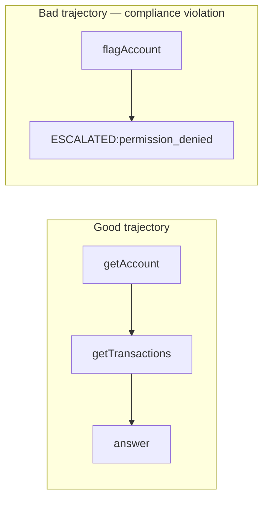

# 1.4 Trajectory logging

## Where we are

After chapter 1.3: CaseBot has a loop and a tool registry. Tools run. But there is no record of what happened — no audit trail.

## What we're fixing this chapter

Compliance asks: *was `getAccount` called before `flagAccount`?* A chat transcript can't answer that. A string of LLM outputs can't answer that. A **trajectory** — an ordered, structured log of every action and result — can.

We add trajectory logging **before** memory (chapters 1.5–1.7) on purpose: first you must be able to prove what the agent did. Then we'll see why chat history fails as memory.

Run step 4:

```bash
python3 examples/build/step04_trajectory.py
cat logs/step04.json
```

```
step 0: getAccount → success=True
step 1: getTransactions → success=True

Tools used: ['getAccount', 'getTransactions']
Saved: logs/step04.json
```

```json
{
  "case_id": "456",
  "outcome": "Account 456 reviewed. No fraud indicators.",
  "tools_used": ["getAccount", "getTransactions"],
  "step_count": 2,
  "steps": [
    {
      "step": 0,
      "action_type": "tool_call",
      "action": {"type": "tool_call", "tool": "getAccount", "args": {"accountId": "456"}},
      "result": {"success": true, "data": {"balance_usd": 142.5, "status": "active"}, "error": null},
      "timestamp": "2026-06-26T12:00:00Z"
    }
  ]
}
```

That JSON file is the evidence trail. It answers questions a compliance officer, a debugger, or an automated test might ask:
- Which tools were called, and in what order?
- What were the exact arguments passed?
- What did each tool return?
- When did each step happen?
- What was the final outcome?



## The data structures

```python
from dataclasses import dataclass, field, asdict
from typing import Any
import time, json
from pathlib import Path

@dataclass
class TrajectoryStep:
    step: int
    action_type: str             # "tool_call", "answer", "escalate"
    action: dict[str, Any]       # {type, tool, args, text}
    result: dict[str, Any] | None = None   # ToolResult as dict
    timestamp: str = ""

@dataclass
class Trajectory:
    case_id: str
    task: str
    steps: list[TrajectoryStep] = field(default_factory=list)
    outcome: str = ""

    def log(self, step: int, action: Action, result: ToolResult | None = None) -> None:
        self.steps.append(
            TrajectoryStep(
                step=step,
                action_type=action.type.value,
                action={
                    "type": action.type.value,
                    "tool": action.tool,
                    "args": action.args,
                    "text": action.text,
                },
                result=asdict(result) if result else None,
                timestamp=time.strftime("%Y-%m-%dT%H:%M:%SZ", time.gmtime()),
            )
        )

    def tools_used(self) -> list[str]:
        return [
            s.action["tool"]
            for s in self.steps
            if s.action_type == "tool_call" and s.action.get("tool")
        ]

    def save(self, path: str | Path) -> None:
        payload = {
            "case_id": self.case_id,
            "task": self.task,
            "outcome": self.outcome,
            "tools_used": self.tools_used(),
            "step_count": len(self.steps),
            "steps": [asdict(s) for s in self.steps],
        }
        Path(path).write_text(json.dumps(payload, indent=2))
```

`Trajectory` is a plain Python dataclass. No framework, no special library. It grows by appending `TrajectoryStep` objects, and it serializes to JSON at the end.

## Every step gets logged, no exceptions

The key discipline: **every action is logged, regardless of success or failure**.

```python
# In the agent loop:
result = self.tools.run(action.tool, action.args)
self.trajectory.log(step, action, result)      # log BEFORE checking success

if not result.success:
    self.trajectory.outcome = f"ESCALATED:tool_error:{result.error}"
    return self.trajectory.outcome
```

Notice: `trajectory.log(step, action, result)` happens before the failure check. If we only logged successful steps, we'd lose the most important information — what failed and why.

A trajectory that shows `flagAccount → permission_denied` is invaluable for debugging. A trajectory that silently omits the failed step is worse than no trajectory at all — it misleads.

## What the trajectory enables

**Compliance verification.** You can inspect `tools_used()` and verify the order. `lookup_before_flag` is just two lines:

```python
def lookup_before_flag(traj: Trajectory) -> bool:
    tools = traj.tools_used()
    if "flagAccount" not in tools:
        return True   # no flag attempted, pass
    if "getAccount" not in tools:
        return False  # flagged without any lookup
    return tools.index("getAccount") < tools.index("flagAccount")
```

This check runs on the JSON file — no LLM, no inference, just indexing a list. It's fast, deterministic, and reproducible.

**Debugging.** When the agent fails in production, you don't have to reproduce the issue — you read the trajectory. What was the agent doing just before the failure? What did the tool return? What was the state of memory at that point?

**Cost accounting.** `step_count` tells you how many LLM inference calls were made. If a simple case took 15 steps instead of 3, something went wrong (the planner was confused, a tool returned unexpected format, etc.). The trajectory makes this visible immediately.

**Regression testing.** Book 2 runs property checks on trajectories as part of CI. For every deployment, you run 100 cases and verify that all property checks pass at the same or higher rates. The trajectory is the input to those checks.

## What not to log

One important discipline: **don't log raw LLM prompts in the compliance trajectory**.

LLM prompts frequently contain the full memory context, which may include PII from previous tool results. Account numbers, balances, personal names — all of this flows through the prompt. Logging it creates a compliance problem: you now have PII in your audit log that needs to be controlled.

The trajectory logs structured data: tool names, arguments, results, outcomes. Not the prompt that produced the decision. The prompt is ephemeral; the structured log is the record.

(In diagnostic/development contexts, logging prompts is fine. In production compliance logs, be careful.)

## The trajectory is the source of truth

When you run CaseBot and it produces a result, the trajectory is what happened — not the LLM's summary of what happened, not the final answer string. The final answer might say "account closed, no fraud detected" but the trajectory shows that `getTransactions` was never called. Those two facts together tell the real story.

Book 2 is built entirely on this principle: measure the *trajectory*, not the *outcome*. The trajectory is what compliance cares about. The outcome is just the conclusion.

## What changed in CaseBot

```
Loop → Tools → Trajectory (JSON: steps, tools_used, outcome, timestamps)
```

Every action and result is logged. Failed tool calls are logged before escalation.

## What breaks next

The agent logs what it *did*, but not what it *knew*. If you store state as chat history, constraints get dropped after a dozen turns. Chapter 1.5 demonstrates that failure.

**Next →** [1.5 Chat history is not memory](./04-state.md)
