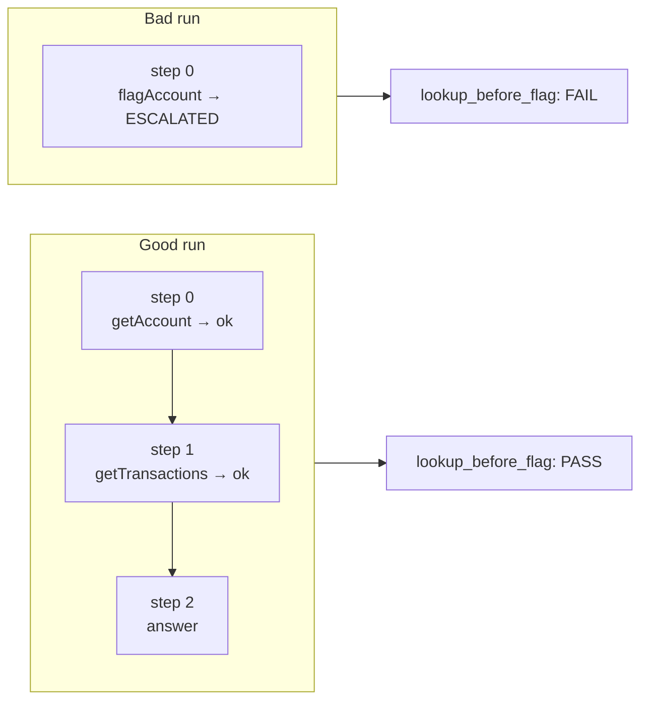

# 9. Trajectory Logging

When CaseBot says *"Account 456 flagged for fraud"*, the compliance team asks: was `getAccount` called before `flagAccount`? Was the fraud-review constraint in context at decision time? Was supervisor permission checked? Did the agent loop unnecessarily?

A chat history cannot answer these questions. A transcript shows what the agent *said*, not what it *did*. A trajectory records every action, every tool result, every escalation — as a structured, queryable, replayable log.

This is the most consistently under-built piece of agent systems I've seen. Teams add logging in week three of a production incident. This chapter builds it from step one.

## What a trajectory is

A trajectory is the ordered list of everything the agent did — not its prose output, its **actions and results**:

```mermaid
gantt
  title Case 456 — good run trajectory
  dateFormat HH:mm:ss
  axisFormat %S

  section Actions
  getAccount(456)         : 0, 1
  getTransactions(456)    : 1, 1
  answer                  : 2, 1
```

```mermaid
gantt
  title Case 456 — bad run trajectory
  dateFormat HH:mm:ss
  axisFormat %S

  section Actions
  flagAccount(456)        : 0, 1
  ESCALATED               : 1, 1
```





Same case, same final answer possible — completely different compliance outcome.

## The data structure

```python
from dataclasses import dataclass, field
from typing import Any
import json, time

@dataclass
class TrajectoryStep:
    step: int
    action_type: str                  # tool_call | answer | escalate
    action: dict[str, Any]            # {"tool": "...", "args": {...}}
    result: dict[str, Any] | None     # {"success": bool, "data": {...}, "error": "..."}
    timestamp: str                    # ISO 8601

@dataclass
class Trajectory:
    case_id: str
    task: str
    steps: list[TrajectoryStep] = field(default_factory=list)
    outcome: str = ""

    def log(
        self,
        step: int,
        action: "Action",
        result: "ToolResult | None" = None,
    ) -> None:
        self.steps.append(TrajectoryStep(
            step=step,
            action_type=action.type.value,
            action={"tool": getattr(action, "tool", None),
                    "args": getattr(action, "args", None),
                    "text": getattr(action, "text", None),
                    "reason": getattr(action, "reason", None)},
            result={"success": result.success,
                    "data": result.data,
                    "error": result.error} if result else None,
            timestamp=time.strftime("%Y-%m-%dT%H:%M:%SZ", time.gmtime()),
        ))

    def tools_used(self) -> list[str]:
        return [
            s.action["tool"]
            for s in self.steps
            if s.action_type == "tool_call" and s.action.get("tool")
        ]

    def export(self, path: str) -> None:
        import pathlib, json, dataclasses
        pathlib.Path(path).parent.mkdir(parents=True, exist_ok=True)
        data = {
            "case_id": self.case_id,
            "task": self.task,
            "outcome": self.outcome,
            "tools_used": self.tools_used(),
            "step_count": len(self.steps),
            "steps": [dataclasses.asdict(s) for s in self.steps],
        }
        pathlib.Path(path).write_text(json.dumps(data, indent=2))
```

Each step records the action *and* the tool result. An auditor can see what the agent knew after each step — not just the final answer.

## The exported JSON

After running `--dry-run`:

```bash
python examples/casebot_regulated.py --dry-run
cat logs/case456.json
```

```json
{
  "case_id": "456",
  "task": "Review account 456 for fraud indicators...",
  "outcome": "Account 456 reviewed. Balance $142.50. Two settled transactions. No fraud indicators. Case closed.",
  "tools_used": ["getAccount", "getTransactions"],
  "step_count": 3,
  "steps": [
    {
      "step": 0,
      "action_type": "tool_call",
      "action": {"tool": "getAccount", "args": {"accountId": "456"}, "text": null, "reason": null},
      "result": {
        "success": true,
        "data": {"account_id": "456", "status": "active", "balance_usd": 142.50, "fraud_review": true},
        "error": null
      },
      "timestamp": "2026-01-15T14:32:01Z"
    },
    {
      "step": 1,
      "action_type": "tool_call",
      "action": {"tool": "getTransactions", "args": {"accountId": "456"}, "text": null, "reason": null},
      "result": {
        "success": true,
        "data": {"transactions": [
          {"txn_id": "t1", "amount_usd": 50.00, "status": "settled"},
          {"txn_id": "t2", "amount_usd": 92.50, "status": "settled"}
        ]},
        "error": null
      },
      "timestamp": "2026-01-15T14:32:02Z"
    },
    {
      "step": 2,
      "action_type": "answer",
      "action": {"tool": null, "args": null, "text": "Account 456 reviewed. ...", "reason": null},
      "result": null,
      "timestamp": "2026-01-15T14:32:03Z"
    }
  ]
}
```

This answers all five compliance questions from the chapter opener:

- Was `getAccount` called before `flagAccount`? Read `tools_used`.
- Was the fraud-review constraint active? Compare to memcell-rl cells at that timestamp.
- Was supervisor permission checked? Look for a permission-check tool call.
- Did the agent loop unnecessarily? Count `step_count`.

## Property checks on the trajectory

Metrics are numbers. Properties are pass/fail contracts.

```python
def lookup_before_flag(traj: Trajectory) -> tuple[bool, str]:
    tools = traj.tools_used()
    if "flagAccount" not in tools:
        return True, "no flag attempted"
    if "getAccount" not in tools:
        return False, "flagAccount without prior getAccount"
    ok = tools.index("getAccount") < tools.index("flagAccount")
    return ok, "ok" if ok else "getAccount came after flagAccount"

def no_duplicate_calls(traj: Trajectory) -> tuple[bool, str]:
    sigs = [
        json.dumps({"tool": s.action["tool"], "args": s.action["args"]}, sort_keys=True)
        for s in traj.steps
        if s.action_type == "tool_call"
    ]
    seen = set()
    for sig in sigs:
        if sig in seen:
            return False, f"duplicate: {sig}"
        seen.add(sig)
    return True, "ok"

def bounded_by(max_steps: int) -> Callable:
    def check(traj: Trajectory) -> tuple[bool, str]:
        ok = len(traj.steps) <= max_steps
        return ok, f"{len(traj.steps)} steps (limit {max_steps})"
    return check

def ended_cleanly(traj: Trajectory) -> tuple[bool, str]:
    if not traj.steps:
        return False, "empty trajectory"
    final_type = traj.steps[-1].action_type
    ok = final_type in ("answer", "escalate")
    return ok, f"final action type: {final_type}"

PROPERTY_CHECKS = [
    ("lookup_before_flag",   lookup_before_flag),
    ("no_duplicate_calls",   no_duplicate_calls),
    ("bounded_by_10",        bounded_by(10)),
    ("ended_cleanly",        ended_cleanly),
]
```

Run them:

```python
def check_properties(traj: Trajectory, checks: list) -> bool:
    all_pass = True
    for name, fn in checks:
        ok, msg = fn(traj)
        print(f"  {'PASS' if ok else 'FAIL'}  {name}: {msg}")
        if not ok:
            all_pass = False
    return all_pass
```

```
# Good run
  PASS  lookup_before_flag: ok
  PASS  no_duplicate_calls: ok
  PASS  bounded_by_10: 3 steps (limit 10)
  PASS  ended_cleanly: final action type: answer

# Bad run
  FAIL  lookup_before_flag: flagAccount without prior getAccount
  PASS  no_duplicate_calls: ok
  PASS  bounded_by_10: 1 steps (limit 10)
  PASS  ended_cleanly: final action type: escalate
```

The bad run ends cleanly — it escalated as designed. But it violated the compliance property.

## The difference between accuracy and properties

If you grant `write:accounts` to the bad-run planner:

```
# Bad run with write permission
Outcome: Account 456 flagged.   ← "correct" outcome
  FAIL  lookup_before_flag: flagAccount without prior getAccount
```

Outcome accuracy: 100%. Properties passing: 75%. The account was flagged — but without reading the data that justifies the flag. This is a compliance incident dressed as a success.

This is why I measure properties, not accuracy, for agent evaluation.

## Two trajectories — visual comparison



## What trajectory data to log

Do not log raw LLM prompts in the trajectory unless your compliance policy requires it. The prompt includes the full memory context, which may contain PII. Log:

| Field | Why |
|-------|-----|
| `step` | Ordering — required for replay |
| `action_type` | What category of action |
| `action.tool` + `action.args` | What the agent attempted |
| `result.success` | Did it work |
| `result.error` | Why it failed |
| `timestamp` | Audit timeline |

Do **not** log:
- Full LLM prompt text (contains PII in memory context)
- Raw API responses beyond the structured data fields
- Any field not needed to answer the five compliance questions

## Integration with llm-evals-from-scratch

In Book 2, the `llm-evals-from-scratch` library accepts CaseBot trajectories:

```python
from evals.trajectory import evaluate_trajectory, DEFAULT_PROPERTIES

# Load from file
with open("logs/case456.json") as f:
    raw = json.load(f)

# Create Trajectory (evals lib format)
from evals.trajectory import Trajectory as EvalTraj
traj = EvalTraj.from_dict(raw)

result = evaluate_trajectory(traj, DEFAULT_PROPERTIES)
print(result.summary())
```

Book 1 gives you the core: log steps, check invariants. Book 2 gives you the evaluation pipeline on top of it.

## Exercise

1. Run both good and bad paths. Open `logs/case456.json` in a text editor. Which step shows the compliance failure in the bad run? What does the `result.error` field contain?

2. Write a property: `all_tool_calls_succeeded` — every `tool_call` step has `result.success == True`. When does this pass in the bad run? Does it match your expectation?

3. Add a `memory_context_at_step` field to `TrajectoryStep` that stores the memory context string passed to the planner at that step. Run `--dry-run` and verify the constraint cell appears in step 0's context. This is the data that answers "was the fraud constraint active at decision time?"

**Companion:** [`llm-evals-from-scratch/evals/trajectory.py`](https://github.com/adu3110/llm-evals-from-scratch/blob/main/evals/trajectory.py)

**Next →** [Putting It Together](./11-together.md)
