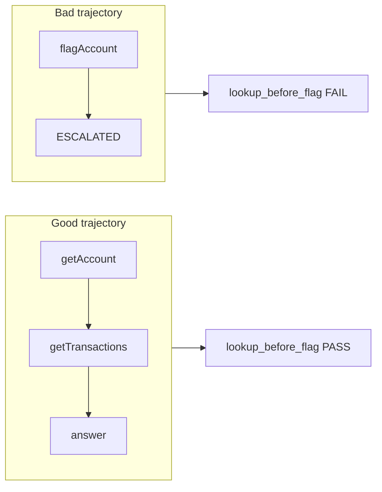

# 9. Trajectory Logging

Final answer: *"Account 456 flagged for review."*

Compliance asks:

1. Was `getAccount` called before `flagAccount`?
2. Was the fraud-review constraint active?
3. Was supervisor permission checked?
4. Did the agent loop unnecessarily?

A chat transcript cannot answer these. A **typed trajectory** can.

## What a trajectory is

A trajectory is the ordered list of everything the agent did — not what it said, what it **did**:

```mermaid
gantt
  title Case 456 trajectory (good run)
  dateFormat X
  axisFormat %s

  section Steps
  getAccount         :0, 1
  getTransactions    :1, 1
  answer             :2, 1
```



```python
@dataclass
class TrajectoryStep:
    step: int
    action_type: str
    action: dict
    result: dict | None
    timestamp: str
```

Each step records the action **and** the tool result. Auditors see what the agent knew, not just what it claimed.

## Exported JSON

After a run, CaseBot writes `logs/case456.json`:

```json
{
  "case_id": "456",
  "task": "Review account 456 for fraud indicators...",
  "outcome": "Account 456 reviewed. Case closed.",
  "tools_used": ["getAccount", "getTransactions"],
  "step_count": 3,
  "steps": [
    {
      "step": 0,
      "action_type": "tool_call",
      "action": {"tool": "getAccount", "args": {"accountId": "456"}},
      "result": {"success": true, "data": {"balance_usd": 142.50}}
    }
  ]
}
```

```bash
python examples/casebot_regulated.py --dry-run
cat logs/case456.json | python -m json.tool
```

## Property checks

Metrics are numbers. Properties are pass/fail contracts over the trajectory:

```python
def lookup_before_flag(traj: Trajectory) -> tuple[bool, str]:
    tools = traj.tools_used()
    if "flagAccount" not in tools:
        return True, "no flag attempted"
    if "getAccount" not in tools:
        return False, "flagAccount without prior getAccount"
    return tools.index("getAccount") < tools.index("flagAccount"), "ok"
```

Run after every case:

```bash
python examples/casebot_regulated.py --dry-run --bad-run
# FAIL  lookup_before_flag: flagAccount without prior getAccount
```

Book 2 extends this with a full eval pipeline in [`llm-evals-from-scratch`](https://github.com/adu3110/llm-evals-from-scratch). Book 1 gives you the core idea: **log steps, check invariants.**

## Good run vs bad run



Same final answer possible. Different compliance outcome.

## What to log

| Field | Why |
|-------|-----|
| `step` | Ordering |
| `action_type` | tool_call / answer / escalate |
| `action.tool` + `action.args` | What was attempted |
| `result.success` + `result.error` | What happened |
| `timestamp` | Audit timeline |

Do **not** log raw LLM prompts in the compliance trajectory unless policy requires it. Log actions and results.

## Exercise

Add a property check: `no_duplicate_tool_calls` — every `(tool, args)` pair appears at most once. Run good and bad paths. Wire it into the `PROPERTY_CHECKS` list in `casebot_regulated.py`.

**Companion:** [`llm-evals-from-scratch/evals/trajectory.py`](https://github.com/adu3110/llm-evals-from-scratch/blob/main/evals/trajectory.py)

**Next →** [Putting It Together](./11-together.md)
