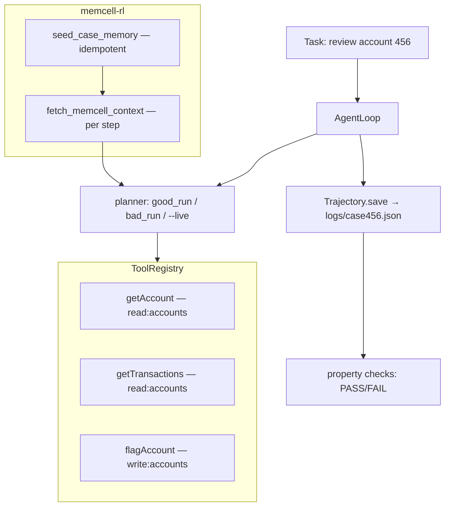

# 18. Putting it together — CaseBot

Steps 2–9 added one layer at a time. Step 10 is the complete system. Everything you built is in one file: `casebot_regulated.py`.

```bash
# Terminal 1 — start the memory server:
uvicorn memcell_rl.app:app --port 8000

# Terminal 2 — good run:
python3 examples/casebot_regulated.py --dry-run

# Terminal 2 — compliance failure demo:
python3 examples/casebot_regulated.py --dry-run --bad-run

# Terminal 2 — live LLM planner (optional):
OPENAI_API_KEY=sk-... python3 examples/casebot_regulated.py --live
```

**Good run** (char count varies based on cells accumulated in the DB):

```
[memcell] context loaded (85 chars on fresh DB)
Outcome: Account 456 reviewed. Balance $142.50. Two settled transactions. No fraud indicators. Case closed.
Tools:   ['getAccount', 'getTransactions']
Steps:   3
  PASS  lookup_before_flag: no flag attempted
  PASS  bounded_steps: 3 steps (limit 12)
Saved:   logs/case456.json
```

**Bad run:**

```
Outcome: ESCALATED:tool_error:permission_denied: write:accounts required
  FAIL  lookup_before_flag: flagAccount without prior getAccount
  PASS  bounded_steps: 2 steps (limit 12)
```

The bad run fails at two independent layers: the registry rejected the tool call (no write permission), and the trajectory property check detected the process violation (flag without prior lookup). Fixing one doesn't fix the other.



## The map: build step to CaseBot module

| Build step | What you built | CaseBot module |
|------------|---------------|----------------|
| step01 | Task string | Task description in `run_case()` |
| step02 | Agent loop | `AgentLoop.run()` |
| step03 | Tool registry | `ToolRegistry.run()` |
| step04 | Trajectory log | `Trajectory.log()`, `Trajectory.save()` |
| step05 | Chat memory failure | Understanding of why you need step06 |
| step06 | Typed memory cells | `seed_case_memory()` |
| step07 | Context assembly | `fetch_memcell_context()` |
| step08 | Planner function | `good_run_planner`, `bad_run_planner`, `make_live_planner()` |
| step09 | Stop conditions | Duplicate check, tool error escalation, max steps |

About 350 lines total. No framework. Every line traceable to a specific design decision.

## What happens end-to-end

Let's trace the good run in detail:

**1. Seed memory** — `seed_case_memory()` writes the fraud-review constraint to memcell-rl (idempotently — if it already exists, skips). This is the starting state: one constraint cell for case 456.

**2. Fetch initial context** — `fetch_memcell_context(task)` calls `POST /v1/cells/decide` with `scope={"case":"456"}` and `budget_tokens=800`. Returns: `"CONSTRAINT: account_456_under_fraud_review: no_outbound_transfers until review closes"`.

**3. Loop step 0** — Planner returns `getAccount({"accountId":"456"})`. Registry checks `read:accounts` permission — granted. Executes. `ToolResult(success=True, data={"balance_usd":142.50,"status":"active"})`. Trajectory logs step 0. Context refreshed.

**4. Loop step 1** — Planner returns `getTransactions({"accountId":"456"})`. Same permission check. `ToolResult(success=True, data={"transactions":[...]})`. Trajectory logs step 1. Context refreshed.

**5. Loop step 2** — Planner returns `ANSWER: "Account 456 reviewed..."`. Trajectory logs step 2 with outcome. Loop returns outcome string.

**6. Property checks** — `lookup_before_flag`: tools_used = ['getAccount','getTransactions']. No 'flagAccount' → PASS. `bounded_steps`: 3 steps ≤ 12 → PASS.

**7. Save** — Trajectory written to `logs/case456.json`.

Every step logged. Two property checks passed. Zero API calls to OpenAI. The system works correctly with a scripted planner.

## What the bad run demonstrates

The bad planner returns `flagAccount` at step 0, before any lookup. Two things happen:

**Layer 1 — Registry.** The registry checks `write:accounts` in permissions. It's not there (only `read:accounts` is granted). Returns `ToolResult(success=False, error="permission_denied: write:accounts required")`. The loop escalates immediately.

**Layer 2 — Property check.** The trajectory shows only one step: `flagAccount` with a failure result. `lookup_before_flag` checks whether `getAccount` appeared before `flagAccount`. It didn't. FAIL.

The compliance violation is caught by two independent mechanisms. Neither one is "trust the model" — both are code that runs on structured data.

This is the architecture: the model proposes actions. Python decides whether to execute them. Python logs everything. Python checks the log.

## Before Book 2

You have a working agentic system. It handles a simple regulated case correctly, fails the wrong behavior in two different ways, logs every step, and can be run with a scripted plan (for testing) or a live LLM (for production).

Book 2 asks: how do you know it *keeps* working? You add a feature (new tool, updated prompt, different memory policy). How do you know the compliance properties still hold? How do you measure whether the system degraded?

The trajectory is the input to Book 2. Every piece of data Book 2 uses to evaluate the system comes from the logs you're already generating.

**Book 1 complete.** → [Why Final-Answer Accuracy Lies](../book2/13-final-answer-lies.md)
