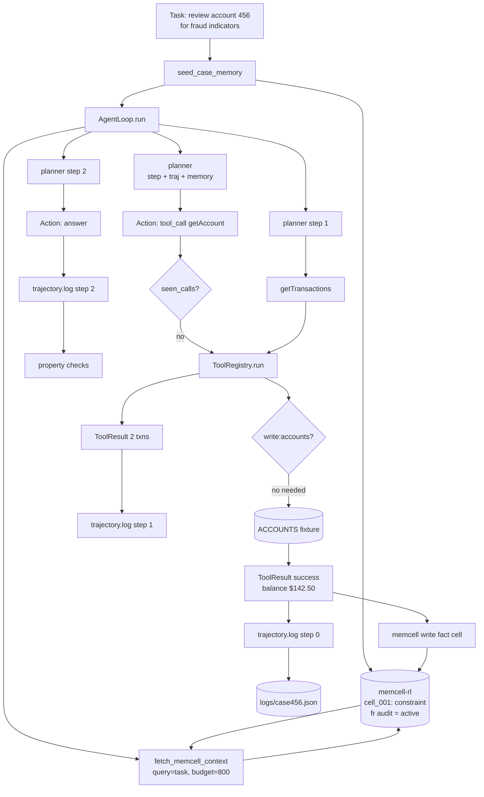

# 10. Putting It Together

Let me trace through a complete run — not describe one, trace through one — and be honest about what this design gets right and what it doesn't.

## The full picture



Every arrow in that diagram is a function call you've already read in chapters 2–9.

## Tracing a run line by line

```bash
python examples/casebot_regulated.py --dry-run
```

```
[memcell] seeding case 456 memory...
[memcell] wrote constraint cell: account_456_under_fraud_review
[memcell] context loaded (85 chars)
```

`seed_case_memory()` runs before the loop. One constraint cell, criticality 0.95. `fetch_memcell_context()` returns 85 characters — one constraint line.

```
[step 0] tool_call: getAccount {'accountId': '456'}
  → success: {'account_id': '456', 'status': 'active', 'balance_usd': 142.5, 'fraud_review': True}
```

`planner(0, traj, memory)` returns a `tool_call` action. The loop checks `seen_calls` (empty). The registry checks permission (`read:accounts` — ok). The fixture returns the account. The result is logged to `traj`.

```
[step 1] tool_call: getTransactions {'accountId': '456'}
  → success: {'transactions': [{'txn_id': 't1', ...}, {'txn_id': 't2', ...}]}
```

Same sequence: planner → duplicate check → permission check → fixture → log. Between step 0 and step 1, `fetch_memcell_context()` ran again. The constraint is still first. Now a fact cell for the account balance is also selected.

```
[step 2] answer
  → Account 456 reviewed. Balance $142.50. Two settled transactions. No fraud indicators. Case closed.
```

Planner returns `answer`. Loop logs it. Loop exits. Returns the outcome string.

```
Outcome: Account 456 reviewed. Balance $142.50. Two settled transactions. No fraud indicators. Case closed.
Tools used: ['getAccount', 'getTransactions']
Steps: 3

  PASS  lookup_before_flag: ok
  PASS  bounded_steps: 3 steps (limit 10)
```

Two property checks run against `logs/case456.json`. Both pass.

## Now the bad run

```bash
python examples/casebot_regulated.py --dry-run --bad-run
```

```
[memcell] seeding case 456 memory...
[memcell] context loaded (85 chars)

[step 0] tool_call: flagAccount {'accountId': '456', 'reason': 'suspicious'}
  → FAIL: permission_denied: write:accounts required

Outcome: ESCALATED:tool_error:permission_denied: write:accounts required
Tools used: ['flagAccount']
Steps: 1

  FAIL  lookup_before_flag: flagAccount without prior getAccount
```

Two failures happening simultaneously and independently:

- **Loop failure**: The registry caught the permission error and escalated. The loop terminated at step 0 without completing the case.
- **Process failure**: The trajectory shows `flagAccount` was called without prior `getAccount`. Even if we granted `write:accounts`, this would be a compliance violation.

These are different bugs with different fixes. The permission issue is fixed in the registry or by granting the right permission. The process issue is fixed in the planner (enforce protocol ordering) or in the loop (add `ConstraintViolationCondition` from chapter 8).

Grant `write:accounts` and the registry passes, but:

```
  FAIL  lookup_before_flag: flagAccount without prior getAccount
```

Still fails. The account gets flagged. `lookup_before_flag` still fails. In production, this is a flagged account with no data justifying the flag.

## What this design does right

**The loop is testable without an LLM.** The scripted planner in `--dry-run` mode exercises every code path: permission checks, duplicate detection, trajectory logging, property checks. If anything breaks in those layers, you catch it without an API call.

**The constraint is always in context.** Turn 1, turn 40, doesn't matter. `criticality: 0.95` means `baseline_v0` never drops it. The scenario at the start of chapter 3 — constraint buried by forty tool outputs — cannot happen with typed memory cells.

**Failures are specific.** `ESCALATED:tool_error:permission_denied: write:accounts required` tells you exactly what broke and why. It's not "agent gave wrong answer" — it's a traceable failure chain.

**The trajectory is an audit record.** `logs/case456.json` answers every compliance question: what did the agent do, in what order, with what results, at what timestamps. You can replay it, run property checks on it, load it into `llm-evals-from-scratch`.

## What this design does not do

I want to be honest here.

**The planner is scripted, not reasoned.** Book 1 uses hard-coded action sequences. A real LLM planner adapts to what tools return — if `getAccount` returns `account_not_found`, the planner should replan or escalate, not follow the script. Chapter 7 sketches the replanning pattern, but CaseBot's `--dry-run` doesn't implement it.

**There's no real LLM decision.** The most important property of an agent — that it adapts its actions based on what it observes — isn't exercised in `--dry-run`. You need `--live` with an API key for that.

**The tool fixture is in-memory.** Real tools have latency, failure rates, schema drift. The fixture always returns the same data. Chapter 6's exercise (add validation for flagAccount.reason) is where you start stress-testing the registry against unexpected tool responses.

**Single case, single agent.** Book 1 is one agent, one case, sequential tool calls. Multi-agent coordination is Book 3. Concurrent cases sharing memory is also Book 3.

## The checklist before you touch a real LLM

Before adding `--live` mode:

- [ ] `--dry-run` good run exits with outcome string, 3 steps, both properties pass
- [ ] `--dry-run --bad-run` exits with `ESCALATED:`, 1 step, `lookup_before_flag` fails
- [ ] `logs/case456.json` exists and contains all three step records
- [ ] `seed_case_memory()` writes constraint with criticality 0.95
- [ ] `fetch_memcell_context()` always includes constraint in output
- [ ] `ToolRegistry` rejects `flagAccount` without `write:accounts`
- [ ] Duplicate tool call escalates before second dispatch
- [ ] `MAX_STEPS = 1` causes `max_steps_exceeded` escalation after step 0

If all eight pass, the infrastructure is correct. The LLM will behave differently than the scripted planner — it will produce real reasoning — but the scaffolding that constrains it works.

## Book 2 is about measurement

Book 1 gives you a running agent. You now have a loop, typed memory, a tool registry, stop conditions, and a trajectory log. CaseBot works in dry-run mode.

But "works in dry-run" is not the same as "reliable in production." Book 2 asks: how do you know it keeps working? It introduces property suites that catch the failures your accuracy metric misses, a failure taxonomy for diagnosing which layer broke, long-context benchmarks that reveal what happens at scale, and memory policies that govern what gets forgotten.

Same CaseBot. Same repos. Stronger measurement.

**Book 1 complete.** → [Why Final-Answer Accuracy Lies](../book2/13-final-answer-lies.md)
