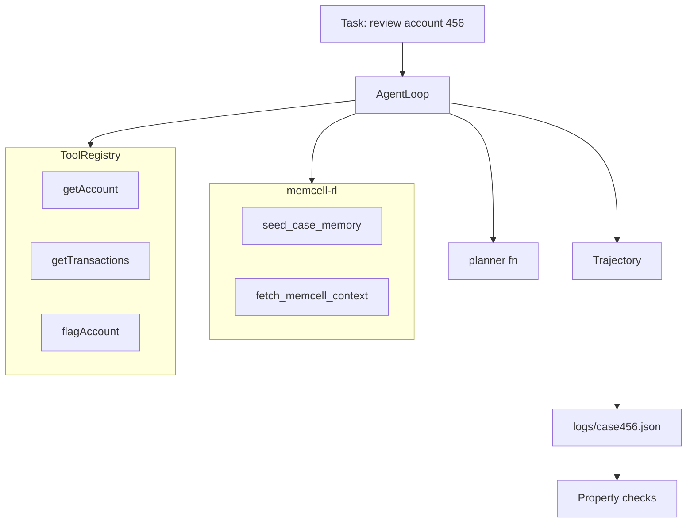

# 10. Putting It Together

We've built CaseBot one layer at a time. This chapter shows the full system — and gives you a checklist to verify it works.

## CaseBot v1 architecture



Every box maps to code in [`casebot_regulated.py`](https://github.com/adu3110/memcell-rl/blob/main/examples/casebot_regulated.py).

## Module map

| Concept | Chapter | Code |
|---------|---------|------|
| Agent loop | 2 | `AgentLoop.run()` |
| Memory cells | 3–4 | `seed_case_memory()`, memcell-rl API |
| Context assembly | 5 | `fetch_memcell_context()` |
| Tools + permissions | 6 | `ToolRegistry` |
| Planning | 7 | `good_run_planner()` |
| Stop conditions | 8 | duplicate check, max steps, tool errors |
| Trajectory + eval | 9 | `Trajectory.save()`, `lookup_before_flag()` |

One file. One case. One coherent system.

## Run the full pipeline

Terminal 1 — memory service:

```bash
cd memcell-rl
uvicorn memcell_rl.app:app --port 8000
```

Terminal 2 — compliant run:

```bash
python examples/casebot_regulated.py --dry-run
```

Expected output:

```
[memcell] context loaded (85 chars)
Outcome: Account 456 reviewed. Balance $142.50. Two settled transactions. No fraud indicators. Case closed.
Tools:   ['getAccount', 'getTransactions']
Steps:   3
  PASS  lookup_before_flag
  PASS  bounded_steps
```

Terminal 2 — compliance failure demo:

```bash
python examples/casebot_regulated.py --dry-run --bad-run
```

Expected:

```
Outcome: ESCALATED:tool_error:permission_denied: write:accounts required
  FAIL  lookup_before_flag: flagAccount without prior getAccount
```

Read both trajectory files. Compare step sequences side by side.

## Book 1 checklist

Before you move to Book 2, verify:

- [ ] Loop terminates on answer, escalate, or max steps
- [ ] Constraints written as memcell-rl cells with high criticality
- [ ] Context from `decide()` always includes constraints
- [ ] Tools registered with permission checks
- [ ] Destructive tools blocked without `write:accounts`
- [ ] Duplicate tool calls detected
- [ ] Every step logged to trajectory JSON
- [ ] Property checks run on every export
- [ ] No agent framework in the critical path
- [ ] `--dry-run` works without an LLM API key

## What Book 2 adds

Book 1 gives you a working agent. Book 2 asks: **how do you know it keeps working?**

- Why final-answer accuracy lies
- Full property-check suites
- Model failure vs system failure diagnosis
- Memory policies and forgetting
- RL-ready transitions from memcell-rl
- Regression suites in CI

Same CaseBot. Same repos. Stronger measurement.

## What I want you to take away

You don't need LangChain to build an agent. You need:

1. A loop that dispatches typed actions
2. Memory that survives context pressure
3. Tools with permission gates
4. Stop conditions that escalate safely
5. Trajectories that prove compliance

Build that first. Swap in any LLM later.

**Book 1 complete.** → [Why Final-Answer Accuracy Lies](../book2/13-final-answer-lies.md) *(draft)*
