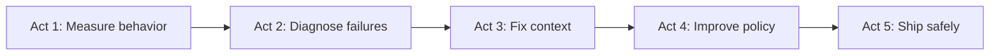

# Book 2 Roadmap — Making CaseBot Reliable

Book 1 gave you a working CaseBot. Book 2 answers: **how do you know it keeps working?**

Same case (account 456). Same trajectory files. New question: did the agent follow the *process*, not just get the right answer?

## The story in five acts

| Act | Chapters | Question |
|-----|----------|----------|
| **1 — Measure behavior, not answers** | [2.1](./13-final-answer-lies.md) → [2.2](./14-trajectory-properties.md) | Did the agent follow compliance rules, or just get lucky? |
| **2 — Diagnose before you fix** | [2.3](./15-model-vs-system.md) | When it fails, is it the model or the infrastructure? |
| **3 — Why context fails** | [2.4](./16-long-context.md) → [2.6](./18-memory-policies.md) | Why does the model "forget" constraints that are technically in the prompt? |
| **4 — Improve over time** | [2.7](./19-rl-transitions.md) | Can memory policy learn from production runs? (optional depth) |
| **5 — Ship safely** | [2.8](./20-benchmarks.md) → [2.10](./22-production.md) | Benchmarks, CI regression, production checklist |

## Prerequisites

You should have:

- Finished Book 1 and run `casebot_regulated.py --dry-run`
- A trajectory file at `logs/case456.json`
- Optionally: memcell-rl running for memory-policy chapters

## How to read

Each chapter opens with **where CaseBot is** in the reliability journey. Run the evaluation commands before reading the theory — the numbers make the argument.

**Start →** [2.1 Why Final-Answer Accuracy Lies](./13-final-answer-lies.md)
