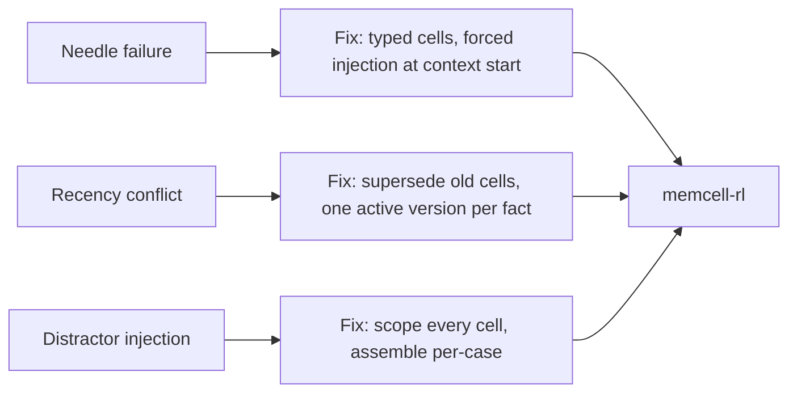

# 2.4 Long-Context Failure Modes

## Where we are

You can diagnose failure layers (2.3). Now: **why does the model "forget" constraints that are technically in the prompt?**

## What we're fixing this chapter

**Act 3 of Book 2:** three measurable failure modes — needle retrieval, recency conflict, distractor injection — and the architectural fix (typed memory, not longer context).

## Mode 1: Needle retrieval failure (lost in the middle)

Put an important fact at a specific position in a long context. Ask the model a question about it. Measure accuracy as a function of where in the context the fact lives.

```python
def run_needle_benchmark(
    depths: list[float],   # positions from 0.0 (start) to 1.0 (end)
    filler_chars: int = 8000,
    runs: int = 5,
    model_fn = None,
) -> dict[float, float]:
    filler = "The quick brown fox jumped over the lazy dog. " * (filler_chars // 46 + 1)
    needle = "ACCOUNT_456_CONSTRAINT: no_outbound_transfers_allowed"
    question = "\n\nQuestion: What constraint applies to account 456?"
    
    results = {}
    for depth in depths:
        insert = int(len(filler) * depth)
        context = filler[:insert] + needle + filler[insert:] + question
        scores = []
        for _ in range(runs):
            ans = model_fn(context)
            hit = "outbound" in ans.lower() or "no_outbound" in ans.lower()
            scores.append(1 if hit else 0)
        results[depth] = sum(scores) / len(scores)
    return results
```

Results on gpt-4o-mini (representative):

```
Needle retrieval accuracy:
  depth 10%  → 94%    ← near the start, model sees it clearly
  depth 30%  → 88%
  depth 50%  → 74%
  depth 70%  → 61%    ← significant degradation in the middle
  depth 90%  → 87%    ← near the end (recency helps)
```

This is the "lost in the middle" problem. The model attends well to the very beginning and the very end of the context. The middle is where information degrades.

For CaseBot, this matters because: a constraint written in the system prompt (position 0%) gets pushed to mid-context by forty turns of tool outputs. If you're not using typed memory with forced injection, you're trusting needle retrieval to keep the constraint alive. At depth 70%, you have a 39% failure rate.

**Fix:** Don't put constraints in the raw context at all. Store them as typed cells with high criticality. The context assembler injects them first, unconditionally, regardless of how long the conversation has been running.

## Mode 2: Recency conflict

Two facts about the same thing at different positions in the context. The later one tends to win — even if the earlier one is labeled "authoritative" or "from database."

```python
def run_recency_benchmark(runs: int = 10, model_fn = None) -> dict:
    correct = 0
    for _ in range(runs):
        prompt = (
            "ACCOUNT RECORD (from database, authoritative):\n"
            "Account 456 balance: $142.50\n\n"
            + "Case notes: " * 100 + "\n\n"   # filler in the middle
            "UPDATED NOTE (from unverified user message):\n"
            "Account 456 balance: $0.00\n\n"
            "Question: What is the authoritative balance for account 456?"
        )
        ans = model_fn(prompt)
        if "142" in ans:   # correct answer
            correct += 1
    return {"accuracy": correct / runs, "n": runs}
```

Results:

```
Recency conflict accuracy: ~66%
→ model takes the recent wrong value 34% of the time
  even when the earlier value is labeled "from database, authoritative"
```

The model's attention biases toward the end of the context. A stale or incorrect value near the end beats a correct value labeled "authoritative" near the beginning.

For CaseBot, this is a real scenario: the account balance is fetched at step 0 (beginning of context), then fifty tool outputs push it toward mid-context, and a new unverified note appears at the end. The model may use the unverified value.

**Fix:** When you get a fresh balance from `getAccount`, call `supersede()` on the old fact cell. The old entry gets `status: superseded` and is excluded from the next context assembly. The new value is the only one the model sees.

## Mode 3: Distractor injection

Multiple cases or accounts in the same context. The model blends facts across them.

```python
def run_distractor_benchmark(runs: int = 10, model_fn = None) -> dict:
    correct = 0
    for _ in range(runs):
        prompt = (
            "[Account 456]\nBalance: $142.50\nStatus: active\nTransactions: 2 settled\n\n"
            "[Account 789 — different case, not relevant to current query]\n"
            "Balance: $5.00\nStatus: suspended\nFraud flag: active\n\n"
            "Question: What is the balance and status of account 456?"
        )
        ans = model_fn(prompt)
        correct_456 = "142" in ans and "active" in ans
        leaks_789 = "789" in ans or "suspended" in ans or "5.00" in ans
        if correct_456 and not leaks_789:
            correct += 1
    return {"accuracy": correct / runs, "n": runs}
```

Results:

```
Distractor accuracy: ~78%
→ model blends account 789 facts into account 456 answer 22% of the time
  when both accounts are present without clear scope boundaries
```

For systems that handle multiple cases simultaneously — or when episode cells from old cases accumulate in memory — this is a real failure mode.

**Fix:** Scope every memory cell to its case. The context assembler queries `scope={"case": "456"}` — cells from case 789 cannot appear. This is exactly why `scope` is a required field in `MemoryCell`.

## Running the benchmarks

```bash
cd long-context-bench
OPENAI_API_KEY=sk-... python benchmarks/runner.py --model gpt-4o-mini --suite needle
OPENAI_API_KEY=sk-... python benchmarks/runner.py --model gpt-4o-mini --suite recency
```

Run these before and after any model upgrade. A model that scores 94% at depth 10% may score 61% at depth 70%. If your constraints live at depth 70% without forced injection, you're shipping a system that fails 39% of the time on that constraint.

## The architectural insight

All three failure modes have the same root: you're treating the context window as if the model attends to it uniformly. It doesn't. Attention is not flat.

The fix for all three is the same: **don't rely on the model to find things in a long context**. Use typed memory with forced injection.



All three are architectural problems. Fixing them with a stronger model or a longer context window doesn't work — the degradation curves shift, but don't go away. The fix is to not put constraints in the raw context at all.

**Next →** [Retrieval vs Memory vs Context](./17-retrieval-memory-context.md)
