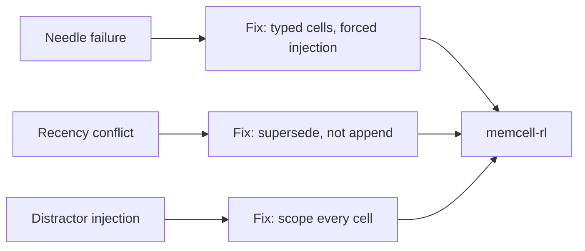

# 14. Long-Context Failure Modes

128k context windows were supposed to solve the memory problem. They didn't. The failures are predictable, architectural, and completely separate from whether your model is "good enough." I want to walk through the three modes that matter for agent systems — with benchmarks you can run.

## Mode 1: Needle retrieval failure

Put an important fact deep in a long context. Ask the model a question about it. Accuracy drops with depth.

This is the "lost in the middle" problem. It's not fixed by longer context windows — GPT-4o-mini with 128k still degrades significantly at depth > 70%.

For CaseBot this matters because: constraints written in turn 1 get pushed deep by forty tool-output observations. If you're not using typed memory cells with forced injection, you're trusting needle retrieval.

```python
import os, urllib.request, json

OPENAI_URL = "https://api.openai.com/v1/chat/completions"

def call_model(prompt: str, model: str = "gpt-4o-mini") -> str:
    body = json.dumps({
        "model": model,
        "messages": [{"role": "user", "content": prompt}],
        "max_tokens": 60,
        "temperature": 0,
    }).encode()
    req = urllib.request.Request(
        OPENAI_URL, data=body,
        headers={"Content-Type": "application/json",
                 "Authorization": f"Bearer {os.environ['OPENAI_API_KEY']}"},
    )
    with urllib.request.urlopen(req) as r:
        return json.loads(r.read())["choices"][0]["message"]["content"].strip()

def run_needle(depths: list[float], filler_chars: int = 8000, runs: int = 5) -> dict:
    filler = "The quick brown fox jumped over the lazy dog. " * (filler_chars // 46 + 1)
    needle = "ACCOUNT_456_CONSTRAINT: no_outbound_transfers_allowed"
    question = "\n\nQuestion: What constraint applies to account 456?"
    results = {}
    for depth in depths:
        insert = int(len(filler) * depth)
        context = filler[:insert] + needle + filler[insert:] + question
        scores = []
        for _ in range(runs):
            ans = call_model(context)
            scores.append(1 if "outbound" in ans.lower() or "no_outbound" in ans.lower() else 0)
        results[depth] = sum(scores) / len(scores)
    return results
```

```
Needle retrieval accuracy (gpt-4o-mini, representative):
  depth 10%  → 94%
  depth 30%  → 88%
  depth 50%  → 74%
  depth 70%  → 61%   ← significant drop
  depth 90%  → 87%   ← recency helps, needle near the end again
```

**Fix:** don't put constraints in the raw context at all. Store them as typed cells with `criticality: 1.0`. The context assembler injects them first, unconditionally, regardless of depth.

## Mode 2: Recency conflict

Two facts about the same thing, at different positions in context. The later one tends to win — even if the earlier one is labeled "authoritative."

For CaseBot: balance from `getAccount` at turn 1, then a stale cached balance from an episode cell at turn 35. The model often takes the recent one.

```python
def run_recency(runs: int = 10) -> dict:
    correct = 0
    for _ in range(runs):
        prompt = (
            "ACCOUNT RECORD (from database, authoritative):\n"
            "Account 456 balance: $142.50\n\n"
            + "Filler case notes. " * 100 + "\n\n"
            "UPDATED NOTE (from unverified user message):\n"
            "Account 456 balance: $0.00\n\n"
            "Question: What is the authoritative balance for account 456?"
        )
        ans = call_model(prompt)
        if "142" in ans:
            correct += 1
    return {"accuracy": correct / runs, "n": runs}
```

```
Recency conflict accuracy: ~66%
→ model takes the recent wrong value 34% of the time
  even when the earlier value is labeled "authoritative"
```

**Fix:** supersede stale facts explicitly. When you get a fresh balance from `getAccount`, call `supersede()` on the old fact cell. The old entry gets `status: superseded` and can't leak into context.

## Mode 3: Distractor injection

Multiple cases or accounts in the same context. The model blends facts across them.

This is a real production bug when an agent has multi-case visibility — or when episode cells from old cases accumulate in memory without scope filtering.

```python
def run_distractor(runs: int = 10) -> dict:
    correct = 0
    for _ in range(runs):
        prompt = (
            "[Account 456]\nBalance: $142.50\nStatus: active\nTransactions: 2 settled\n\n"
            "[Account 789 — different case, not relevant]\n"
            "Balance: $5.00\nStatus: suspended\nFraud flag: active\n\n"
            "Question: What is the balance and status of account 456?"
        )
        ans = call_model(prompt)
        correct_456 = "142" in ans and "active" in ans
        leaks_789 = "789" in ans or "suspended" in ans or "5.00" in ans
        if correct_456 and not leaks_789:
            correct += 1
    return {"accuracy": correct / runs, "n": runs}
```

```
Distractor accuracy: ~78%
→ blends account 789 facts into account 456 answer 22% of the time
  without explicit scope labels in context
```

**Fix:** scope every memory cell to its case. The context assembler queries `scope={"case": "456"}` — cells from case 789 cannot appear.

## The pattern across all three



All three are architectural problems. Typed memory with criticality, supersession, and scope solves all three without changing the model.

## Run the benchmarks

```bash
cd long-context-bench
python benchmarks/run.py  # see README for setup
```

Run these before and after any model upgrade. A model that scores 94% at depth 10% may score 61% at depth 70% — and your regulated constraints live at whatever depth the context assembler puts them.

## Exercise

Run `casebot_regulated.py --dry-run` and add ten low-criticality episode cells before the loop. Does the constraint still appear in `fetch_memcell_context()` output? What would happen at depth 80% if you were using raw context injection instead of memcell-rl?

**Companion:** [`long-context-bench`](https://github.com/adu3110/long-context-bench)

**Next →** [Retrieval vs Memory vs Context](./17-retrieval-memory-context.md)
