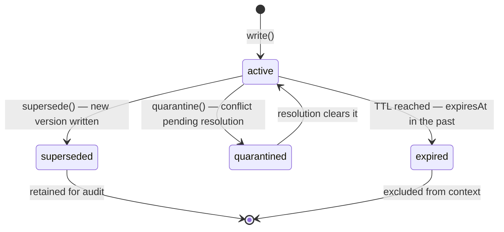

# 2.6 Memory Policies and Forgetting

Not everything should stay in memory forever. Without explicit forgetting, three bad things happen: token budgets blow up with stale data, expired facts compete with fresh ones for context space, and PII accumulates past its legal retention window. Forgetting is not a cleanup job — it's a **policy** wired into every memory operation.

## What baseline_v0 does

memcell-rl ships a policy called `baseline_v0` in `memcell_rl/core/policy.py`. Simplified sketch:

```python
def baseline_v0(candidates, budget_tokens):
    # 1. Suppress deleted / expired / superseded
    # 2. Assign constraint mode when type=constraint and criticality >= 0.7
    # 3. Sort: constraint mode > criticality > future_utility > score
    # 4. Fill budget (token estimate = len(content)//4); log budget_exceeded
    ...
```

Constraints get **priority in the sort key**, not a separate unconditional bypass. Under an extremely tight budget, even a constraint can be suppressed — test with `step07_memcell.py` at `budget_tokens=100`.

## The four forgetting mechanisms



| Mechanism | When to use | What it means |
|-----------|-------------|---------------|
| `supersede` | Balance updated, fact changed | Old version kept for audit, new one active |
| `quarantine` | Two agents disagree (Book 3) | Cell held pending human or resolver review |
| `expired` | PII retention window ended | TTL set on write, auto-excluded from context |
| `soft_delete` | Correction, data error | Content replaced with `[deleted]`, audit trail preserved |

## Setting TTL on PII cells

```python
from datetime import datetime, timedelta

# Account holder's SSN — must expire after 30 days per policy
memcell_post("/v1/cells/write", {
    "type": "fact",
    "scope": {"case": "456"},
    "content": "SSN on file: ***-**-1234",
    "sensitivity": "restricted",
    "valid_until": (datetime.utcnow() + timedelta(days=30)).isoformat() + "Z",
    "policy_features": {"criticality": 0.9},
})
```

After 30 days, `decide()` excludes this cell from context. It remains in the database for audit. The agent can't accidentally use it.

## Quarantine in practice

When the fraud engine and the account lookup return contradictory risk scores:

```python
# Quarantine the stale assessment
memcell_post("/v1/cells/quarantine", {
    "cell_id": old_risk_cell_id,
    "reason": "contradicted_by:fraud_engine_v2",
})
# Write fresh assessment
memcell_post("/v1/cells/write", {
    "type": "fact",
    "scope": {"case": "456"},
    "content": "risk_score: high (fraud_engine_v2)",
    "policy_features": {"criticality": 0.8},
})
```

The quarantined cell is invisible to `decide()` until explicitly cleared. No silent merging.

## Feedback loop: learning from forgetting

Every `decide()` call in memcell-rl creates an RL transition. When a case succeeds, the feedback scores the memory decisions:

```python
memcell_post("/v1/cells/feedback", {
    "query_id": decision["query_id"],
    "transition_id": decision["transition_id"],
    "task_success": True,
    "unsafe_action": False,
    "stale_memory_error": False,
    "tokens_used": 850,
    "latency_ms": 340,
})
```

A run where a stale cell caused a wrong answer gets `stale_memory_error: True` and negative reward. Over time, `baseline_v0` can be replaced with a learned policy trained on these transitions — that's Book 2's last chapter.

## Exercise

Write a constraint cell for case 456 with `valid_until` set 10 seconds in the future. Sleep 15 seconds. Call `decide()`. Confirm the constraint is no longer in `selected_cells`. Does CaseBot still pass `lookup_before_flag` without it?

**Next →** [RL-Ready Transitions](./19-rl-transitions.md)
