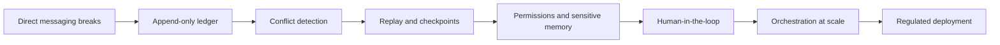

# Book 3 Roadmap — Scaling CaseBot

Book 1: one agent, one case. Book 2: prove it works. Book 3: **what happens when multiple agents work the same case?**

## The problem

CaseBot works alone. In production you might have:

- **InvestigatorAgent** — reads raw account data
- **PolicyAgent** — checks fraud-engine rules
- **ResolverAgent** — breaks ties when they disagree

If they send messages to each other directly, you lose ordering, attribution, and conflict detection. When something goes wrong, you can't replay what happened.

## The story

| Ch | Title | What you add |
|----|-------|--------------|
| [3.1](./24-no-direct-messaging.md) | Why direct messaging breaks | The coordination problem |
| [3.2](./25-ledger.md) | Append-only coordination logs | `agent-ledger` as shared truth |
| [3.3](./26-conflicts.md) | Conflict detection | Two agents disagree → system notices |
| [3.4](./27-replay.md) | Replay and checkpoints | Reconstruct state at any point |
| [3.5](./28-permissions.md) | Permissions and sensitive memory | PII, quarantine, TTL |
| [3.6](./29-hitl.md) | Human-in-the-loop | Designed pause, not error fallback |
| [3.7](./30-cost-latency.md) | Cost and latency control | Token budgets at scale |
| [3.8](./31-orchestration.md) | Multi-agent orchestration | Roles, handoffs, parallelism |
| [3.9](./32-regulated.md) | Regulated deployment | Audit-grade production |
| [3.10](./33-lessons.md) | Lessons learned | What actually mattered |

## Prerequisites

- Book 1 complete (CaseBot running)
- Book 2 property checks understood (trajectory as source of truth)

**Start →** [3.1 Why Direct Messaging Breaks](./24-no-direct-messaging.md)
