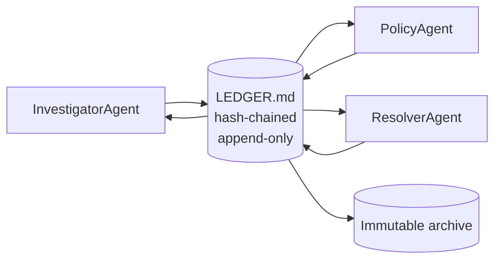

# 3.1 Why Direct Messaging Breaks

## Where we are

Book 1: one CaseBot, one case. Book 2: you can measure and ship it reliably. Now: **what happens when InvestigatorAgent, PolicyAgent, and ResolverAgent all work case 456 at once?**

## What we're fixing this chapter

Direct agent-to-agent messaging feels natural but loses ordering, attribution, and conflict detection. We name the failure modes before building the fix (chapter 3.2: the ledger).

## Failure 1: Messages vanish

```python
# Two agents "communicating"
agent_a.send(agent_b, {"message": "account 456 looks clean, recommend close"})
agent_b.send(agent_a, {"message": "disagree — fraud engine flagged it, recommend hold"})
```

Now your compliance officer asks:
- "What did each agent know at the time of their recommendation?"
- "Which recommendation was acted on?"
- "If both agents gave contradictory recommendations, who broke the tie and how?"

You cannot answer any of these questions. The messages existed in memory during execution. They're gone now.

## Failure 2: Race conditions on shared state

```python
# Both agents read and write a shared dict
shared_state = {"account_456_status": "active", "risk_level": "unknown"}

# Agent A and Agent B run concurrently:
# Agent A: shared_state["risk_level"] = "low"
# Agent B: shared_state["risk_level"] = "high"
```

Last write wins. There's no ordering guarantee. If agents A and B run concurrently, the final value could be either one's write, depending on timing. The system's output depends on which process was scheduled by the OS at what millisecond.

You can't reproduce this. You can't audit it. You can't test for it reliably.

## Failure 3: No conflict detection

Suppose Agent A and Agent B both look at account 456 and reach opposite risk assessments. With direct messaging:

- Agent A writes `risk_level = "low"` to shared state
- Agent B writes `risk_level = "high"` to shared state
- One overwrites the other silently
- The downstream FixerAgent acts on whichever value happened to be last

The system never noticed there was a conflict. It picked one value arbitrarily. The result might be right; it might be wrong. You can't tell.

## What you actually need

For a regulated multi-agent workflow, I need four properties from the coordination mechanism:

1. **Ordering** — I can replay the exact sequence of decisions, in the order they happened
2. **Attribution** — I know which agent wrote which entry
3. **Conflict detection** — if two agents disagree about the same fact, the system notices automatically
4. **Immutability** — no agent can modify a past entry

A list of in-memory messages gives you none of these. An append-only log with typed entries and a hash chain gives you all of them.

## The ledger model

Agents communicate *through* a shared ledger, not *to* each other. Each agent appends its observations and decisions as typed entries. No agent modifies past entries. When any agent needs to know what another agent concluded, it reads the ledger.



The ledger is the single shared truth. Every agent action is visible to every other agent. Every action is timestamped and attributed. Past entries cannot be changed.

## What each agent does with the ledger

```python
from agent_ledger.python.ledger import Ledger, EntryType

ledger = Ledger("LEDGER.md")

# InvestigatorAgent finishes its analysis:
ledger.append(
    agent="InvestigatorAgent",
    etype=EntryType.OBSERVATION,
    content={"key": "risk_level", "value": "low", "evidence": "2 settled transactions, normal balance"}
)

# PolicyAgent finishes its analysis:
ledger.append(
    agent="PolicyAgent",
    etype=EntryType.OBSERVATION,
    content={"key": "risk_level", "value": "high", "evidence": "fraud engine score: 0.87"}
)

# Ledger detects the conflict:
conflicts = ledger.detect_conflicts()
# → [(entry from InvestigatorAgent, entry from PolicyAgent)]
```

The conflict is detected automatically because two OBSERVATION entries have the same key and different values. No agent has to explicitly report a disagreement — the ledger structure makes it visible.

## When is direct messaging acceptable?

I want to be honest about tradeoffs: for research prototypes, quick demos, and brainstorming agents where nothing irreversible happens and you don't need an audit trail, direct messaging is simpler and fine. Use it.

For CaseBot — regulated financial case resolution — it is not fine. Every agent action is a potential compliance artifact. If account 456 gets flagged based on a conflict that nobody detected, and a regulator asks what happened, "our agents sent messages to each other" is not an acceptable answer.

The ledger is more work to set up. It pays for itself the first time something goes wrong and you can answer "here's every agent's observation, in order, with attribution and timestamps."

**Next →** [Append-Only Coordination Logs](./25-ledger.md)
