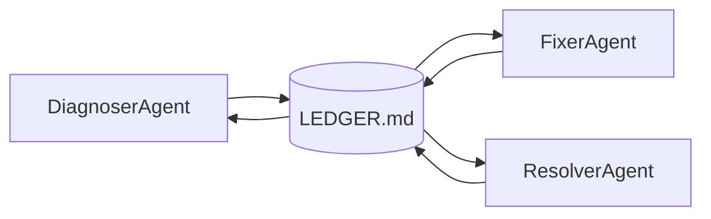

# 21. Why Direct Messaging Breaks

When people design multi-agent systems for the first time, they build agent-to-agent messaging. It seems natural — agents are like people, people send messages. The problem is that agent-to-agent messages have none of the properties you actually need: they're not ordered, not auditable, not replayable, and when two agents disagree about the same fact, there's no record of either claim.

Let me show you what goes wrong.

## The direct messaging pattern

```python
# Seems fine
agent_a.send(agent_b, {"message": "account 456 looks clean"})
agent_b.send(agent_a, {"message": "flag it anyway, fraud engine triggered"})
```

Now ask the compliance team: *what did each agent know at the time of flagging? Who decided first? If both sent conflicting instructions, which one took effect?*

You can't answer any of these. The messages are gone.

## The shared mutable dict pattern

```python
shared_state = {"account_456_status": "active"}

# Agent A and Agent B both do this:
shared_state["account_456_status"] = "flagged"   # race condition
```

Last write wins. No ordering guarantee. No audit trail. If two agents write concurrently, you get a result that's either A's or B's depending on timing — and you can't tell which.

## What you actually need

For regulated workflows, I need four things from multi-agent coordination:

1. **Ordering** — I can replay the sequence of decisions
2. **Attribution** — I know which agent wrote which entry
3. **Conflict detection** — two agents disagree → the system notices
4. **Immutability** — no agent can change a past entry

That's an append-only log with typed entries and a hash chain. It already exists: `agent-ledger`.

## The ledger model

Agents communicate by writing to the ledger and reading from it. Never directly.



The ledger is the single shared truth. Every agent appends its observations, decisions, and tool results as typed entries. No agent modifies past entries. State is reconstructed by replaying the log.

## When direct messaging is OK

I want to be honest: for research prototypes and low-stakes brainstorming agents, direct messaging is fine. If nothing irreversible happens and you don't need an audit trail, it's simpler.

For CaseBot — regulated financial case resolution — it's not OK. Every agent action is a potential compliance artifact.

**Next →** [Append-Only Coordination Logs](./25-ledger.md)
