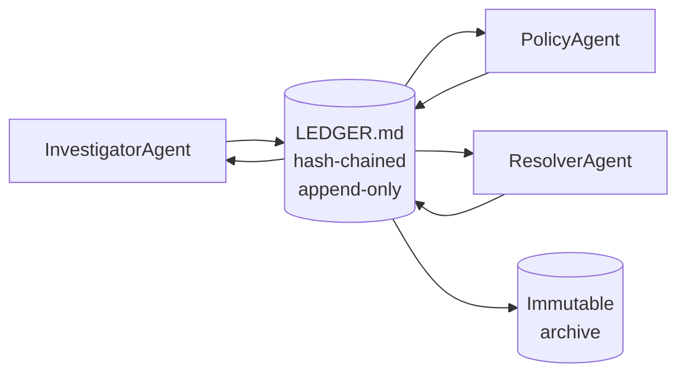

# 22. Append-Only Coordination Logs

Book 1 was one agent, one case. Book 3 is multiple agents on the same case — or on related cases running in parallel. The first question is: how do they share state?

The wrong answer, which most teams reach for first: a shared dict or direct agent-to-agent messages. Chapter 21 explains why those break. The right answer is an append-only, hash-chained log that all agents can read and any agent can write to (within their permissions). That log is the ledger.

## What a ledger gives you

An append-only ledger with typed entries provides four things that matter for regulated systems:

**Ordering** — every entry has a sequence number. You can always reconstruct what each agent knew at any point, by replaying entries up to that sequence.

**Attribution** — every entry has an `agent` field. You know who wrote what.

**Conflict detection** — when two agents disagree about the same fact, the ledger detects the contradiction automatically.

**Tamper evidence** — a SHA-256 hash chain means you can detect if any historical entry was modified. `verify_chain()` returns `False` if the ledger was altered after the fact.



## The data structure

From `agent-ledger/python/ledger.py` (actual API — run `python ledger.py` from that directory):

```python
from enum import Enum
from dataclasses import dataclass
from typing import Any

class EntryType(str, Enum):
    PLAN        = "PLAN"
    TOOL_CALL   = "TOOL_CALL"
    OBSERVATION = "OBSERVATION"
    CONFLICT    = "CONFLICT"
    RESOLUTION  = "RESOLUTION"
    CHECKPOINT  = "CHECKPOINT"
    ANSWER      = "ANSWER"

@dataclass
class LedgerEntry:
    seq: int               # 1-indexed in the running ledger
    timestamp: str
    agent: str
    etype: EntryType
    content: dict[str, Any]
    hash: str = ""         # SHA-256 chain link (16-char hex in demo)

class Ledger:
    def append(self, agent: str, etype: EntryType, content: dict) -> LedgerEntry: ...
    def verify_chain(self) -> bool: ...
    def detect_conflicts(self) -> list[tuple[LedgerEntry, LedgerEntry]]: ...
    def replay(self, up_to_seq: int | None = None) -> list[LedgerEntry]: ...
```

Human escalation is modeled as `EntryType.RESOLUTION` or a dedicated `OBSERVATION` — the demo repo does not define separate `ESCALATE` / `HUMAN_APPROVAL` enum values. Extend the enum if your deployment needs them.

The hash chain is the tamper-evidence mechanism. Each entry's `hash` is computed from the previous hash plus this entry's content. `verify_chain()` returns `False` if any link was altered.

## What the LEDGER.md file looks like

The ledger persists as a Markdown file with one JSON block per entry:

```markdown
<!-- seq=0 agent=InvestigatorAgent etype=PLAN ts=2026-01-15T14:30:00Z -->
```json
{"assignments": [{"agent": "InvestigatorAgent", "task": "gather_account_data"}]}
```
<!-- hash=a3f8b2... prev=000000... -->

<!-- seq=1 agent=InvestigatorAgent etype=TOOL_CALL ts=2026-01-15T14:30:01Z -->
```json
{"tool": "getAccount", "args": {"accountId": "456"}, "result": {"balance": 142.50}}
```
<!-- hash=7c9d1f... prev=a3f8b2... -->

<!-- seq=2 agent=InvestigatorAgent etype=OBSERVATION ts=2026-01-15T14:30:02Z -->
```json
{"key": "account_status", "value": "active"}
```
<!-- hash=2b4e8a... prev=7c9d1f... -->
```

Human-readable. Machine-parseable. Each entry's position in the file corresponds to its sequence number.

## Running it

```bash
cd agent-ledger/python
pip install -e .
OPENAI_API_KEY=sk-... python ledger.py
```

The demo runs two agents (Investigator and PolicyAgent) against a shared ledger, introduces a deliberate OBSERVATION conflict, and shows the Resolver handling it:

```
[seq=0] InvestigatorAgent: PLAN
[seq=1] InvestigatorAgent: TOOL_CALL getAccount
[seq=2] InvestigatorAgent: OBSERVATION requires_migration=False
[seq=3] PolicyAgent: OBSERVATION requires_migration=True    ← conflict!
[seq=4] InvestigatorAgent: CONFLICT on key requires_migration
[seq=5] ResolverAgent: RESOLUTION → requires_migration=True (policy override)
[seq=6] InvestigatorAgent: ANSWER → migration required, escalating

Chain valid: True
```

After the run, open `LEDGER.md`. Every entry is visible. Every entry is linked to the one before it via the hash chain.

## State reconstruction

The ledger's `state()` method replays all entries to compute current state:

```python
def state(self) -> dict:
    s = {}
    for e in self.entries:
        if e.etype == EntryType.OBSERVATION:
            s[e.content.get("key", "")] = e.content.get("value")
        elif e.etype == EntryType.RESOLUTION:
            # Resolved value from conflict
            key = e.content.get("key")
            val = e.content.get("resolved_value")
            if key:
                s[key] = val
        elif e.etype == EntryType.CHECKPOINT:
            s = dict(e.content.get("snapshot", {}))
    return s
```

Any agent can call `ledger.state()` to read current state. No agent can modify past entries. This is exactly the contract you want for regulated coordination.

## Why the ledger beats shared dicts

```
Shared mutable dict:
  agent_a["risk"] = "low"
  agent_b["risk"] = "high"   ← last write wins, no history
  # who wrote "high"? when? what did agent_a think it was overwriting?

Append-only ledger:
  seq=2  InvestigatorAgent: OBSERVATION risk=low    (14:32:01)
  seq=3  PolicyAgent:       OBSERVATION risk=high   (14:32:03)
  seq=4  Resolver:          CONFLICT on key risk
  seq=5  Resolver:          RESOLUTION risk=high (policy override, fraud_engine_v2)
  # complete history, attribution, conflict resolution, audit trail
```

The dict approach loses information. The ledger accumulates it.

## Linking to Book 1 trajectories

Each Book 1 trajectory is a single-agent step log. Each ledger is a multi-agent coordination log. They're linked by `case_id`:

```python
# Single agent (Book 1)
trajectory = Trajectory(case_id="456", task=task)
# logs to logs/case456.json

# Multi-agent coordination (Book 3)
ledger = AgentLedger("cases/456/LEDGER.md")
# each agent's tool calls + observations logged here
```

For a complete audit of case 456: combine the per-agent `Trajectory` exports with the shared `LEDGER.md`. The trajectory shows what each agent did step by step. The ledger shows how they coordinated.

## Exercise

1. Run the agent-ledger demo. Inspect `LEDGER.md`. Count the entries. Verify the hash chain manually: compute `sha256(entry_0)` and confirm it matches `prev_hash` in entry 1.

2. Manually edit one character in `LEDGER.md` (in the content of seq=2). Run `verify_chain()`. Does it detect the modification? At which sequence?

3. Add a fourth agent: `AuditAgent`. It should run after the Resolver and append a summary OBSERVATION: `{"key": "audit_complete", "value": True}`. Check that `ledger.state()["audit_complete"] == True` after the run.

**Companion:** [`agent-ledger/python/ledger.py`](https://github.com/adu3110/agent-ledger/blob/main/python/ledger.py)

**Next →** [Conflict Detection and Resolution](./26-conflicts.md)
