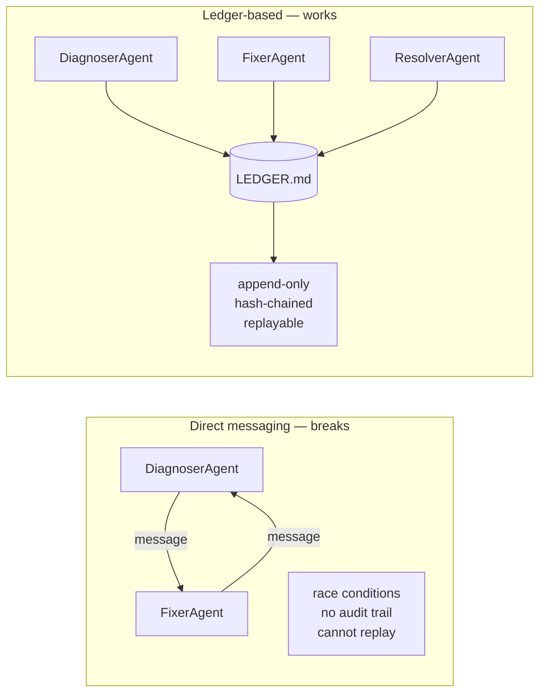

# 22. Append-Only Coordination Logs

Book 1 was one agent, one case. Book 3 is multiple agents on the same case — or on related cases running in parallel. The first question is: how do they share state?

The naive answer is: send messages between agents. That breaks immediately in regulated workflows. Messages can be lost, reordered, or arrive after a decision was already made. There's no audit trail. You can't replay what happened.

The better answer: **agents never communicate directly. They all write to a shared ledger and read from it.**

## The coordination problem



## How `agent-ledger` works

Every agent action is appended as a typed entry:

```python
class EntryType(str, Enum):
    PLAN        = "PLAN"
    TOOL_CALL   = "TOOL_CALL"
    OBSERVATION = "OBSERVATION"
    CONFLICT    = "CONFLICT"
    RESOLUTION  = "RESOLUTION"
    CHECKPOINT  = "CHECKPOINT"
    ANSWER      = "ANSWER"
```

Each entry has a SHA-256 hash chained to the previous:

```python
def compute_hash(self, prev_hash: str) -> str:
    payload = f"{self.seq}|{prev_hash}|{json.dumps(self.content, sort_keys=True)}"
    return hashlib.sha256(payload.encode()).hexdigest()[:16]
```

Tamper any entry → `verify_chain()` fails. Every action is permanently attributable to a specific agent at a specific time.

## The ledger as audit log

```
[0001] PLAN        DiagnoserAgent  2026-06-26T10:00:01Z  hash=8adecb7c
[0002] TOOL_CALL   DiagnoserAgent  2026-06-26T10:00:02Z  hash=4ae8e139
[0003] OBSERVATION DiagnoserAgent  2026-06-26T10:00:03Z  hash=eedce462
[0004] CHECKPOINT  DiagnoserAgent  2026-06-26T10:00:04Z  hash=1f23a409
[0005] PLAN        FixerAgent      2026-06-26T10:00:05Z  hash=9bc3e71a
[0006] OBSERVATION FixerAgent      2026-06-26T10:00:06Z  hash=2d47f8b0
[0007] OBSERVATION DiagnoserAgent  2026-06-26T10:00:07Z  hash=5e6d9c12  ← CONFLICT
[0008] CONFLICT    ResolverAgent   2026-06-26T10:00:08Z  hash=3a1b7f44
[0009] RESOLUTION  ResolverAgent   2026-06-26T10:00:09Z  hash=7c0e5d21
```

Anyone can read `LEDGER.md` and reconstruct exactly what happened — no log aggregation system required.

## Running it

```bash
cd agent-ledger/python
OPENAI_API_KEY=sk-... python ledger.py
```

Output:

```
  Total entries    : 22
  Hash chain valid : True
  Conflict detected between DiagnoserAgent and FixerAgent on 'requires_migration'
  Resolution: Store event_id in KV cache; no schema migration needed.
```

The full ledger is in `LEDGER.md` — plain text, git-diff friendly, human-readable.

## Conflict detection

Two agents can write contradictory OBSERVATION entries for the same key:

```python
fixer.observe("requires_migration", "no")
diagnoser.observe("requires_migration", "yes")   # contradicts FixerAgent

conflicts = ledger.detect_conflicts()
# [(entry for "no", entry for "yes")]
```

The `ResolverAgent` mediates — calls an LLM with both values and appends a RESOLUTION entry. The ledger is now consistent and auditable.

## Replay

To reconstruct state at any point in time:

```python
# What did the system know after entry 5?
state = ledger.replay(up_to_seq=5)
# Replay all entries → reconstruct dict
```

This matters in regulated workflows: if an agent made a bad decision, you can rewind the ledger to the decision point and see exactly what it knew.

## The CaseBot extension (Book 3)

In a multi-agent case resolution:

- `DiagnoserAgent` — reads account and transactions, logs observations
- `PolicyAgent` — checks active constraints from memcell-rl, logs restrictions  
- `FixerAgent` — proposes resolution given both agents' observations
- `AuditorAgent` — reads the full ledger, verifies chain, exports compliance report

Each agent runs its Book 1 loop independently. They coordinate only via the ledger. No direct messages. No shared in-memory state.

## Exercise

Run `ledger.py` and open `LEDGER.md`. Find the CONFLICT entry. What would happen if you deleted entry 7 manually? Run `verify_chain()` to confirm tamper detection.

**Companion:** [`agent-ledger/python/ledger.py`](https://github.com/adu3110/agent-ledger/blob/main/python/ledger.py)

**Next →** [Conflict Detection and Resolution](./26-conflicts.md)
