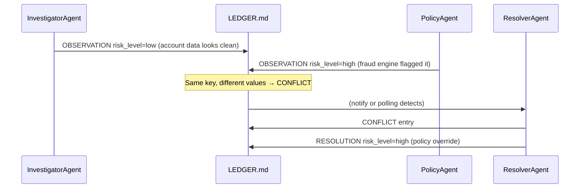

# 3.3 Conflict Detection and Resolution

Two agents can look at the same account and reach opposite conclusions. That's not a failure of the system — it can be intentional. A fraud investigation should have an InvestigatorAgent checking raw account data and a separate PolicyAgent checking the fraud engine output. If they agree, great. If they disagree, the system needs to notice and resolve the contradiction before any downstream action is taken.

The failure mode is when the conflict is invisible. One agent's write silently overwrites the other's. Nobody notices. The downstream FixerAgent acts on whichever value happened to land last.

## How conflicts arise



The conflict is created by two OBSERVATION entries with the same key and different values. The ledger detects it during `detect_conflicts()`.

## Detection

```python
def detect_conflicts(
    entries: list[LedgerEntry],
) -> list[tuple[LedgerEntry, LedgerEntry]]:
    state: dict[str, LedgerEntry] = {}
    conflicts = []
    for e in entries:
        if e.etype != EntryType.OBSERVATION:
            continue
        key = e.content.get("key", "")
        if not key:
            continue
        if key in state:
            prev_val = state[key].content.get("value")
            curr_val = e.content.get("value")
            if prev_val != curr_val:
                # Conflict: same key, different values
                conflicts.append((state[key], e))
        state[key] = e
    return conflicts
```

This is an O(n) scan. For every OBSERVATION, check whether we've seen this key before with a different value. If yes, emit a conflict pair — the earlier entry and the later one.

Note: the function returns *pairs*, not individual entries. You need both sides to understand the conflict. Who wrote the earlier value? Who contradicted it? When?

## What a conflict looks like in the ledger

```markdown
<!-- seq=2  InvestigatorAgent  OBSERVATION  14:32:02 -->
{"key": "risk_level", "value": "low"}

<!-- seq=3  PolicyAgent  OBSERVATION  14:32:04 -->
{"key": "risk_level", "value": "high"}

<!-- seq=4  ResolverAgent  CONFLICT  14:32:05 -->
{"key": "risk_level", "agent_a": "InvestigatorAgent", "value_a": "low",
 "agent_b": "PolicyAgent",      "value_b": "high"}

<!-- seq=5  ResolverAgent  RESOLUTION  14:32:08 -->
{"key": "risk_level", "resolved_value": "high",
 "reason": "fraud_engine_v2 has higher confidence than manual inspection"}
```

Every step is preserved. The audit team can see exactly who said what and when, what the conflict was, and how it was resolved.

## Resolution strategies

Resolution can be automatic or human-in-the-loop depending on the stakes:

```python
class ResolverAgent:
    def __init__(self, ledger: AgentLedger, use_llm: bool = True):
        self.ledger = ledger
        self.use_llm = use_llm

    def resolve_all(self) -> int:
        conflicts = detect_conflicts(self.ledger.entries)
        for a_entry, b_entry in conflicts:
            self._resolve_one(a_entry, b_entry)
        return len(conflicts)

    def _resolve_one(
        self,
        a: LedgerEntry,
        b: LedgerEntry,
    ) -> LedgerEntry:
        key = a.content["key"]

        # Log the conflict first
        self.ledger.append(self.name, EntryType.CONFLICT, {
            "key": key,
            "agent_a": a.agent, "value_a": str(a.content["value"]),
            "agent_b": b.agent, "value_b": str(b.content["value"]),
        })

        # Decide resolution strategy based on key type
        if key in HIGH_STAKES_KEYS:
            # High-stakes: always escalate to human
            return self.ledger.append(self.name, EntryType.ESCALATE, {
                "reason": f"conflict on high-stakes key: {key}",
                "pending_resolution": {"key": key, "candidates": [
                    {"agent": a.agent, "value": a.content["value"]},
                    {"agent": b.agent, "value": b.content["value"]},
                ]},
            })

        if self.use_llm:
            resolved = self._llm_resolve(a, b)
        else:
            # Policy rule: prefer the PolicyAgent's value on risk keys
            resolved = (
                b.content["value"]
                if b.agent == "PolicyAgent" and key.startswith("risk")
                else a.content["value"]
            )

        return self.ledger.append(self.name, EntryType.RESOLUTION, {
            "key": key,
            "resolved_value": resolved,
            "reason": "policy_override" if not self.use_llm else "llm_arbitration",
        })

    def _llm_resolve(self, a: LedgerEntry, b: LedgerEntry) -> Any:
        prompt = (
            f"Two agents disagree on '{a.content['key']}':\n"
            f"  {a.agent}: {a.content['value']}\n"
            f"  {b.agent}: {b.content['value']}\n"
            f"Which value is correct? Return only the value, no explanation."
        )
        # ... call LLM, parse response
        ...

HIGH_STAKES_KEYS = {"risk_level", "fraud_flag", "account_blocked"}
```

## No silent merging

I want to be emphatic about this: **never average or silently merge conflicting facts.**

`risk_level: (low + high) / 2 = medium` is not a resolution. It's a fabrication. You've invented a value that neither agent said, and in doing so you've buried the disagreement that the system was designed to surface.

The only valid resolutions are:
1. Explicitly choose one value, with a reason
2. Escalate to human, with both candidates visible

Both are logged to the ledger. Both are auditable. "We resolved the conflict on risk_level at 14:32:08 by choosing the PolicyAgent's value because fraud_engine_v2 supersedes manual inspection" is a complete audit record. "medium" is not.

## After resolution, what does state look like?

```python
ledger = AgentLedger("cases/456/LEDGER.md")
state = ledger.state()
print(state["risk_level"])  # "high"  — resolved value
```

`state()` replays all entries. When it encounters a RESOLUTION entry, it updates the key with the resolved value. Downstream agents reading `ledger.state()["risk_level"]` see `"high"`, regardless of what InvestigatorAgent wrote earlier.

The OBSERVATION entries are still in the ledger. `state()` just doesn't use them for that key after the RESOLUTION.

## Property check for conflict handling

Add this to your property suite:

```python
def no_action_after_unresolved_conflict(traj_or_entries: list[LedgerEntry]) -> tuple[bool, str]:
    """No TOOL_CALL or ANSWER entries should appear after an unresolved CONFLICT."""
    conflict_keys: set[str] = set()
    resolved_keys: set[str] = set()

    for e in traj_or_entries:
        if e.etype == EntryType.CONFLICT:
            conflict_keys.add(e.content.get("key", ""))
        elif e.etype == EntryType.RESOLUTION:
            resolved_keys.add(e.content.get("key", ""))
        elif e.etype in (EntryType.TOOL_CALL, EntryType.ANSWER):
            unresolved = conflict_keys - resolved_keys
            if unresolved:
                return False, f"action taken with unresolved conflicts: {unresolved}"

    return True, "ok"
```

This is the multi-agent equivalent of `lookup_before_flag`. It enforces: no agent may take action while a conflict is unresolved.

## Exercise

1. Run the agent-ledger demo. Open `LEDGER.md`. Find the CONFLICT entry. What key conflicted? What were the two values? Which agent wrote each one?

2. Modify the demo to make `ResolverAgent.use_llm = False` and use the policy rule instead: "PolicyAgent's risk value always wins." Re-run. Does the resolution match?

3. Write the property `no_action_after_unresolved_conflict` and check it against the demo's ledger entries. Does it pass? Now remove the resolver step and re-run — does the property now fail?

**Companion:** [`agent-ledger/python/ledger.py`](https://github.com/adu3110/agent-ledger/blob/main/python/ledger.py)

**Next →** [Replay and Checkpoints](./27-replay.md)
