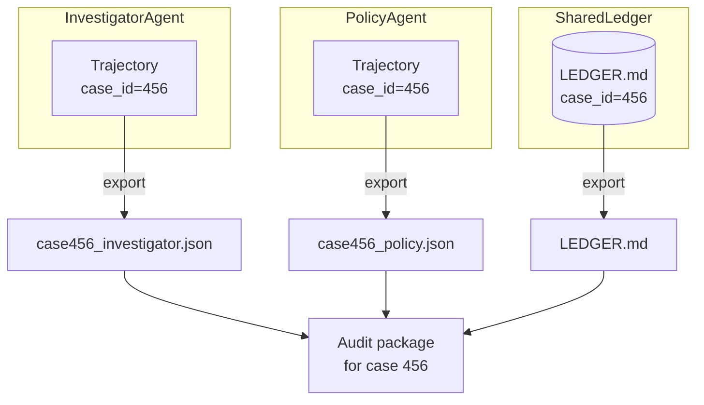

# 24. Replay and Checkpoints

An append-only ledger gives you something that most agent systems don't have: the ability to reconstruct exactly what any agent knew at any point in the case's history. Not approximately. Exactly.

This matters when something goes wrong in production. Without replay, debugging a multi-agent failure looks like reading a chat log and trying to figure out which message caused the wrong state. With replay, you reconstruct the exact state each agent was operating on at the exact moment it made the decision you want to understand.

## How replay works

The ledger stores every OBSERVATION and RESOLUTION in sequence order. State at sequence `N` is computed by replaying all entries with `seq <= N`:

```python
def state_at(entries: list[LedgerEntry], seq: int) -> dict:
    """Reconstruct ledger state as of sequence number seq."""
    state = {}
    for e in entries:
        if e.seq > seq:
            break
        if e.etype == EntryType.OBSERVATION:
            state[e.content.get("key", "")] = e.content.get("value")
        elif e.etype == EntryType.RESOLUTION:
            key = e.content.get("key")
            if key:
                state[key] = e.content.get("resolved_value")
        elif e.etype == EntryType.CHECKPOINT:
            state = dict(e.content.get("snapshot", {}))
    return state
```

State at seq=2 is the world before the PolicyAgent wrote. State at seq=5 is after the Resolver wrote the resolution. You can diff any two points in time:

```python
before = state_at(ledger.entries, seq=2)
after  = state_at(ledger.entries, seq=5)
changed = {k: (before.get(k), after[k]) for k in after if after[k] != before.get(k)}
# {"risk_level": ("low", "high")}
```

That diff answers: *what did the Resolver change?*

## A full debugging session

When a production case goes wrong:

```python
import sys, json
from agent_ledger import AgentLedger, EntryType

# 1. Load the ledger
ledger = AgentLedger(f"cases/{case_id}/LEDGER.md")

# 2. Verify the chain hasn't been tampered with
ok, err = ledger.verify_chain()
if not ok:
    print(f"INTEGRITY FAILURE: {err}")
    sys.exit(1)
print(f"Chain OK ({len(ledger.entries)} entries)")

# 3. Find the wrong action
wrong_seq = None
for e in ledger.entries:
    if e.etype == EntryType.TOOL_CALL and "flagAccount" in str(e.content):
        wrong_seq = e.seq
        break

if wrong_seq is None:
    print("No flagAccount call found")
    sys.exit(0)

print(f"\nflagAccount at seq={wrong_seq}")

# 4. Reconstruct state before the wrong action
state_before = state_at(ledger.entries, wrong_seq - 1)
print(f"\nState before flagAccount:")
for k, v in sorted(state_before.items()):
    print(f"  {k}: {v}")

# 5. Check what the resolver wrote
resolutions = [
    e for e in ledger.entries
    if e.etype == EntryType.RESOLUTION and e.seq < wrong_seq
]
print(f"\nResolutions before the flag: {len(resolutions)}")
for r in resolutions:
    print(f"  seq={r.seq}: {r.content.get('key')} → {r.content.get('resolved_value')}")
```

```
Chain OK (9 entries)

flagAccount at seq=7

State before flagAccount:
  account_status: active
  requires_migration: True
  risk_level: high

Resolutions before the flag: 1
  seq=5: risk_level → high
```

In 10 lines you've confirmed: the flagAccount call happened when `risk_level` was `high` (correctly resolved). The flag was valid.

## Checkpoints

For long cases (50+ entries), replaying from genesis every time becomes expensive. Checkpoint entries snapshot state at a given point:

```python
def checkpoint(ledger: AgentLedger, agent: str) -> LedgerEntry:
    snapshot = ledger.state()
    return ledger.append(agent, EntryType.CHECKPOINT, {"snapshot": snapshot})
```

Replay from the latest CHECKPOINT:

```python
def fast_state(ledger: AgentLedger) -> dict:
    """Replay from last checkpoint instead of from genesis."""
    last_checkpoint = None
    last_checkpoint_seq = -1

    for e in ledger.entries:
        if e.etype == EntryType.CHECKPOINT:
            last_checkpoint = e
            last_checkpoint_seq = e.seq

    if last_checkpoint is None:
        return state_at(ledger.entries, len(ledger.entries) - 1)

    # Start from checkpoint snapshot
    state = dict(last_checkpoint.content.get("snapshot", {}))

    # Replay only entries after the checkpoint
    for e in ledger.entries:
        if e.seq <= last_checkpoint_seq:
            continue
        if e.etype == EntryType.OBSERVATION:
            state[e.content.get("key", "")] = e.content.get("value")
        elif e.etype == EntryType.RESOLUTION:
            key = e.content.get("key")
            if key:
                state[key] = e.content.get("resolved_value")

    return state
```

The full history is still in the ledger for audit. Checkpoints just avoid re-processing it on every read.

## When to checkpoint

```python
# Checkpoint every N entries
CHECKPOINT_INTERVAL = 20

def should_checkpoint(ledger: AgentLedger) -> bool:
    last_cp = max(
        (e.seq for e in ledger.entries if e.etype == EntryType.CHECKPOINT),
        default=-1,
    )
    return (len(ledger.entries) - 1 - last_cp) >= CHECKPOINT_INTERVAL
```

Or at natural case boundaries: after a RESOLUTION, after HUMAN_APPROVAL, after each agent stage in a pipeline. Checkpoints at semantically meaningful points make debugging easier — you can skip to "after the investigator stage" without replaying every individual tool call.

## Linking trajectories and ledgers

In Book 1, each agent produces a single-agent `Trajectory`. In Book 3, each agent also appends to the shared ledger. They're linked by `case_id`:



For a full audit: the audit package for case 456 contains every agent's trajectory and the shared ledger. The trajectories answer "what did each agent do step by step?" The ledger answers "how did they coordinate?"

## What replay is not

Replay reconstructs state from a log. It does not re-run the agents or re-execute tool calls. This is the right choice for audit: you want to know what the system *knew*, not simulate what would happen if you ran it again with today's data.

If you need to re-run the case (e.g., to test a fix), do it against a test fixture — not by replaying the production ledger. The production ledger is a record, not a runnable simulation.

## Exercise

1. Run the agent-ledger demo. Manually add a CHECKPOINT entry at seq=3 by calling `ledger.append("AuditAgent", EntryType.CHECKPOINT, {"snapshot": ledger.state()})`. Run `fast_state()`. Confirm it returns the same result as `state_at(entries, len(entries)-1)`.

2. Now add 20 more OBSERVATION entries (you can script it: `for i in range(20): ledger.append("FillAgent", EntryType.OBSERVATION, {"key": f"fill_{i}", "value": i})`). Measure how long full replay takes vs checkpoint-based replay.

3. Corrupt entry seq=3 by editing `LEDGER.md` (change one character). Run `verify_chain()`. At which sequence does the error appear? Why does editing seq=3 also invalidate seq=4, seq=5, etc.?

**Companion:** [`agent-ledger/python/ledger.py`](https://github.com/adu3110/agent-ledger/blob/main/python/ledger.py)

**Next →** [Permissions and Sensitive Memory](./28-permissions.md)
