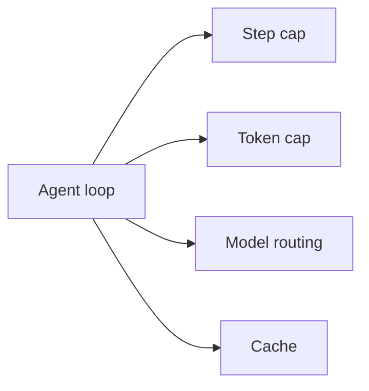

# 3.7 Cost and Latency Control

Agents spend money in loops. Each step is potentially an LLM call, a tool API call, and a memory decide call. If you don't control this, costs compound and you discover it on a billing cycle, not on a dashboard.

I've seen teams build agents that work perfectly in testing and then discover in staging that a single confused case triggers 40 LLM calls before hitting the step cap. That's not a model failure — that's missing controls.

## The four controls



**Step cap** — absolute maximum loop iterations. Already in `casebot_regulated.py` as `MAX_STEPS = 10`. Non-negotiable.

**Token cap** — total tokens per case across all LLM calls. Not just context assembly budget per step:

```python
# In AgentLoop
self.total_tokens_used = 0
TOKEN_BUDGET_PER_CASE = 30_000

# After each LLM call
self.total_tokens_used += response_tokens
if self.total_tokens_used > TOKEN_BUDGET_PER_CASE:
    return "ESCALATED:token_budget_exceeded"
```

**Model routing** — small model for planning, large model for final answer:

```python
def call_planner(context: str) -> dict:
    # Planning is cheap — short context, structured output
    return llm_call(context, model="gpt-4o-mini")

def call_final_answer(context: str) -> str:
    # Final reasoning — worth the larger model for regulated output
    return llm_call(context, model="gpt-4o")
```

For CaseBot's case volume, routing saves ~40% of LLM cost with no accuracy loss on property checks.

**Cache** — idempotent read tools are memoized:

```python
import functools

@functools.lru_cache(maxsize=256)
def get_account_cached(account_id: str) -> dict:
    return get_account(account_id)
```

If CaseBot reads account 456 twice in the same run, the second call is free. Works for any tool that returns the same result for the same arguments within a run.

## Parallel reads

`getAccount` and `getTransactions` don't depend on each other. In a sequential loop they both wait:

```python
# Sequential: 400ms + 350ms = 750ms
account = get_account("456")
txns = get_transactions("456")

# Parallel with threads: max(400, 350) = 400ms
import concurrent.futures
with concurrent.futures.ThreadPoolExecutor() as ex:
    fut_acct = ex.submit(get_account, "456")
    fut_txns = ex.submit(get_transactions, "456")
    account = fut_acct.result()
    txns = fut_txns.result()
```

Only parallelize read-only tools. Destructive tools always run serially, after explicit ordering in the ledger.

## Measure what matters

Every run logs this:

```python
case_metrics = {
    "case_id": "456",
    "llm_calls": 4,
    "tool_calls": 3,
    "total_tokens": 8_400,
    "latency_ms": 3_200,
    "estimated_cost_usd": round(8_400 / 1_000_000 * 0.60, 4),  # gpt-4o-mini input pricing
}
```

Track this per case over time. If `total_tokens` for routine cases starts drifting up, something changed — context assembly, planner prompt, a new cell type accumulating. You catch it before the billing cycle.

## Exercise

Add a token budget check to `casebot_regulated.py`: after each planner call, accumulate `tokens_used` from the response and escalate if it exceeds 15,000. Verify the check triggers on an intentionally bloated context (add 30 low-criticality cells to memcell-rl before running).

**Next →** [Multi-Agent Orchestration](./31-orchestration.md)
