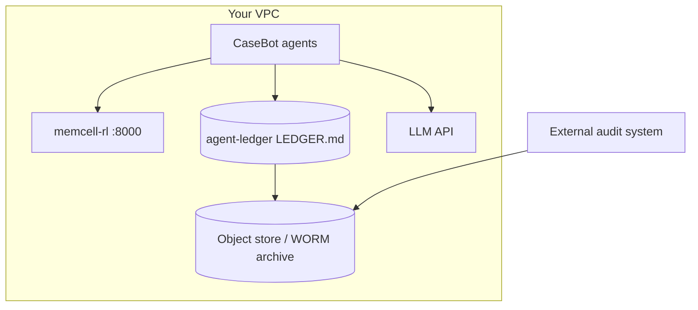

# 29. Regulated Deployment

A regulator, an auditor, or a senior engineer will ask five questions about any production agent system. Let me walk through each and show how the architecture answers it.

## The five questions

**1. What decision was made?**

The ledger's final state. `ledger.state()` returns the resolved facts and the outcome. The trajectory's final step has the outcome string. Neither lives in the LLM's head — both are in files you can read.

**2. What data informed it?**

The memory snapshot assembled at the decision step. If you log `fetch_memcell_context()` output per step — which `casebot_regulated.py` does — you have a record of exactly what the LLM saw when it decided.

**3. Who acted?**

Every ledger entry has an `agent` field. Every tool call in the trajectory has the agent name. The HUMAN_APPROVAL entry has `approved_by`. Attribution is complete.

**4. Can you reproduce state at decision time?**

`state_at_seq(N)` on the ledger. Combined with the trajectory's per-step context log. Yes.

**5. Was policy violated?**

Property checks. `evaluate_trajectory(traj)` with CASEBOT_SUITE. If any check fails, the policy was violated and you have an exact description of which step caused it.

## Deployment topology



- Agents run in your VPC
- Memory and ledger never leave your infrastructure
- LLM is a stateless API call — replaceable without changing the agent architecture
- Ledgers are archived daily to immutable storage (WORM where required)

## Data retention and PII

Align memory cell TTL and ledger archive with your retention policy:

```python
# PII cells expire automatically after retention window
"valid_until": (datetime.utcnow() + timedelta(days=retention_days)).isoformat()

# Ledger export for audit: full
# Ledger export for ops: redacted (PII fields replaced with ***)
def redact_for_ops(entry: LedgerEntry) -> LedgerEntry:
    content = dict(entry.content)
    for pii_key in ["ssn", "card_number", "account_holder"]:
        if pii_key in content:
            content[pii_key] = "***"
    return LedgerEntry(**{**entry.__dict__, "content": content})
```

## Change management

Every change to the agent system goes through the same process:

```
1. Model upgrade
   → Run regression suite (property checks)
   → Run long-context needle + recency benchmarks on new model
   → Deploy only if all pass

2. Policy change (baseline_v0 → baseline_v1)
   → Shadow mode: run both policies in parallel, compare selected cells
   → Verify property suite passes with new policy
   → Gradual rollout with monitoring

3. New tool added
   → Write property check for the tool's invariants first
   → Add to smoke suite before deployment
```

The regression suite is the deployment gate. A model upgrade that breaks `lookup_before_flag` does not go to production.

## What "enterprise-grade" actually means

It's not "built with LangChain" or "uses a vector database" or "has a demo". It means:

- Every case has a complete, replayable audit trail
- Every property check is green on the release commit
- Every failure has a diagnosis, not just a ticket
- Humans are in the loop for irreversible actions
- PII is handled according to retention policy, not left to accumulate

The architecture in this series — typed memory, trajectory logging, property checks, append-only ledger, HITL gates — gives you all of this without a third-party framework in the critical path.

## Exercise

Write a deployment checklist as a Python script that: (1) runs the property suite on a sample trajectory, (2) verifies `verify_chain()` on a sample ledger, (3) checks that all active memory cells in memcell-rl have a `valid_until` field if sensitivity is `pii`. Run it as part of your CI pipeline.

**Next →** [Lessons Learned](./33-lessons.md)
