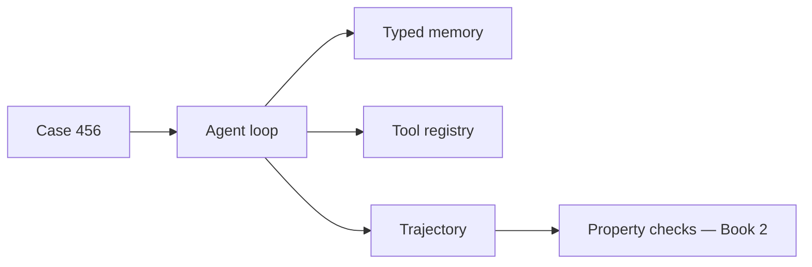

# Building Agentic Systems

I want to show you how to build an agentic system from scratch — no LangChain, no agent framework, no magic. One running example (CaseBot, a regulated case-review agent) and a single build path you type and run chapter by chapter.

## How to read this book

Each chapter adds **one layer** to the same system. You run code before you read theory. When something breaks, the next chapter fixes it.

```bash
# Clone (if you don't have the repo yet):
git clone https://github.com/adu3110/memcell-rl.git
cd memcell-rl

# Or, from this website workspace:
cd repos/memcell-rl

python3 examples/build/step01_task.py
python3 examples/build/step02_loop.py
# … through step09_stops.py

# Step 10 — full CaseBot (needs memcell-rl server for live memory):
uvicorn memcell_rl.app:app --port 8000   # terminal 1
python3 examples/casebot_regulated.py --dry-run   # terminal 2
# Optional: OPENAI_API_KEY=sk-... python3 examples/casebot_regulated.py --live
```

**Finished artifact:** [`casebot_regulated.py`](https://github.com/adu3110/memcell-rl/blob/main/examples/casebot_regulated.py) — not the starting point. You get there by step 10.

## The spine (one case, one loop)

Case 456: review an account for fraud in a regulated workflow. The agent must lookup account data before any destructive action, respect constraints, log every step, and escalate when it cannot proceed safely.



## Three books

| Book | Question |
|------|----------|
| **1** | How do I build the loop, memory, tools, and log? |
| **2** | How do I know it keeps working? |
| **3** | How do multiple agents coordinate without breaking audit? |

Start Book 1. Run step 01 now.

**Next →** [Overview — a task is not an agent](./book1/02-philosophy.md)
